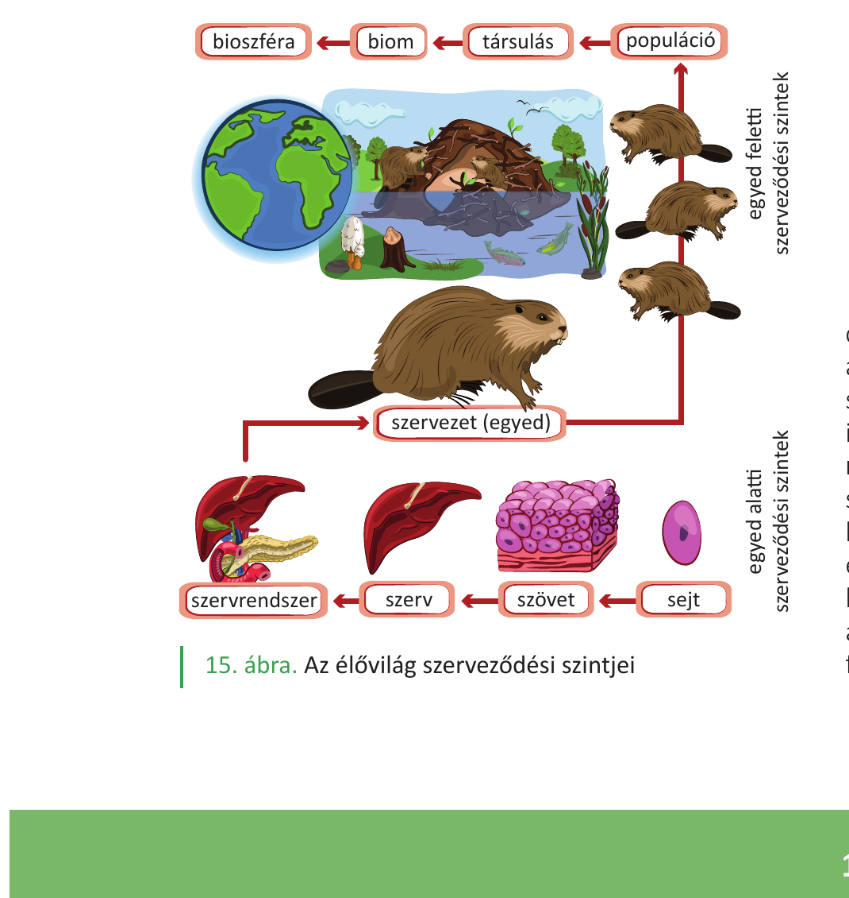

# 1. Életkritériumok

**Az élet fogalma.** Az élő rendszerek a természet hierarchikusan felépülő, anyag- és energiaforgalmat folytató, önszabályozó rendszerei. Az élővilág szerveződési szintjei: sejt → szövet → szerv → szervezet (egyed) → populáció → társulás → bioszféra.

**Az élet (egyedi) kritériumai – a könyv felsorolása:**

1. **Elhatárolódás:** az élőlények saját, szabályozott összetételű belső környezetet különítenek el a külvilágtól; ez a hierarchia minden szintjén (sejt, szervezet) jellemző. A sejtek határoló membránjai féligáteresztők, az anyagcsere itt zajlik.
2. **Energiaátalakítás:** az élő szervezetek viszonylag magas rendezettségüket folyamatos energiabevitel árán tartják fenn. Energiát alakítanak át (fény → kémiai vagy kémiai → kémiai/mechanikai), a sejtek központi energiahordozója az ATP.
3. **Anyagátalakítás (anyagcsere):** a belső rendezettség fenntartása szabályozott anyagátalakító folyamatokra (felépítő és lebontó folyamatok) épül; ezeket enzimek katalizálják.
4. **Programozottság, információs működés:** a felépítést és működést örökítő anyag (DNS) tárolt információ szabályozza; lehetővé teszi a fejlődést és az ingerekre adott válaszokat.

**Egyed feletti (evolúciós) kritériumok:**

5. **Szaporodás** – az egyedek véges életűek, az élet folytonosságát az utódok létrehozása biztosítja.
6. **Változékonyság (öröklődő változatosság)** – a populáción belüli eltérések és a környezet együtt teszik lehetővé az evolúciós alkalmazkodást.

---

## Ábra

*Az élővilág szerveződési szintjei (sejt → szövet → szerv → szervezet → populáció → társulás → biom → bioszféra)*

---

## Kapcsolódó fogalmak a könyvből

- **Önszabályozás, visszacsatolás** (negatív/pozitív) – a stabilitás fenntartásának eszköze (12–13. o.).
- **Hierarchikus rendszerszemlélet** – minden szint a kisebb rendszerekből épül fel és nagyobb rendszer része (13. o., 15. ábra).
- **Élettelen rendszerekkel szembeni különbség:** az élő rendszerek nyitottak (anyag/energia áramlik át rajtuk), és a magas rendezettséget aktívan tartják fenn.
