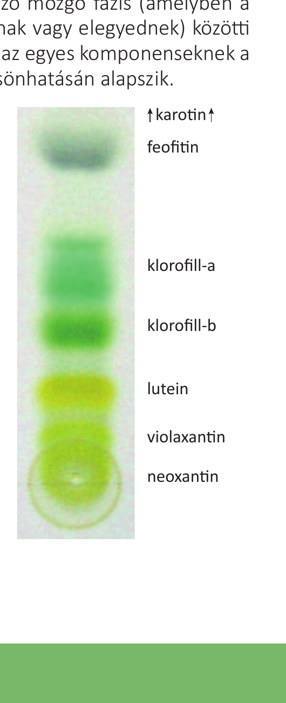

# 2. Kromatográfia és gélelektroforézis

## Vázlat (~200 szó)

Mindkét módszer **biokémiai keverékek (molekulák) szétválasztására** szolgál: különböző tulajdonságok alapján más-más sebességgel haladnak az anyagok egy közegen át.

**Kromatográfia (papír- vagy oszlopkromatográfia)**

- Két fázisa van: **álló fázis** (adszorbens, hajszálcsöves szerkezetű – pl. papír, cellulóz, orvosi szén, kréta) és **mozgó fázis** (folyékony oldószer).
- A mozgó fázist a **kapillárishatás** húzza végig az álló fázison.
- Az oldott anyagok a mozgó fázissal együtt haladnak, de eltérő mértékben **adszorbeálódnak** (megtapadnak) az álló fázis felületén. Amelyik anyag erősebben kötődik, rövidebb utat tesz meg.
- Eredmény: az anyagok különböző távolságokra jutnak, **csíkokra/foltokra különülnek el** (pl. növényi színanyagok: klorofill-a, klorofill-b, xantofillok, karotinok).
- Az adszorpciót Van der Waals-erők, esetleg kémiai kötés (kemiszorpció) okozza; a nagy **fajlagos felület** (felület/tömeg arány) növeli a hatékonyságot.

**Gélelektroforézis**

- Lényegében **egyenáramú elektromos térben, gélen végzett kromatográfia**.
- A gél hálózatos szerkezetű: a kisebb molekulák könnyebben átjutnak rajta, a nagyobbak nehezebben → **méret szerinti elválasztás**.
- Tipikus felhasználás: **DNS-darabok** szétválasztása a hosszuk (bázispárok száma) szerint; a startvonaltól különböző távolságra jutnak.
- Fehérjéknél is használható (méret és töltés szerinti elválasztásra).

**Rokon elválasztási módszerek a könyvből**

- **Szűrés** – méret szerint választ el.
- **Centrifugálás** – sűrűség és tömeg szerint; a részecskék sugárirányban mozognak, a nagyobb sűrűségű anyag a cső alján gyűlik össze (g-érték többszöröseiben mérik a gyorsulást).

---

## Ábra

*Növényi színanyagok kromatogramja: a különböző festékek (xantofillok, klorofill-a, klorofill-b, karotinok stb.) más-más magasságban jelennek meg a papíron.*
