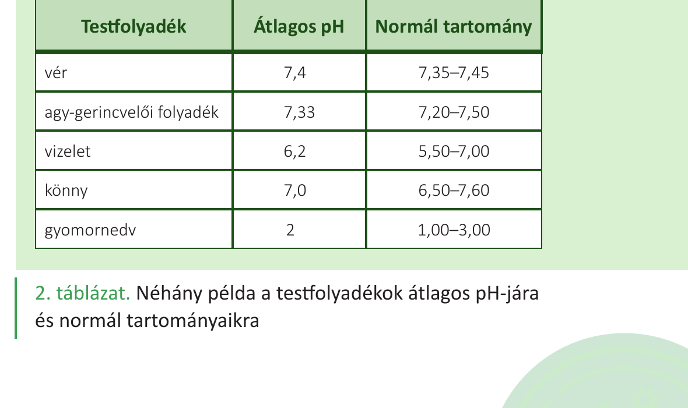

# 3. A víz tulajdonságai és biológiai jelentősége

## Vázlat (~200 szó)

A víz nemcsak élőhely az élőlényeknek, hanem **az élő szervezetek legfontosabb szervetlen vegyülete** is (a testtömeg ~60–95%-a). Tulajdonságait molekulaszerkezete határozza meg.

**Szerkezet és kötések**

- A vízmolekulában O–H **kovalens kötés** van, **dipólusos (poláris)** szerkezetű (V-alak; oxigénen részleges negatív, hidrogéneken részleges pozitív töltés).
- Molekulái egymással **hidrogénkötéseket** alkotnak – innen ered a víz minden „rendhagyó" tulajdonsága.

**Fizikai tulajdonságok és biológiai jelentőség**

- **Magas olvadás- és forráspont, magas fajhő, magas párolgáshő** – sok energia kell a felmelegítéséhez/elpárologtatásához → kiváló **hőtároló** és **hőszabályozó** közeg (pl. izzadással való hűtés).
- **Sűrűsége 4 °C-on maximális** – a jég lebeg a víz felszínén, az állóvizek fenekére nem fagy be, télen is megmarad a víz alatti élet.
- **Nagy felületi feszültség** (a felszínen hidrogénkötések miatt összetartó hártya) – egyes állatok ezen mozognak/megülnek.

**Kémiai szerep**

- **Univerzális oldószer:** poláris és ionos vegyületeket old (sók, cukrok, aminosavak); a hidrofób (apoláris) anyagokat „kilöki" → membránok kialakulásának alapja.
- **Biokémiai reakciók közege és résztvevője:** **hidrolízisnél** vízmolekula közbeiktatásával bontunk kötéseket; **kondenzációnál** víz lép ki melléktermékként (pl. fehérje- és cukor­képződéskor).
- A pufferrendszerek (pl. hidrogén-karbonát/szénsav) a víz alapú belső környezet **pH-ját tartják állandóan** (vér pH ≈ 7,4).

---

## Táblázat

*Néhány testfolyadék átlagos pH-ja és normáltartománya (vér 7,35–7,45; gyomornedv 1,0–3,0 stb.).*
