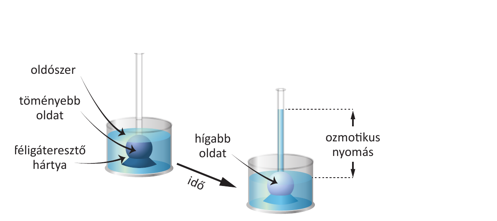

# 4. Ozmózis

Az **ozmózis** az oldószer-molekulák egyirányú áramlása **féligáteresztő hártyán** át a hígabb oldatból a töményebb felé. A jelenség hátterében – a diffúzióhoz hasonlóan – a részecskék rendezetlen hőmozgása áll, csak itt az oldószer (legtöbbször víz) szabadon átjut a hártyán, míg az oldott anyag nem.

**Diffúzió → ozmózis**

- **Diffúzió:** valamely anyag (gáz, oldott anyag) a magasabb koncentrációjú helyről az alacsonyabb felé mozog (Δc/Δx koncentrációgradiens), amíg ki nem egyenlítődik.
- **Ozmózis:** féligáteresztő hártya (csak az oldószer-molekulák számára átjárható) választja el a két oldatot; a kétoldali koncentrációkülönbséget az oldószer áramlása próbálja kiegyenlíteni.
- A folyamat **dinamikus egyensúly**ig tart: amikor a töményebb oldat oszlopnyomása megegyezik az **ozmotikus nyomással** (Π).

**Ozmotikus nyomás**

- Az a hidrosztatikai nyomás, amely a koncentrációkülönbség miatti oldószer-áramlást megállítaná.
- Híg oldatra: **Π = c · R · T** (c = oldott anyag móláris koncentrációja, R = egyetemes gázállandó, T = abszolút hőmérséklet).
- **Fordított (revers) ozmózis:** ha a töményebb oldatra az ozmotikus nyomásnál nagyobb nyomást fejtünk ki, az oldószer az ellenkező irányba áramlik (ivóvíz-előállítás, vesedialízis elvi alapja).

**Élettani jelentőség és példák**

- **Izotóniás** oldat: ugyanaz az ozmotikus nyomása, mint a sejt belsejének (vér ≈ 0,9%-os NaCl); a sejt térfogata változatlan.
- **Hipotóniás** oldat (sejten kívül hígabb): a víz **beáramlik** a sejtbe, az **felduzzad**, akár szét is reped → **hemolízis** (vörösvérsejtek esetében).
- **Hipertóniás** oldat (sejten kívül töményebb): a víz **kiáramlik** a sejtből, a sejt **zsugorodik** (plazmolízis a növényi sejtben).
- Biológiai szerep: tápanyagfelvétel, vesekanyarulati vízvisszaszívás, növényi turgornyomás (támasztó hatás), gyökérnyomás.

---

## Ábra

*Ozmométer: a féligáteresztő hártyán keresztül a hígabb oldatból a töményebbe áramlik az oldószer, amíg ki nem alakul a dinamikus egyensúly. A folyadékoszlop magasságkülönbsége az ozmotikus nyomást mutatja.*

---

*Az anyag az 1. tankönyv 28, 29, 30. oldalain található.*
