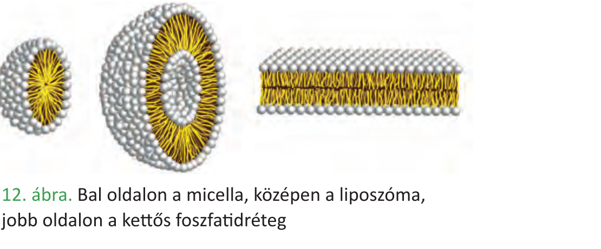

# 5. A lipidek

A lipidek (zsírszerű anyagok) változatos szerkezetű szerves vegyületek. Közös tulajdonságuk, hogy molekulájuk nagyobb része **apoláris**: vízben nem oldódnak, viszont szerves oldószerekben (éter, kloroform, benzin) igen. Négy nagy csoportjuk a **neutrális zsírok**, a **foszfolipidek**, a **szteroidok** és a **karotinoidok**.

**Neutrális zsírok (trigliceridek)**

- 1 **glicerin** + 3 **zsírsav** észterkötéssel kapcsolódik egymáshoz; reakciómelléktermék 3 vízmolekula (kondenzáció).
- A zsírsavak hosszú szénláncú karbonsavak (C₁₂–C₂₄), lehetnek **telítettek** (csak egyszeres C–C kötés; pl. sztearinsav, palmitinsav) vagy **telítetlenek** (egy/több kettős kötés; pl. olajsav, linolsav, linolénsav). A telítetlen zsírsavakat tartalmazó lipidek olvadáspontja alacsonyabb → szobahőn folyékonyak (olajok), a telítettek szilárdak (zsírok).
- Funkció: a szervezet legjobb **energiaraktára** (1 g ≈ 37 kJ, kétszerese a szénhidráténak), **hőszigetelő** (bőr alatti zsírpárna), **mechanikai védelem** (szervek körüli zsírpárna), **víztaszító** bevonatok (toll, szőr).

**Foszfolipidek**

- Felépítésük a zsírokéhoz hasonló, de az egyik zsírsav helyén **foszfátcsoport** és gyakran egy nitrogéntartalmú szerves vegyület áll.
- Így a molekula **két részből** áll: **vízben oldódó (poláris/hidrofil) "fej"** és **két apoláris (hidrofób) zsírsav-"farok"**.
- Vízben spontán **kettős réteget** (vagy micellát, liposzómát) képeznek, ahol a poláris fejek a víz felé, az apoláris farkak egymás felé fordulnak → ez a **biológiai membránok alapszerkezete**.

**Szteroidok**

- Négy összekapcsolódó szénatomos gyűrűből álló, jellegzetes vázú vegyületek.
- **Koleszterin:** állati sejtmembránok alkotója, prekurzora más szteroidoknak.
- **Epesavak:** zsírok emésztését segítik (emulgeálás).
- **Hormonok:** nemi hormonok (tesztoszteron, ösztrogén, progeszteron), mellékvesekéreg-hormonok (kortizol, aldoszteron).
- **D-vitamin:** Ca-anyagcsere szabályozása.

**Karotinoidok**

- Zsírban oldódó, sárga–narancs–vörös színű pigmentek.
- **Karotinok** és **xantofillok** szerepe a fotoszintézisben (kiegészítő színanyagok).
- A **β-karotin** az **A-vitamin (retinol/retinal) provitaminja** – a retinal a látás során a rodopszinban szerepet játszó fényreceptor-molekula része.

---

## Ábra

*Bal oldalon a micella, középen a liposzóma, jobb oldalon a kettős foszfolipidréteg. A poláris (hidrofil) fejek a víz felé, az apoláris (hidrofób) zsírsav-farkak egymás felé fordulnak – ez a biológiai membránok alapja.*

---

*Az anyag az 1. tankönyv 47, 48, 49, 50, 51, 52. oldalain található.*
