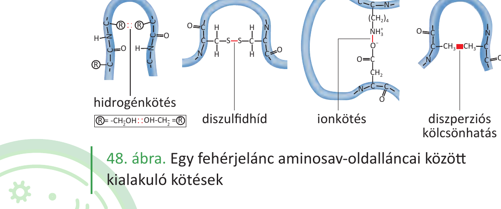

# 8. A fehérjék szerkezete és funkciói

A fehérjék **20 fajta α-aminosavból** felépülő polimerek; egy fehérje **térszerkezete** (és így a funkciója is) az **aminosav-sorrend** által meghatározott. A szerkezet bármely változása (mutáció, denaturáció) közvetlenül a működést rontja.

**A négy szerveződési szint és funkcionális jelentősége**

- **Elsődleges szerkezet:** az aminosavak **kovalens peptidkötéssel** összekapcsolt sorrendje. Genetikailag kódolt (DNS → RNS → fehérje). Egyetlen aminosav cseréje is megváltoztathatja a teljes térszerkezetet és a működést – tipikus példa a **sarlósejtes vérszegénység**: a hemoglobin β-láncának egy glutaminsavja valinra cserélődik, ezért a fehérje rosszul polimerizál, a vörösvértest sarló alakot vesz fel.
- **Másodlagos szerkezet:** a peptidlánc **gerincén** hidrogénkötések alakítanak ki szabályos motívumokat – **α-hélixet** (csavart) vagy **β-redőt** (összerakott szalagok). Ezek építik fel a fehérje vázát; a β-kanyar köti össze őket.
- **Harmadlagos szerkezet:** az **oldalláncok közötti** kölcsönhatások (diszulfid-híd S–S, ionos és hidrogénkötések, **hidrofób kölcsönhatások**) hozzák létre a fehérje végleges térbeli alakját – **globuláris** (gömbölyű) vagy **fonálszerű (rostos)** formát.
- **Negyedleges szerkezet:** több polipeptidlánc kapcsolódik egy működő egységgé. Klasszikus példa a **hemoglobin** (4 alegység, 4 hem-csoport, 4 O₂-kötőhely; a kötés **kooperatív**, és pH/CO₂ által szabályozott).

**Forma és funkció kapcsolata**

- **Fonálszerű fehérjék** – mechanikai szerep, vízben nem oldódnak:
  - **keratin** (haj, köröm, szaru), **kollagén** (kötőszövet, csont, bőr szilárdsága), **elasztin** (rugalmas szövetek), **fibrin** (véralvadás), **aktin–miozin** (izom-összehúzódás).
- **Globuláris fehérjék** – kémiai/szabályozó szerep, vízben oldhatók:
  - **enzimek** (biokatalizátorok, aktív hely a térszerkezet függvénye; lásd 9. tétel),
  - **szállítófehérjék** (hemoglobin: O₂; albumin: zsírsav, gyógyszerek),
  - **hormonok** (inzulin, glukagon, növekedési hormon),
  - **antitestek** (immunválasz, Y alak: antigén-kötő hely),
  - **receptorok és transzporterek** (membránfehérjék, Na/K-pumpa).

**Denaturáció: ha a szerkezet sérül, a funkció megszűnik**

- A térszerkezetet stabilizáló gyengébb kötések (H-kötés, ionos, hidrofób) **hő**, **erős sav/lúg**, **nehézfém-ionok**, **alkohol** vagy **mechanikai hatás** miatt felbomlanak.
- Az elsődleges szerkezet (peptidkötések) általában megmarad, de a fehérje **visszafordíthatatlanul elveszti működését** (pl. tojásfehérje sütése, láz okozta enzimkárosodás).
- A denaturált fehérjék gyakran csapadékká állnak össze (**koaguláció**).

A fehérje tehát **csak ép szerkezetben működőképes**; a sejt molekuláris kísérők (chaperonok) segítségével biztosítja a helyes feltekeredést.

---

## Ábra

*A fehérje harmadlagos szerkezetét stabilizáló kötéstípusok az aminosav-oldalláncok között: hidrogénkötés, diszulfidhíd (S–S), ionkötés és diszperziós (hidrofób) kölcsönhatás. Ezek határozzák meg a fehérje végleges térbeli alakját – és így a funkcióját.*

---

*Az anyag az 1. tankönyv 61, 62, 63, 64, 65. oldalain található.*
