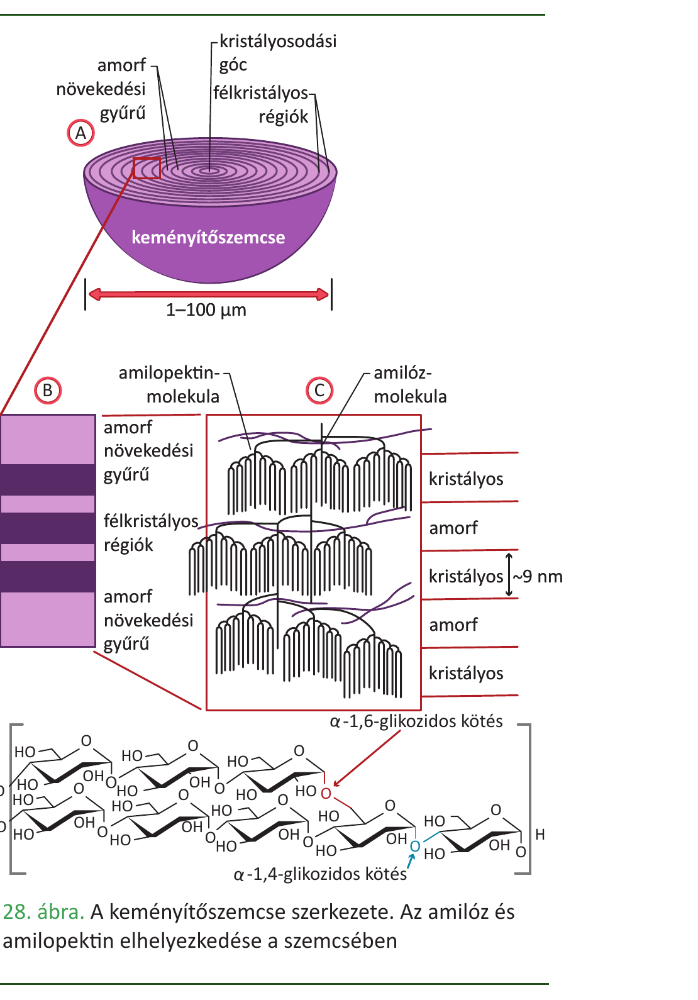

# 6. A szénhidrátok biológiai szerepe

A szénhidrátok szénből, hidrogénből és oxigénből felépülő szerves vegyületek, általános képletük (C·H₂O)ₙ – innen az „**oxigénes szénhidrátok**", **cukrok** elnevezés. Háromféle csoport van: **monoszacharidok** (egyetlen cukoregység), **diszacharidok** (két egységből) és **poliszacharidok** (sok egységből).

**Monoszacharidok**

- 3–7 szénatomosak; a legfontosabbak a **triózok** (glicerinaldehid, dihidroxiaceton), **pentózok** (ribóz – RNS, dezoxiribóz – DNS, ATP, NAD, FAD), és **hexózok** (glükóz, fruktóz, galaktóz).
- Vizes oldatban gyűrűs (α-, β-) formában fordulnak elő (D-glükóz: 99% gyűrűs).
- A **glükóz** az élő szervezetek elsődleges, gyorsan hozzáférhető energiaforrása; a vér normál glükózszintje nagyjából állandó.

**Diszacharidok** (két monoszacharid + **glikozidos kötés** + 1 vízmolekula kilépésével = kondenzáció)

- **Maltóz** = 2 α-D-glükóz (keményítő bontásából); **cellobióz** = 2 β-D-glükóz (cellulóz bontásából).
- **Szacharóz** (répa-/nádcukor) = α-D-glükóz + β-D-fruktóz; növények szállítóformája.
- **Laktóz** (tejcukor) = β-D-galaktóz + β-D-glükóz; az emlősök tejének fő cukra.

**Poliszacharidok – raktározás és váz**

- **Keményítő:** növények tartalék-tápanyaga; α-D-glükóz egységekből, **balmenetes hélix**. Két fajta: **amilóz** (egyenes) és **amilopektin** (elágazó, α-1,6 kötések). Jód-keményítő próba: kékes szín.
- **Glikogén:** állati raktár-tápanyag (májban, izomban; ember kb. 400 g); szerkezete a keményítőhöz hasonló, de **erősebben elágazó** → gyorsabb energiafelszabadítás.
- **Cellulóz:** növények sejtfalának alkotója; β-D-glükóz egységekből, **egyenes szálak**, amelyek párhuzamos kötegekbe (mikrofibrillumokba) rendeződnek, hidrogénkötések tartják össze – ezért rendkívül szilárd, vízben oldhatatlan. Az ember nem tudja emészteni; a kérődzők bélflórája és a gombák képesek lebontani.

**Cukrok kimutatása**

- **Redukáló cukrok** (szabad glikozidos OH-csoportú aldehidcsoportot tartalmaznak): **Fehling-próba** (téglavörös Cu₂O csapadék), **ezüsttükör-próba**. Idetartoznak a monoszacharidok és a laktóz, maltóz, cellobióz.
- **Nem redukáló cukor:** szacharóz (mindkét gyűrűs hidroxilcsoportja kötésben van).

**Biológiai szerepek összefoglalva**

- **Energiaforrás:** glükóz → biológiai oxidáció → ATP (1 g szénhidrát ≈ 17 kJ); gyorsan mobilizálható üzemanyag, az agy szinte kizárólag ezt használja.
- **Tartalék-tápanyag:** keményítő (növény), glikogén (állat) – a vércukorszint szabályozásában a máj glikogénje központi (inzulin/glukagon).
- **Vázanyag, mechanikai szilárdság:** cellulóz (növény), **kitin** (gomba sejtfal, ízeltlábú külső váz).
- **Információhordozók/jelmolekulák:** ribóz (RNS, ATP, NAD⁺, FAD), dezoxiribóz (DNS).
- **Sejtfelismerés:** glikoproteinek és glikolipidek a sejtmembrán külső oldalán (vércsoportok, immunválasz, sejt-sejt kommunikáció).

---

## Ábra

*A keményítőszemcse szerkezete: az egyenes amilóz és az elágazó amilopektin elhelyezkedése a szemcsében (α-1,4 és α-1,6 glikozidos kötések).*

---

*Az anyag az 1. tankönyv 55, 56, 57, 58, 59. oldalain található.*
