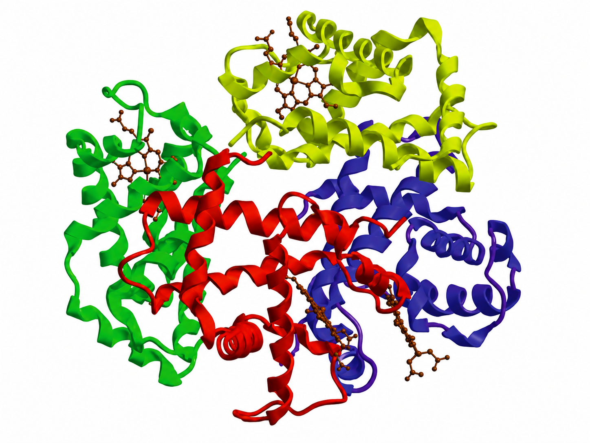

# 7. A fehérjék biológiai szerepe

A fehérjék **aminosavakból** felépülő polimerek; a legtöbb fehérje 50–200 aminosavból áll. **20 fajta α-aminosav** építi fel a természetes fehérjéket. Az aminosavak **peptidkötéssel** (–CO–NH–) kapcsolódnak: két aminosav között víz lép ki (kondenzáció).

**Aminosavak szerkezete és csoportosítása**

- Az **α-aminosav** központi szénatomján négy csoport: aminocsoport (–NH₂), karboxilcsoport (–COOH), hidrogén és **változatos oldallánc (R)**.
- Az oldallánc alapján: **apoláris** (alanin, valin, leucin), **poláris semleges**, **savas** (Asp, Glu) és **bázikus** (Lys, Arg, His) aminosavak; külön a **kéntartalmúak** (cisztein, metionin).
- A 20-ból **9 esszenciális** – az emberi szervezet nem tudja előállítani, táplálékkal kell felvenni; az állati eredetű fehérjék arányuk miatt teljes értékűek.

**A fehérjék szerkezeti szintjei**

- **Elsődleges:** az aminosavak **sorrendje** a polipeptidláncban (genetikailag meghatározott).
- **Másodlagos:** a peptidlánc gerincén **hidrogénkötések** szabályos térszerkezetet alakítanak ki – **α-hélix** (csavart) és **β-redő** (összerakott szalagok); a β-kanyar köti össze a szakaszokat.
- **Harmadlagos:** az **oldalláncok közötti** kölcsönhatások (diszulfid-híd S–S, ionos kötés, hidrogénkötés, hidrofób kölcsönhatás) hozzák létre a fehérje térbeli, **globuláris vagy fonálszerű** alakját.
- **Negyedleges:** több polipeptidlánc kapcsolódik egy működő egységgé (pl. **hemoglobin**: 4 alegység).

**Alak szerinti csoportosítás**

- **Fonálszerű (rostos) fehérjék:** vízben nem oldódnak; pl. **keratin** (haj, köröm), **kollagén** (kötőszövet), **fibrin** (véralvadás), **miozin** (izom).
- **Globuláris fehérjék:** vízben oldhatók; pl. **albumin** (vérplazma, fehérjeszállítás), **hemoglobin** (O₂-szállítás), enzimek, ellenanyagok.

**Denaturáció és koaguláció**

- A térszerkezet (a másodlagos, harmadlagos, negyedleges) **visszafordíthatatlan** megszűnése; az elsődleges szerkezet megmarad. A fehérje **elveszti működését**.
- Kiváltó hatások: **hő** (pl. tojásfehérje sütés), **erős sav/lúg**, **nehézfém-ionok**, **szerves oldószerek (alkohol)**, mechanikai (rázás).
- **Koaguláció:** a denaturált fehérjék összeállása szilárd csapadékká.

**Biológiai szerepek**

- **Enzimek** (biokatalizátorok), **szabályozó hormonok** (inzulin, glukagon), **antitestek** (immunvédelem), **receptorok**, **transzporterek** (Na/K-pumpa).
- **Szállítás** (hemoglobin, albumin), **mozgás** (aktin–miozin), **váz/szerkezet** (keratin, kollagén), **tartalék-tápanyag** (kazein, ovalbumin), **véralvadás** (fibrin), **alvadásgátlás**, **sejtfelismerés** (membránfehérjék).

---

## Ábra

*A hemoglobin négy alegysége (2 α- és 2 β-lánc) – a fehérjék negyedleges szerkezetének klasszikus példája. A vörös, kék, zöld, sárga színek a négy különálló polipeptidláncot jelölik; a barna porfirinvázba ágyazott vasion az oxigén megkötésére szolgál (hem-csoport).*

---

*Az anyag az 1. tankönyv 61, 62, 63, 64, 65. oldalain található.*
