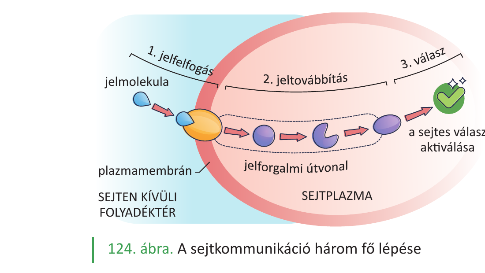
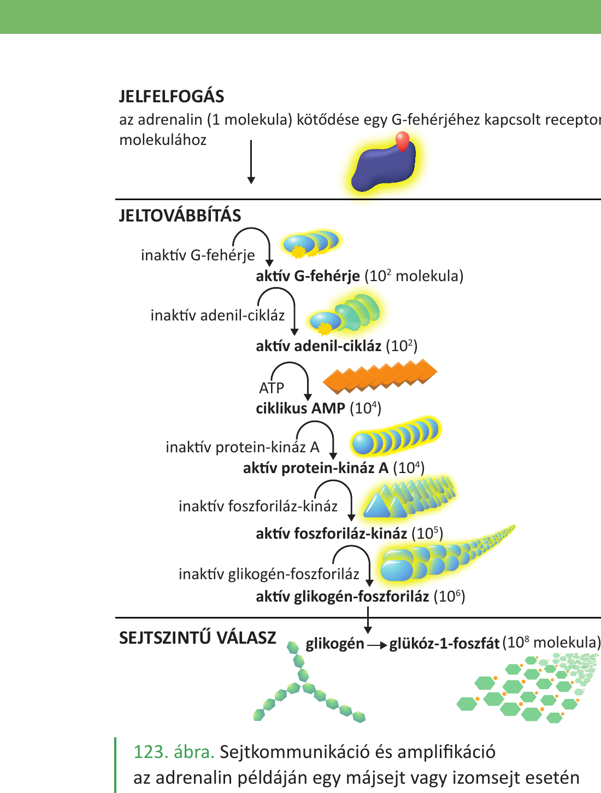
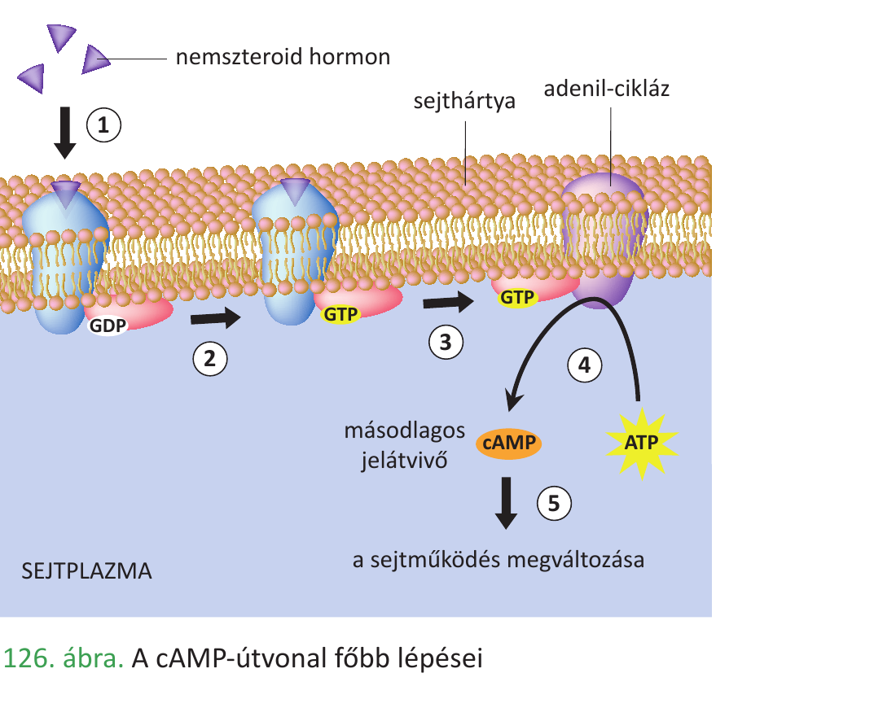
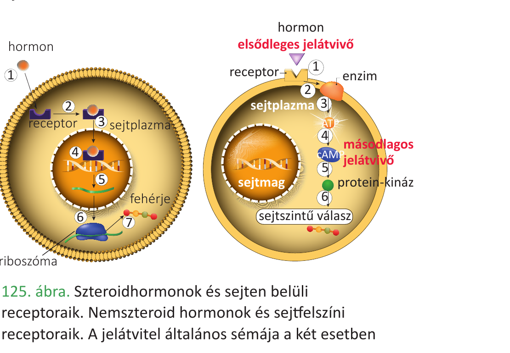

# 9. Enzimműködés, enzimgátlás, jelátvitel

## Enzimműködés

Az **enzimek biokatalizátorok**: élő sejtek által termelt, túlnyomórészt **globuláris fehérjék**, amelyek a biokémiai reakciók **aktiválási energiáját csökkentik**, így gyorsítva a reakciót, de a saját szerkezetük változatlan marad. Egyetlen sejtben több ezer enzim működik.

- **Aktív centrum:** a fehérje egy zsebszerű része, ahova a **szubsztrát** (átalakuló molekula) bekötődik. Bekötés modellje: korábban **kulcs-zár modell**, ma elfogadott az **indukált illeszkedés** – a szubsztrát kötődéskor finoman alakítja az aktív centrum formáját.
- **Enzim–szubsztrát-komplex** → termékek; az enzim újra felhasználható.
- **Specifikusság:** minden enzim adott szubsztrátot vagy szubsztrátcsoportot ismer fel.
- **Optimum:** a működés függ a **hőmérséklettől** (kb. 37 °C az emberben; magasabb hő denaturál), a **pH-tól** (pl. pepszin pH ~2, tripszin pH ~8), a **szubsztrát- és enzimkoncentrációtól**.
- Sok enzimnek **kofaktor**ra van szüksége: lehet **fémion** (Mg²⁺, Zn²⁺, Fe²⁺) vagy szerves **koenzim** (NAD⁺, NADP⁺, FAD, ATP – sok vitamin koenzim szerepű, pl. B-vitaminok).

## Enzimgátlás

- **Kompetitív gátlás:** a gátló molekula a szubsztráthoz hasonló alakú, az aktív centrumért **versenyez** a szubsztráttal. A gátlás **több szubsztráttal feloldható**.
- **Nemkompetitív gátlás:** a gátló az enzim egy másik helyére kötődik, **megváltoztatja a térszerkezetet**, így az aktív centrum sem fogadja be a szubsztrátot. Több szubsztráttal **nem oldható fel**.
- **Visszacsatolásos szabályozás:** a végtermék gyakran az anyagcsereút első enzimét gátolja (negatív visszacsatolás).
- **Denaturáció:** hő, pH-eltolódás, nehézfém-ion → szerkezet sérül → enzim végleg leáll.
- **Példák:** enzimhiányos betegségek – **laktóz-érzékenység** (laktáz hiány), **fenilketonúria** (PKU, fenilalanin-hidroxiláz hiány).

## Jelátvitel (sejtek közötti kommunikáció)

A sejtek kémiai jelmolekulákkal kommunikálnak: **hormonok** (endokrin), **citokinek** (parakrin/autokrin), **neurotranszmitterek**, **feromonok**.

A jelátvitel **három fő lépésből** áll:

1. **Jelfogás:** a jelmolekula (1. hírvivő) köt a **receptorhoz**. Lehet **membránreceptor** (pl. peptidhormonok, adrenalin – G-fehérjéhez kapcsolt) vagy **citoplazmás/sejtmagi receptor** (lipidoldékony szteroid- és pajzsmirigyhormonok).
2. **Jeltovábbítás:** **enzimkaszkád** indul – pl. adrenalin → G-fehérje → adenil-cikláz → **cAMP** (2. hírvivő) → protein-kinázok foszforilálnak más enzimeket. Minden lépésnél **erősítés (amplifikáció)** történik (egy jelmolekula → milliószoros sejtszintű válasz).
3. **Sejtszintű válasz:** enzimaktivitás-, génkifejeződés- vagy ioncsatorna-változás (pl. glikogén → glükóz-1-foszfát az izomban).

Az enzimaktivitás szabályozása és a hormonális jelátvitel **közös elven** működik: a fehérjék térszerkezetét reverzibilisen módosítják (foszforilálás, kötődés).

---

## Ábrák

*A sejtkommunikáció három fő lépése sematikusan: jelfogás (receptor + jelmolekula) → jeltovábbítás (jelforgalmi útvonal a sejtplazmában) → sejtszintű válasz aktiválása.*

*Az adrenalin példáján: 1 hormon molekula → 100 G-fehérje → 100 adenil-cikláz → 10 000 cAMP → 10 000 protein-kináz A → 100 000 foszforiláz-kináz → 1 000 000 aktív glikogén-foszforiláz molekula. Minden lépésnél nagy amplifikáció történik.*

*A cAMP mint másodlagos hírvivő: a membránreceptorhoz kötődő nemszteroid hormon → G-fehérje (GDP↔GTP) → adenil-cikláz → ATP-ből cAMP keletkezik → kaszkád → sejtműködés megváltozása.*

*Két jelfogási típus: a nemszteroid (vízoldékony) hormonok a sejtfelszíni receptorhoz kötődnek és kiváltják a másodlagos hírvivőt; a szteroid (lipidoldékony) hormonok átjutnak a membránon és sejten belüli receptorhoz kötve közvetlenül génkifejeződésre hatnak.*

---

*Az anyag az 1. tankönyv 34, 35, 36, 37, 100, 101, 102. oldalain található.*
