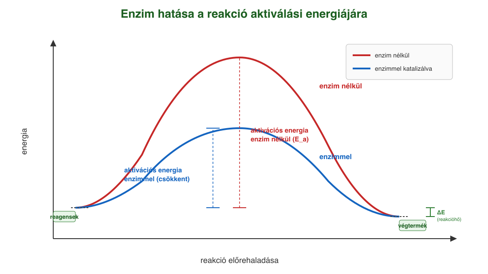
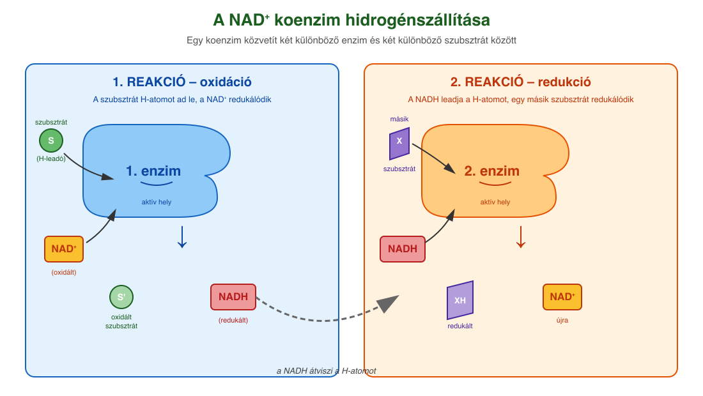
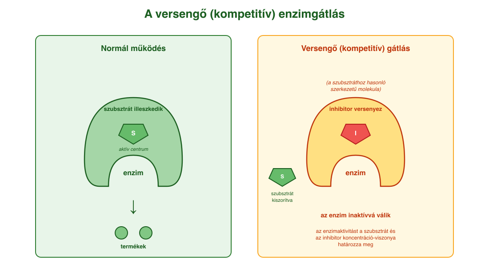

# 10. Enzimek

## Az enzimek felépítése és szerepe

A kémiai reakciók feltétele, hogy a reagáló anyagok részecskéi (atomok, molekulák) **ütközzenek**. Adott hőmérsékleten a részecskék rendezetlen mozgást végeznek (hőmozgás), mozgási sebességük egyenesen arányos a hőmérséklettel. A kémiai kötések felszakításához és új kötések kialakításához energia szükséges – ezt az energiagátat **aktiválási energiának** (Eₐ) nevezzük. Laboratóriumi körülmények között a hőmérséklet növelésével lehet ezt biztosítani, élő szervezetekben azonban a 37 °C körüli testhőmérsékleten **nem áll rendelkezésre annyi energia**, amennyi a kötések felszakításához kellene – a biokémiai reakciók maguktól nem mennének végbe. Ennek ellenére a reakciók zavartalanul lejátszódnak, mert az élőlényekben **biokatalizátorok**, az **enzimek** működnek.

Az enzimek olyan, **elsősorban globuláris fehérjék**, amelyek a biokémiai reakciókat oly mértékben **felgyorsítják**, hogy azok a testünk hőmérsékletén is megfelelő sebességgel mennek végbe. Ezt úgy érik el, hogy a reakció számára **alacsonyabb aktiválási energiájú új utat nyitnak**. Saját szerkezetük közben változatlan marad, így az enzim **újra felhasználható**.

## Aktív centrum és szubsztrát

Az enzim felületén egy zsebszerű hely található – ez az **aktív centrum** (kötőzseb) –, ahova az átalakuló anyag, a **szubsztrát** bekötődik. Az enzimek **reakcióspecifikusak** és **fajlagosak**: minden enzim csak meghatározott szubsztrátot ismer fel, mivel a kötőzseb felépítése specifikus, szerkezete kiegészítő (komplementer) a szubsztrátéval.

- **Kulcs-zár modell:** a szubsztrát úgy illeszkedik az aktív centrumba, mint a kulcs a zárba. Merev struktúrát feltételez.
- **Indukált illeszkedés:** a szubsztrát bekötése **módosítja az enzim szerkezetét**, és ezzel növeli a katalitikus aktivitását is.

Az **enzim–szubsztrát-komplex** átalakulása után termékek keletkeznek, az enzim pedig változatlanul visszanyeri eredeti formáját.

## Az enzimaktivitás és környezeti tényezők

Az **enzimaktivitás** megmutatja, hogy adott idő alatt adott mennyiségű enzim mennyi szubsztrátot képes átalakítani. Az aktivitás függ:

- **Hőmérséklet:** kis emelkedés gyorsít, de **41 °C felett** a fehérje térszerkezete annyira megváltozik, hogy az enzim képtelen ellátni feladatát – ezért a magas láz életveszélyes. Ez a **denaturáció**, általában visszafordíthatatlan.
- **pH (kémhatás):** minden enzimnek van **optimális pH**-ja. A pH-eltolódás megváltoztatja a fehérje töltésviszonyait, és felszakítja a polipeptidláncot stabilizáló kötéseket.
- **Ionkoncentráció.**
- **Nehézfém-ionok** (Pb²⁺, Hg²⁺) és mechanikai hatások szintén denaturálhatják az enzimet.

## Enzimgátlás

Az enzimaktivitás mértékét csökkentő anyagokat **inhibitoroknak** (enzimgátlóknak) nevezzük. Az inhibitoroknak többféle típusát ismerjük. Egyik csoportjuk a **versengő (kompetitív) inhibitorok**, melyek a szubsztráthoz hasonló szerkezetük révén képesek bekötődni az enzim aktív centrumába, elfoglalva azt. Amennyiben inhibitor jelen van, az enzim képtelen a szubsztrát megkötésére, inaktívvá válik. Az enzimaktivitás mértékét a szubsztrát-, illetve az inhibitor-koncentráció viszonyai határozzák meg, ezek versengenek az aktív centrumban való megkötődés lehetőségéért. Az enzimek csak átmenetileg vesznek részt a reakcióban, maradandó változást nem szenvednek, újra felhasználhatók.

## Egyszerű és összetett enzimek; kofaktorok

- **Egyszerű enzimek** csak aminosavakból épülnek fel.
- **Összetett enzimek** működéséhez egy **nem fehérjetermészetű kiegészítő alkatrész**, a **kofaktor** is szükséges.

A kofaktorok típusai:

- **Prosztetikus csoport:** szorosan, **kovalensen** kötődik az enzimhez, eltávolítása az enzim biológiai funkciójának megszűnésével jár. Többnyire **fémion** (Cu²⁺, Zn²⁺, Fe²⁺), amely az aktív centrum térszerkezetéhez szükséges.
- **Koenzim:** olyan **nem fehérjetermészetű vegyület** – kofaktor –, amely **lazán, reverzibilisen** kötődik az enzimekhez. Többnyire **nukleotidszármazék**. A koenzimek általában **szállítómolekulák**, a szubsztrátok közötti **csoportátviteli reakciókban** szerepelnek, mint pl. a **NAD⁺**, **NADP⁺**, melyek hidrogénatomok átvitelében játszanak szerepet. A koenzimek felépítésében gyakran vesznek részt **vitaminjellegű csoportok**, ezért a vitaminhiány gátolja a koenzimek felépülését. A NAD⁺ felépítésében például a **B₃-vitamin** vesz részt.

A **NAD⁺ mint hidrogénszállító koenzim** működése két lépésben zajlik: az 1. enzim a szubsztráttal (elektron-leadó) és a koenzim **oxidált formájával (NAD⁺)** reagál, eközben a koenzim redukálódik (**NADH** keletkezik). Ezután a NADH a 2. enzimhez kötődve **elektronfelvevő szubsztrátot** redukál, így a koenzim **újra NAD⁺-szá oxidálódik**. A két reakcióban két különböző enzim vesz részt.

## Enzimek példái az anyagcserében

- **Na⁺-K⁺ pumpa (ATP-áz):** az állati sejtek legfontosabb ionpumpája. 1 ATP hidrolízisével **3 Na⁺-t pumpál ki** és **2 K⁺-t visz be** a sejtbe; energiaigényes, mert az ionmozgások a koncentrációgradiensekkel ellentétesek.
- **Miozin:** izomszövetek ATP-bontó enzime. A felszabaduló energia a fehérjefonalak elcsúszását, vagyis az **izom-összehúzódást** hajtja.
- **ATP-szintázok:** olyan enzimek, amelyek a különféle folyamatokban felszabaduló energiát képesek ATP előállítására fordítani. Az ATP a lebontó anyagcsere során keletkezik, pl. a glikolízisben, illetve a terminális oxidációban. A terminális oxidáció egy elektronszállító rendszer működésével valósul meg, mely a mitokondriumok belső membránjában található.

## Enzimhiányos emberi betegségek

Sok betegség hátterében egy adott **enzim hiánya vagy elégtelen működése** áll:

- **Tejcukor-érzékenység (laktózintolerancia):** a **laktáz** enzim hiányában a laktóz a vékonybélben nem tud monoszacharidokká bomlani, így nem szívódik fel, és a vastagbélbe kerülve különféle problémákat okoz. A vastagbélbe kerülő laktóz erősen növeli a béltartalom ozmotikus koncentrációját, szívóerejét, miáltal csökkenti a vízfelszívódás mértékét, továbbá a vastagbélben zajló bakteriális erjedés következtében különféle szerves savak és gázok (H₂, CO₂) keletkeznek, melyek erőteljesen fokozzák a bélperisztaltikát. Mindezek eredményeképpen a széklet jelentősen hígul, ami a hasmenés elsődleges oka. A tünetek mértékét a laktózbevitel csökkentésével (pl. laktózmentes tejtermékek fogyasztásával) lehet mérsékelni.
- **Fenilketonúria (PKU):** autoszómás, recesszíven öröklődő betegség. A **fenilalanin-hidroxiláz** enzim hiánya miatt a fenilalanin nem alakul tirozinná, hanem **mérgező anyagcseretermékek** halmozódnak fel a vérben → idegrendszeri károsodás, értelmi fogyatékosság. Kezelése a fenilalaninszegény diéta.

---

## Ábrák

*Egy reakció energiadiagramja enzim nélkül (piros görbe) és enzimmel (kék görbe). Az enzim alacsonyabb aktiválási energiájú új reakcióutat nyit; a reagensek és a végtermék energiája, valamint az összes leadott energia ugyanaz – csak gyorsabban éri el a rendszer az egyensúlyt.*

*A NAD⁺ mint hidrogénszállító koenzim. 1. reakció: az 1. enzim a szubsztrátról hidrogént vesz el, az oxidált koenzim (NAD⁺) redukálódik NADH-vá. 2. reakció: a NADH a 2. enzimhez kötődve átadja a hidrogént egy másik szubsztrátnak, és visszaalakul NAD⁺-szá. Két különböző enzim, egy közös koenzim közvetít közöttük.*

*Bal oldalon a normál enzim-szubsztrát kapcsolódás: a szubsztrát illeszkedik az aktív centrumba, és termékek keletkeznek. Jobb oldalon a versengő (kompetitív) gátlás: az inhibitor a szubsztráthoz hasonló szerkezetű, ezért képes bekötődni az aktív centrumba, és elfoglalja azt; a szubsztrát kiszorul, az enzim inaktívvá válik. Az enzimaktivitást a szubsztrát- és az inhibitor-koncentráció viszonya határozza meg.*

---

*Az anyag az 1. tankönyv 34, 35, 36, 37. oldalain található.*
