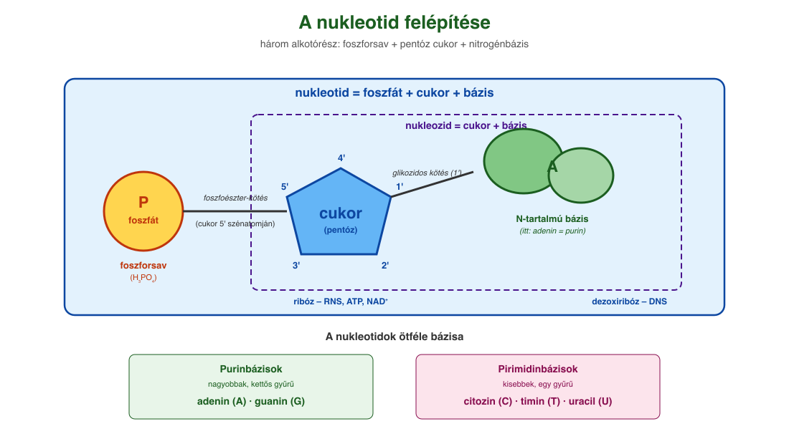
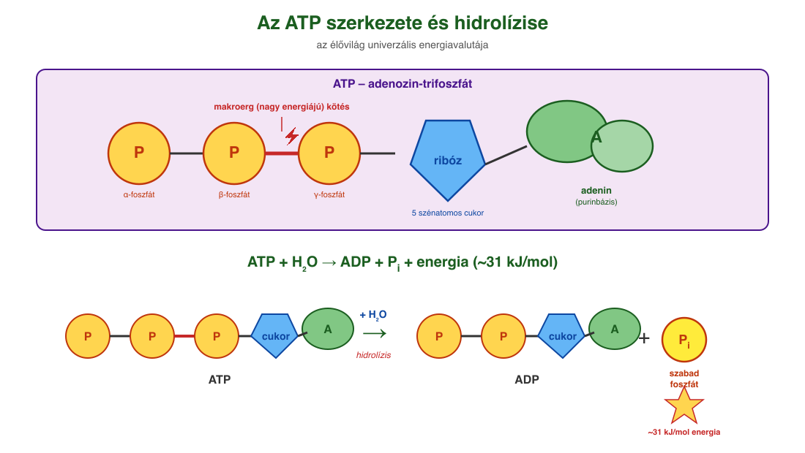
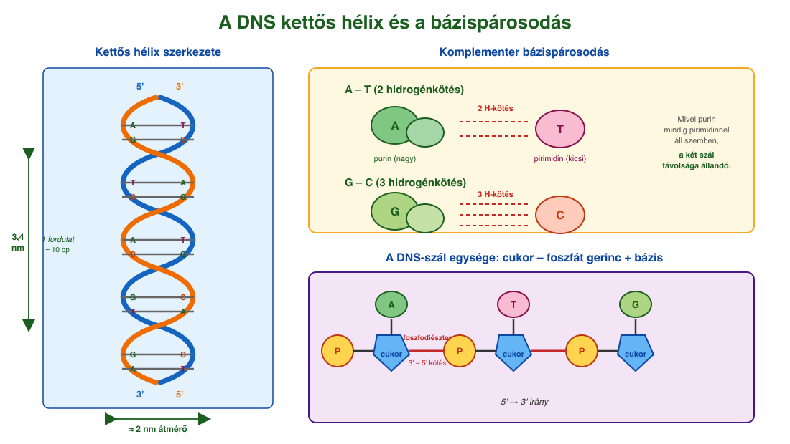

# 11. Nukleotidok

## Felépítés: három alkotórész

A **nukleotidok** három alapegységből felépülő szerves molekulák. Három alkotórészük:

1. **Foszforsav** (H₃PO₄) – egy vagy több foszfátcsoport.
2. **Öt szénatomos monoszacharid (pentóz):** **ribóz** (C₅H₁₀O₅) vagy **dezoxiribóz** (C₅H₁₀O₄). A dezoxiribóz a 2' szénatomján OH helyett csak H-t tartalmaz.
3. **Nitrogéntartalmú szerves bázis**, amely lehet:
    - **Purinbázis** (nagyobb, kettős gyűrű): **adenin (A)**, **guanin (G)**.
    - **Pirimidinbázis** (kisebb, egyszeres gyűrű): **citozin (C)**, **timin (T)**, **uracil (U)**.

A bázis és a cukor **glikozidos kötéssel** (kondenzációval, víz kilépése közben) kapcsolódik – ez a **nukleozid**. A nukleozid cukoregységének 5' szénatomjához egy **foszforsav-maradék** kondenzál **foszfoészter-kötéssel** – így keletkezik a **nukleotid** (nukleozid-monofoszfát).

A bázis gyűrűatomjait számokkal (1, 2, 3...), a cukoregység szénatomjait pedig vesszős számokkal (1', 2', 3', 4', 5') jelöljük, hogy elkülönítsük őket. A DNS-ben a 2' szénatomon **H** áll, az RNS-ben **OH**.

## Egyszerű nukleotidok – koenzimek

Egy vagy két nukleotidegységből és egyéb csoportokból felépülő molekulák. Általában **koenzimek**: enzimekhez **lazán, reverzibilisen** kötődnek, csoportokat (foszfátot, hidrogént, acetilt) szállítanak. Fő képviselők: **ATP, NAD⁺, NADP⁺, FAD, koenzim-A**.

### ATP (adenozin-trifoszfát)

Az **élővilág univerzális energiavalutája**. Felépítése: **adenin** + **ribóz** + **három, sorba kapcsolódó foszfátcsoport**. Az egymást követő foszfátok között **foszfoanhidrid-kötés**, ún. **makroerg (nagy energiájú) kötés** található. Az ATP-t fotoszintézis, a biológiai oxidáció és az erjedés állítja elő.

Az ATP **közvetlen energiaforrás** az endoterm reakciókhoz:

- **ATP + H₂O → ADP + foszfát** (ΔG ≈ −31 kJ/mol)
- **ATP + H₂O → AMP + PPᵢ** (ΔG ≈ −38 kJ/mol)

Az ATP-aktiváció mechanizmusa: az ATP terminális foszfátcsoportja **átkerül** egy enzim segítségével az egyik reagensre → **nagy energiatartalmú köztitermék** keletkezik → ez már a másik kiindulási anyaggal **energetikailag kedvezően** reagál. Példa: **glutaminsav + NH₃ → glutamin** (önmagában endoterm, de ATP-aktivációval kedvezővé válik).

### NAD⁺ és NADP⁺ (nikotinsavamid-adenin-dinukleotid, illetve foszfát)

Két nukleotidegységből álló molekulák, amelyek **két foszfátcsoportnál** kapcsolódnak össze. Egyik bázisuk az **adenin**, a másik a **nikotinsavamid** (B₃-vitaminból). A NADP⁺ abban különbözik a NAD⁺-tól, hogy a ribóz 2' szénatomjához egy **plusz foszfátcsoport** kapcsolódik.

**Funkciójuk: hidrogén- és elektronátvivő koenzimek.**

- A szerves vegyületek oxidációja során leadott **2 elektron + 1 H⁺** felvételére (redukcióra) alkalmasak: **NAD⁺ + 2H⁺ + 2e⁻ ⇌ NADH + H⁺**.
- **NAD⁺ → NADH**: oxidálószer a **lebontó** folyamatokhoz (pl. biológiai oxidáció).
- **NADP⁺ → NADPH**: redukálószer a **felépítő** folyamatokhoz (pl. zsírsavszintézis, koleszterinszintézis, fotoszintézis sötét szakasza).
- A sejtben a NAD⁺/NADH arány magas (sok oxidált forma) – mert oxidáláshoz kell. A NADP⁺/NADPH arány alacsony (sok redukált forma) – mert redukáláshoz kell.

### Koenzim-A (koA)

Egyszerű nukleotid: **adenintartalmú nukleotid** + szerves molekularész (pantoténsav-származék, B₅-vitamin). A molekula végén egy **szulfhidrilcsoport (–SH)** található, ehhez kötődik az **acetilcsoport (CH₃CO–)**. A kötés **nagy energiájú**, felbomlása energetikailag kedvező. A koenzim-A a **cukrok lebontásához** és a **zsírsavak fel- és lebontásához** szükséges (acetil-csoport „építőkövek” szállítása).

## Nukleinsavak

A nukleinsavak nukleotidegységek **foszfátcsoportjaikon keresztül** összekapcsolódó polimerei. Egy nukleotid foszfátcsoportja egy **másik ribóz vagy dezoxiribóz 3' szénatomjához** kapcsolódik **foszfodiészter-kötéssel**, így hosszú lánc jön létre.

### DNS (dezoxiribonukleinsav)

- Cukoregység: **dezoxiribóz**.
- Bázisok: **A, T, G, C** (uracil nincs).
- A láncgerincet a cukor- és foszfátegységek adják (egyforma), a változó részt a hozzájuk kapcsolódó négy különböző bázis. A **bázisok sorrendje hordozza a genetikai információt**.
- **Kettős hélix**: két, egymással ellentétes lefutású szál csavarodik egymás köré (jobbmenetes spirál). A két szál **komplementere egymásnak**: **A–T** és **G–C** bázispárok között **hidrogénkötések** alakulnak ki. Mivel egy purinnal mindig pirimidin áll szemben, a két szál távolsága állandó.
- Méretek: átmérő ≈ **2 nm**, egy fordulat ≈ 3,4 nm és 10 bázispárt tartalmaz (egy bázispár ≈ 0,34 nm).
- **5'- és 3'-vég**: a szabad foszfátot hordozó vég az 5'-vég, a szabad OH-csoportot tartalmazó az 3'-vég. A két szál egymással **antiparalel**.

### RNS (ribonukleinsav)

- Cukoregység: **ribóz** (a 2' szénen OH).
- Bázisok: **A, U, G, C** (timin helyett **uracil**).
- **Egyszálú** (a fehérjeszintézis részleteit a 69. tétel tárgyalja).

A DNS őrzi a genetikai információt, az RNS-ek a fehérjeszintézis során közvetítik és kivitelezik ezt az információt. Az egyszerű nukleotidok (ATP, NAD⁺, koA) ezzel szemben **energetikai és csoportszállító feladatokat** látnak el – a nukleotidok tehát egyaránt **információhordozók és anyagcsere-közvetítők**: kétféle, de szervesen összefüggő szerep ugyanazokból az építőkövekből.

---

## Ábrák

*A nukleotid három alkotórésze: foszforsav (sárga), pentóz cukor (kék – ribóz vagy dezoxiribóz) és nitrogéntartalmú bázis (zöld – itt adenin). A cukor 1' szénatomján glikozidos kötéssel a bázis, az 5' szénatomján foszfoészter-kötéssel a foszfát kapcsolódik. A nukleozid csak a cukorból és a bázisból áll, a nukleotid ehhez kapcsolja a foszfátot. A vesszős számozás (1'–5') a cukoré, a sima számozás (1–9) a bázisé.*

*Az ATP felépítése: adenin (zöld) + ribóz (kék) + három foszfátcsoport (P-P-P, sárga). A foszfátok között foszfoanhidrid-kötések vannak; a két utolsó kötés makroerg (nagy energiájú), villámmal jelölve. Hidrolíziskor (ATP + H₂O) az utolsó foszfát leszakad, ADP és szabad foszfát keletkezik, és kb. 31 kJ/mol energia szabadul fel, ami az endoterm sejtfolyamatokat hajtja.*

*A DNS kettős spirál szerkezete. A két szál antiparalel: az egyik 5' → 3', a másik 3' → 5' irányú; a láncgerincet a cukor (kék) – foszfát (sárga) egységek adják. A két szál között hidrogénkötések kapcsolják össze a komplementer bázispárokat: A–T két, G–C három hidrogénkötéssel. Mivel purin (A, G) mindig pirimidinnel (T, C) áll szemben, a szálak távolsága állandó, ≈ 2 nm. Egy teljes fordulat 3,4 nm hosszú és 10 bázispárt tartalmaz.*

---

*Az anyag az 1. tankönyv 66, 67, 68, 69. oldalain található.*
