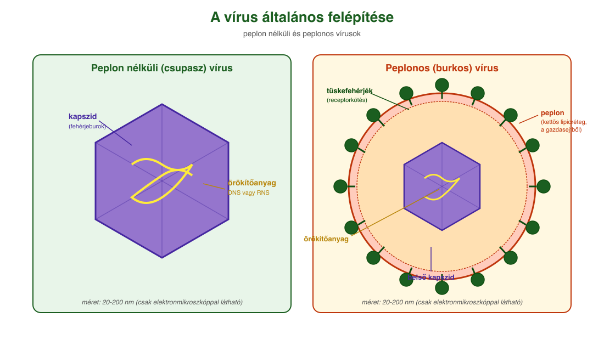
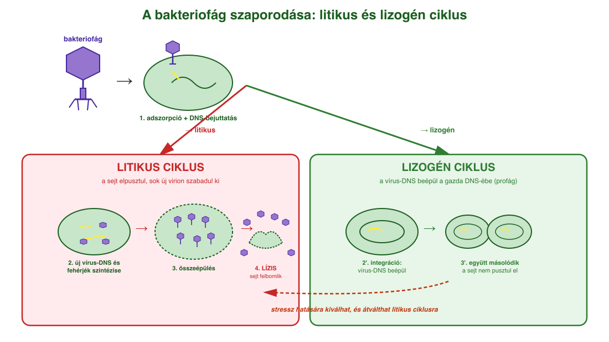
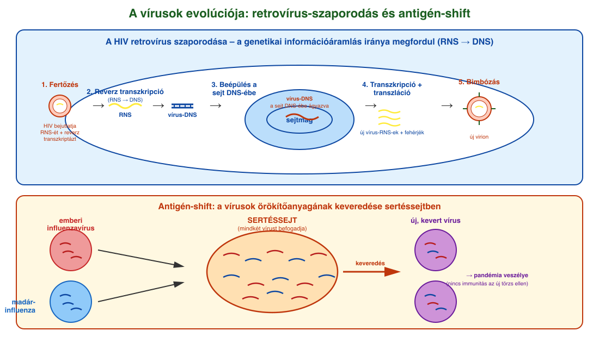

# 12. Vírusok

## Általános jellemzés

A vírusok **nem élőlények**, hanem sejtekből kiszabadult genetikai fertőző ágensek. Négy fő tulajdonság alapján különböznek az élővilágtól:

- **Nem sejtes felépítésűek.** Alapvetően egy örökítőanyagból (DNS vagy RNS) és az azt körülvevő fehérjeburokból (**kapszid**) épülnek fel. Szerkezetük rendkívül szabályos, többjük kristályos formában akár évekig változatlanul fennmarad. Néhány vírust egy **peplon** nevű membrán (a gazdasejtből származó kettős lipidréteg) is körülveszi.
- **Nincs önálló anyagcseréjük és szaporodásuk.** Az alapvető életfunkciókhoz (anyagcsere, szaporodás) be kell jutniuk egy élő sejtbe (**gazdasejt**), és annak anyagait, energiáját használják fel ahhoz, hogy újabb vírusok jöjjenek létre. Eközben a gazdasejt rendszerint elpusztul.
- **Sejtparaziták.** A baktériumokkal ellentétben sejten kívül **nem mutatnak életjelenségeket**, élettelen táptalajon nem tenyészthetők. A sejten kívüli, életjelenséget nem mutató vírus neve **virion**.
- **Nanométeres méretűek** (pl. az influenza kórokozója 80–200 nm átmérőjű), így **csak elektronmikroszkóppal láthatók**, fénymikroszkóppal nem.

A vírusok megfertőzhetik az élet minden sejtformáját: a baktériumokat (a baktériumokat fertőző vírusokat **bakteriofágoknak**, röviden fágoknak nevezzük), az ősbaktériumokat és az eukariótákat (gombák, növények, állatok) egyaránt.

## A vírusfertőzés folyamata

A folyamat lépései általánosan:

1. **Adszorpció:** a vírus felismeri a gazdasejtet és hozzákapcsolódik. A felismerés a sejt receptorai révén történik – a vírusfelszíni fehérjék utánozzák a sejtben természetesen megtalálható receptorok ligandumait. A sejtfelszíni glikoproteinek és glikolipidek sziálsavai például az influenzavírus receptorai. A SARS-CoV-2 koronavírus a humán **ACE₂-receptorhoz** kötődik (amely eredetileg a vérnyomáscsökkentésben vesz részt).
2. **Penetráció:** a vírus enzimekkel feloldja a gazdasejt burkát, és bejuttatja az örökítőanyagát. A fehérjeburok (kapszid) sok esetben **kívül marad**. Egyes vírusok teljes egészben bejutnak (endocitózis), és a sejten belül vetik le burkukat.
3. **Dekapszidáció:** ha a teljes vírus jutott be, megszabadul a kapszidtól, hogy az örökítőanyag hozzáférhetővé váljon a replikációhoz.
4. **Makromolekulák szintézise:** a gazdasejt enzimei és riboszómái új vírus-örökítőanyagot és vírusfehérjéket állítanak elő. Ehhez különböző replikációs, transzkripciós és transzlációs stratégiákra van szükség attól függően, hogy DNS- vagy RNS-vírus, és hogy a replikáció a sejtmagban vagy a citoplazmában játszódik le.
5. **Összeépülés és kiszabadulás (lízis):** a vírusrészecskék összeállnak, és a sejt felbomlásával vagy a sejthártyával együtt (peplonos vírusoknál) szabadulnak ki.

## Litikus és lizogén ciklus

A bakteriofágok két alapvetően eltérő stratégia szerint szaporodnak:

- **Litikus ciklus:** a gazdasejt enzimei másolatokat készítenek a vírus DNS-éről és a vírusfehérjékről, a vírusok összeszerelődnek. A gazdasejt elpusztul (**lízis**), és több száz új virion szabadul ki, amelyek új gazdasejteket fertőznek meg.
- **Lizogén ciklus:** a vírus DNS-e beépül a gazdasejt DNS-ébe (**profág** állapot), és minden sejtosztódáskor együtt másolódik a gazda örökítőanyagával. Évekig csendben maradhat. Esetenként (pl. stresszhatásra) a vírus-DNS kiválik, és **beindítja a litikus ciklust**.

Az embert és állatokat fertőző vírusok szaporodási ciklusa részben hasonlít ehhez, részben eltér. Pl. a **herpeszvírus** DNS-e az emberi sejt DNS-ébe beépülve nyugalmi állapotban maradhat, és fizikai (UV-fény) vagy érzelmi stressz hatására aktiválódik újra.

## A retrovírusok és az AIDS

A **HIV** (Human Immunodeficiency Virus) **retrovírus**: RNS-genomot tartalmaz, **peplonja van**, és a szaporodása során **megfordul a genetikai információ áramlásának szokásos iránya** (DNS → RNS helyett **RNS → DNS**). A vírus magával hozza a **reverz transzkriptáz** enzimet, amely a vírus RNS-éről DNS-t ír át, majd ez a DNS beépül a gazdasejt DNS-ébe. Innen a sejt saját RNS-polimeráza írja át, vírusfehérjék készülnek, és új virionok bimbóznak ki a sejthártyával együtt.

A HIV az **immunrendszer sejtjeit támadja meg**, ezzel **szerzett immunhiányos** állapotot (AIDS-et) okoz, amelyben a szervezet más kórokozókkal szemben is védtelenné válik.

## A vírus okozta sejtkárosodás és védekezés

A közvetlen károsodás okai: a sejt energiájának felhasználása, a sejt saját makromolekuláris szintézisének leállása, a vírus-genom beépüléséből származó mutációk, a gyulladásos válasz (citokinvihar). Egyes vírusok (EBV, HPV) **daganatkeltőek** lehetnek (onkogén vírusok).

A sejt egyik természetes védekezése az **RNS-interferencia**: ha kétszálú RNS jelenik meg (ami normális esetben nincs a sejtben), egy enzim rövid darabokra bontja, és ezekkel azonosítja és lebontja a hasonló szekvenciájú vírus-RNS-eket. Ez nemcsak vírusvédekezés, hanem a saját génkifejeződés szabályozója is – a gyógyítás eszközeként is használják (géncsendesítés, miRNS, siRNS).

## A vírusok evolúciója és változatossága

A vírusok evolúciója gyors. Két fő változatossági forrás:

- **Rekombináció (antigén-shift):** ha egy sejtbe egyszerre kétféle vírustörzs jut be (pl. sertéssejtbe emberi és madár-influenza), az örökítőanyaguk darabjai keveredhetnek. A létrejövő új vírusra az emberek nem rendelkeznek immunitással → **pandémia** veszélye.
- **Mutáció (antigéndrift):** véletlenszerű változások az örökítőanyag szekvenciájában. Az RNS-polimeráz pontatlanabb, mint a DNS-polimeráz (kb. 100 000-szer), ezért az **RNS-vírusok különösen változékonyak**. A felhalmozódó mutációk miatt a vírus antigénszerkezete annyira megváltozhat, hogy a gazdaszervezet elveszíti az eddigi immunitását.

## A vírusok ökológiai szerepe

A vírusok hatalmas szereppel bírnak az ökoszisztémák egyensúlyában: egyes becslések szerint **percenként 100 millió tonna baktérium pusztul el a Földön vírusok miatt**. Az óceáni szénforgalom egyik fő szabályozói; a feltört baktériumokból oldott szerves anyagok szabadulnak fel, amit más heterotróf baktériumok hasznosítanak. Így a vírusok közvetve növelik a nettó légzést és a tápanyagok újrahasznosítását a világóceánokban. A szén-, nitrogén- és foszforciklusok szabályozóiként is azonosították őket.

## Vírusok okozta betegségek

| Betegség | Kórokozó / fő jellemzők |
| --- | --- |
| **Influenza** | magas láz, légúti panaszok, ízületi/izomfájdalom; csepp; védőoltás |
| **COVID-19** | SARS-CoV-2; láz, köhögés, íz/szaglás elvesztése; csepp; védőoltás |
| **Kanyaró** | kiütések, foltok; szövődmények veszélyesek; csepp; MMR-oltás |
| **Bárányhimlő** | hólyagos kiütés; később övsömör; csepp; védőoltás |
| **AIDS** | HIV; immunhiányos állapot; vér, nemi váladék; nincs védőoltás |
| **Hepatitis A–E** | sárgaság, máj-károsodás; A/E széklet, B/C/D vér; védőoltás van (A, B) |
| **HPV** | szemölcs, méhnyakrák; nemi érintkezés; védőoltás |
| **Veszettség** | neurológiai tünetek, víziszony; állatharapás; védőoltás |
| **Herpesz** | hólyagok; ajakon, nemi szerveken; nincs gyógyítás |

---

## Ábrák

*A vírusok két alaptípusa: bal oldalon a peplon nélküli (csupasz) vírus, amelynek külső határa a fehérjeburok (kapszid); jobb oldalon a peplonos vírus, amelyet a gazdasejtből származó kettős lipidréteg vesz körül, benne tüskefehérjékkel (receptorkötők). Az örökítőanyag (DNS vagy RNS) a kapszidon belül helyezkedik el.*

*Bakteriofág két lehetséges szaporodási útja. Litikus ciklus (bal): adszorpció → DNS-bejuttatás → új vírusrészecskék szintézise → lízis (a sejt felbomlik, sok új vírus szabadul ki). Lizogén ciklus (jobb): a vírus DNS-e beépül a baktériumkromoszómába (profág), és minden sejtosztódáskor másolódik vele; később (pl. stresszhatásra) kiválhat és átválthat litikus ciklusra.*

*Felül: a HIV-retrovírus szaporodása. 1. A vírus RNS-ét bejuttatja a sejtbe a reverz transzkriptázzal együtt. 2. A reverz transzkriptáz RNS-ről DNS-t ír (a normál DNS → RNS irány megfordul). 3. A vírus-DNS beépül a sejt DNS-ébe. 4. A sejt saját gépezete vírus-RNS-eket és vírusfehérjéket termel. 5. Az új virionok a sejtmembránnal együtt (peplonosan) bimbóznak ki. Alul: az antigén-shift jelensége: ha egy sertéssejtet egyszerre fertőz emberi és madár-influenza vírus, az örökítőanyag-darabok keveredhetnek, és új, immunológiailag ismeretlen vírustörzs jön létre.*

---

*Az anyag az 1. tankönyv 104, 105, 106, 107. oldalain található.*
