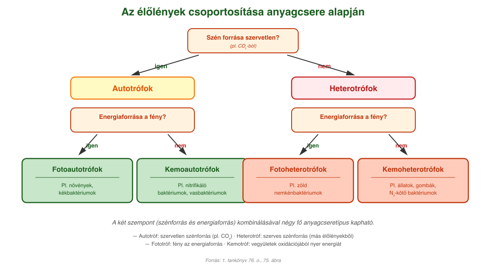
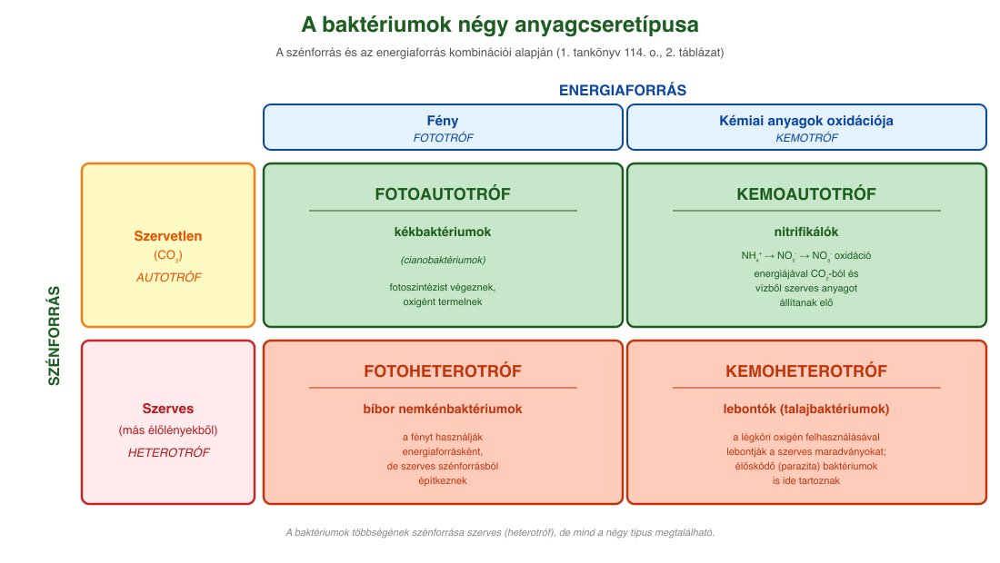

# 13. Anyagcseretípusok (szén- és energiaforrás)

## Az anyagcsere fogalma

A sejtekben az anyagok felvételéhez, leadásához, felhasználásához, átalakításához szükséges biokémiai folyamatokat **anyagcserének** nevezzük.

A felépítő anyagcsere-folyamatok során az élőlények saját, magas energiatartalmú szerves anyagaikat előállíthatják szervetlen anyagokból és szerves anyagokból is.

## Csoportosítás szénforrás szerint: autotróf és heterotróf

Az élőlényeket aszerint csoportosítjuk, hogy honnan **szerzik a szenet** a szerves anyagaik felépítéséhez:

- **Autotrófok:** azok az élőlények, amelyek **szervetlen szénforrásból** (alapvetően szén-dioxidból) is képesek saját testük szerves anyagait előállítani.
- **Heterotrófok:** más élőlények által előállított szerves anyagokat vesznek fel a környezetükből ahhoz, hogy saját szerves anyagaikat felépíthessék.

## Csoportosítás energiaforrás szerint: fototróf és kemotróf

Az élőlényeket az **energiaforrásuk** szerint is csoportosítjuk:

- **Fototrófok:** ha az élőlény a napfényt képes energiaforrásként használni.
- **Kemotrófok:** ha a vegyületek oxidációjával nyer energiát.

## A négy fő anyagcseretípus

A két szempont (szénforrás + energiaforrás) **kombinálható**: így négy fő anyagcseretípust kapunk.

- **Fotoautotrófok:** szervetlen szénforrásból dolgoznak, energiaforrásuk a fény. **Példák: növények, kékbaktériumok.**
- **Kemoautotrófok:** szervetlen szénforrásból dolgoznak, energiát kémiai anyagok oxidációjával nyernek. **Példák: nitrifikáló baktériumok, vasbaktériumok.**
- **Fotoheterotrófok:** szerves szénforrást használnak, energiaforrásuk a fény. **Példák: zöld nemkénbaktériumok.**
- **Kemoheterotrófok:** szerves szénforrást és kémiai energiaforrást használnak. **Példák: állatok, gombák, N₂-kötő baktériumok.**

## A négy típus baktériumoknál

A baktériumok között mind a négy anyagcseretípus megtalálható – a tankönyv 114. oldali 2. táblázata szerint:

| Baktérium | Szénforrás | Energiaforrás | Anyagcseretípus |
| --- | --- | --- | --- |
| **lebontók** | szerves (heterotróf) | kémiai (kemotróf) | kemoheterotróf |
| **nitrifikálók** | szervetlen (autotróf) | kémiai (kemotróf) | kemoautotróf |
| **kékbaktériumok** | szervetlen (autotróf) | fény (fototróf) | fotoautotróf |
| **bíbor nemkénbaktériumok** | szerves (heterotróf) | kémiai (kemotróf) | kemoheterotróf |

### Heterotróf baktériumok

A baktériumok többségének a szénforrása szerves, tehát **heterotróf**. Nagyon sok a **lebontó (szaprofita) szervezet** közöttük. Ilyenek például az anyagok körforgásában fontos korhadékbontó **talajbaktériumok**, amelyek a légköri oxigén felhasználásával lebontják a talajba került szerves maradványokat. Anyagcseréjük révén a talajt ásványi sókban gazdagítják, a légkörbe pedig szén-dioxidot juttatnak.

Heterotrófok az élő szervezetekben megtelepedő, azok anyagaival táplálkozó **élősködő (parazita) baktériumok** is. Minden bizonnyal ezek a legismertebbek, hiszen sok emberi kórokozó tartozik közéjük. Baktériumfertőzés következménye többek között a **Lyme-kór**, a **gümőkór** (tuberkulózis, tbc), a **tüdőgyulladás**, a **kolera**, a **szalmonella**, a **tetanusz**, a **szamárköhögés** és a **diftéria**.

A **pillangós virágú növényekkel** (bab, borsó, lucerna, lóhere) együtt élő **(szimbionta) nitrogéngyűjtő baktériumok** különleges anyagcseréjüknek köszönhetően a társnövény számára felhasználhatóvá teszik a légköri nitrogént, ugyanakkor a növény szerves tápanyagokkal látja el a baktériumokat.

### Autotróf baktériumok

A baktériumok között vannak **autotrófok** is, amelyek szénforrása szervetlen anyag (CO₂). A fotoszintetizálók színanyagaik segítségével a napfény energiáját hasznosítják a szerves anyagok előállításához, majd azok lebontásából nyernek energiát életműködéseikhez. Legjelentősebbek közöttük a **kékbaktériumok** (cianobaktériumok), amelyek fotoszintézise a magasabb rendű növényekéhez hasonlóan oxigént termel.

A **kemotrófok** a kémiai átalakulások energiáját hasznosítják szerves anyagaik egyszerű alkotórészeiből történő előállításához. Kemotróf szervezetek például a talajban élő **nitrifikáló baktériumok**, amelyek a talajban levő nitrogénvegyületeket – ammóniumionokat (NH₄⁺) nitritekké (NO₂⁻), illetve nitrátokká (NO₃⁻) – oxidálják. Ezeknek a kémiai reakcióknak az energiáját hasznosítva szén-dioxidból és vízből szerves anyagokat állítanak elő. A nitrifikáló baktériumok tehát **autotróf és kemotróf** szervezetek.

## A növények és állatok anyagcseréje

A **növények** napközben **fotoszintetizálnak** (fotoautotróf működés): szén-dioxidból és vízből, a napfény energiáját felhasználva szőlőcukrot és oxigént állítanak elő. Egyúttal **biológiai oxidációt** is végeznek (saját szerves anyagaikból nyernek energiát). Éjszaka, fény hiányában csak biológiai oxidációt folytatnak.

Az **állatok és a gombák kemoheterotróf** szervezetek: szénforrásuk és energiaforrásuk is más élőlények szerves anyagai.

---

## Ábrák

*A tankönyv 75. ábrája alapján: az élőlényeket két kérdés mentén osztályozzuk. Először a szén forrása szerint (szervetlen-e?) — ha igen, autotrófok; ha nem, heterotrófok. Ezután mindkét csoporton belül az energia forrása szerint (fény-e?) — ha igen, fototrófok; ha nem, kemotrófok. Így négy anyagcseretípus jön létre: fotoautotrófok (pl. növények, kékbaktériumok), kemoautotrófok (pl. nitrifikáló baktériumok, vasbaktériumok), fotoheterotrófok (pl. zöld nemkénbaktériumok), kemoheterotrófok (pl. állatok, gombák, N₂-kötő baktériumok).*

*A négy fő baktériumi anyagcseretípus a tankönyv 114. oldali 2. táblázata alapján. Mindegyik példáját megnevezve, és a két szempont (szénforrás, energiaforrás) szerint elhelyezve a négyzetes mátrixban.*

---

*Az anyag az 1. tankönyv 76, 113, 114. oldalain található.*
