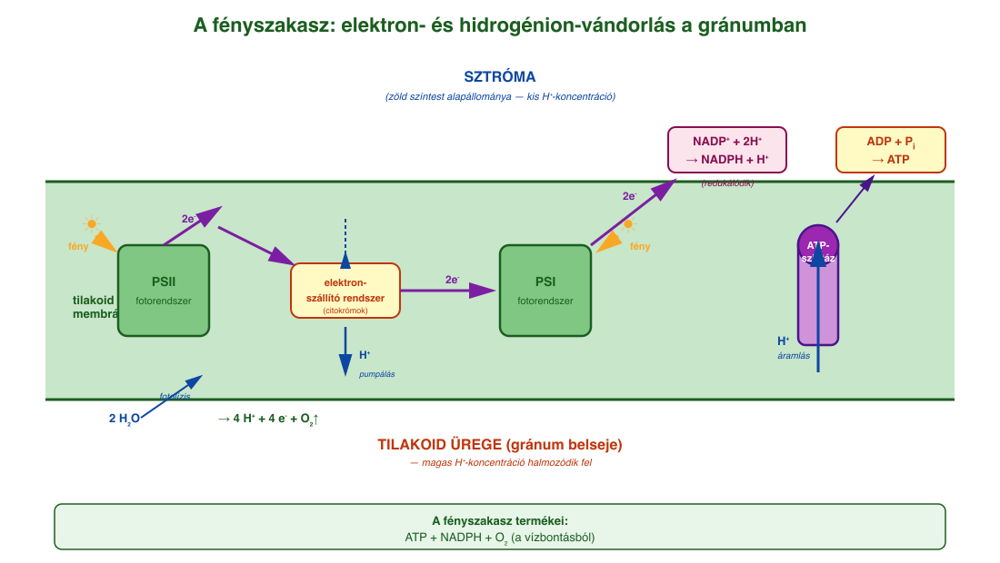
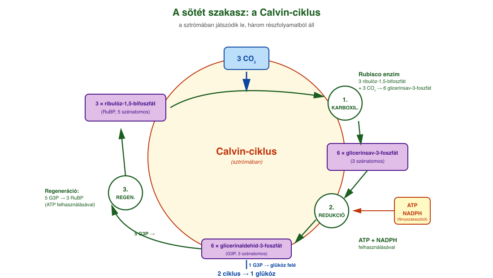
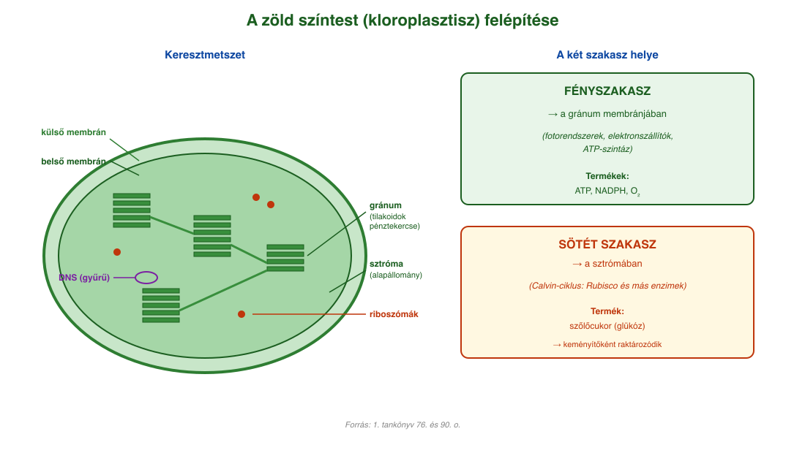

# 14. A fotoszintézis

## A fotoszintézis jelentősége

A **fotoszintézis** az egész élővilág szempontjából alapvető jelentőségű felépítő folyamat. Alacsony energiatartalmú kiindulási anyagokból (szén-dioxidból és vízből) **magas energiatartalmú, hidrogénben gazdag terméket, szőlőcukrot** képződik. A folyamat energiaigényét fényenergia biztosítja.

A zöld növények és a kékbaktériumok sejtjeiben zajló fotoszintézis az alábbi egyszerűsített egyenlettel írható le:

**6 CO₂ + 6 H₂O = C₆H₁₂O₆ + 6 O₂**

A fotoszintetizáló, autotróf élőlények (kékbaktériumok, eukarióta moszatok, növények) az életközösségek legfontosabb **termelő szervezetei**. A földtörténet korai időszakában a kékbaktériumok által több milliárd évig végzett fotoszintézis megemelte a légkör oxigéntartalmát, létrehozták az **oxidáló légkört**. Ennek következtében visszaszorultak az anaerob baktériumok, és megjelentek az oxigénes légzést folytató aerob élőlények.

A fotoszintézis során a Nap sugárzó energiájának csak töredékét (1-3%) kötik meg, de végső soron minden heterotróf szervezet az általuk létrehozott szerves anyagokkal táplálkozik. A fotoszintézis alapvető jelentőségű folyamat a **légkör összetétel**ének alakításában is, hiszen a leghatékonyabb energianyeréshez, a biológiai oxidációhoz szükséges oxigén is ennek a folyamatnak a terméke. A növények a szén-dioxid megkötése révén **széntartalmú vegyületeket** raktároznak a testükben, aminek nagyobb része a légzéssel, illetve végső lebomlásuk során visszajut a környezetbe.

## A zöld színtest (kloroplasztisz)

Eukarióta élőlényekben a fotoszintézis a **zöld színtestekben** történik. A zöld színtestet **kettős (egy külső és egy belső) membrán** határolja. A belső membrán (**tilakoid**) pénztekercsszerű feltekeredéseit **gránumoknak (szemcsék)** nevezzük. A belső membrán által határolt rész az alapállomány (**sztróma**). A sztróma tartalmazza a gyűrű alakú DNS-t és a riboszómákat is.

- A fotoszintézis **fényszakasza** a gránum membránjában levő enzimrendszeren játszódik le.
- A gránum belső tere a hidrogénionok felhalmozódásának helye.
- A **sötét szakasz** a sztrómában játszódik le.

## A fényszakasz

A fotoszintézis fényszakasza a kloroplasztisz gránumán megy végbe. A membránban enzimkomplexek sorozata található, ami a **fényenergiát befogva elektronvándorlást** idéz elő, ez pedig hidrogénionok vándorlását okozza. A **hidrogénionkoncentráció-különbség** adja az energiát az ATP-szintézishez, a nagy energiájú elektronok és hidrogénionok pedig képesek redukálni a **NADP⁺-molekulát**.

A fény befogásához **fotorendszerek (antennakomplex)** találhatók a membránban. Eukarióta növények esetében két fotorendszer található: a **fotorendszer I.** és a **fotorendszer II.** Elnevezésük a felfedezésük sorrendjét tükrözi, nem a folyamatban elfoglalt helyüket.

A fotorendszerek nagy mennyiségben tartalmaznak könnyen gerjeszthető elektronokkal rendelkező **karotinoid** típusú vegyületeket (karotin, xantofill) és **klorofillokat** (klorofill-a és klorofill-b). Ezeket közösen **antennapigmenteknek** nevezzük.

Mindkét vegyületcsoportban közös a **delokalizált elektronrendszer**, ami a fotonok energiáját képes elnyelni (gerjesztődik) vagy átvenni egy másik antennapigment-molekulától. Az I-es fotorendszerben a karotin, a II-es fotorendszerben a xantofill található nagyobb mennyiségben. Ezek bizonyos hullámhosszú fotonokat (**abszorpciós spektrum**) elnyelnek, és energiájukat átadják klorofill típusú molekuláknak.

A klorofillok kisebb aránya miatt egy klorofillmolekula több karotinoid elnyelt energiáját veszi át, így az energia összegződik, mígnem egy klorofill-a-molekulában annyi energia összegződik, hogy egy elektron nemcsak gerjesztődik, hanem ki is szakad a molekulából (magasabb energiájú állapotba kerül) és egy **elektronszállító rendszerre** kerül. Az elektronhiányos klorofill-a-molekula elektronja különböző forrásokból pótlódik.

A fényszakasz során a gránumban megtörténik a **fotolízis**, ennek során fényenergia hatására a víz két hidrogénionra, két elektronra és oxigénre bomlik. A keletkező **oxigén** távozik a zöld színtestből és a növényből, ha csak biológiai oxidáció során fel nem használódik. Az elektronok a II-es fotorendszer elektronjait pótolják, a hidrogénionok pedig felhalmozódnak a gránum belsejében. Az elektronok a fotonok gerjesztésének hatására kiszakadnak a II-es fotorendszerből, és egy citokrómokból álló elektronszállító rendszerre kerülnek. Az elektronok energiája a hidrogénionok sztrómából való transzportjához biztosítanak energiát. Ezután az elektronok eljutnak az I-es fotorendszerhez, ahol ismétlődik a fotonokkal történő gerjesztés és az elektronszállítás, majd a nagy energiájú elektronok **redukálják a NADP⁺-t**.

Eközben a hidrogénionok felhalmozódnak a gránumban, a sztrómában viszont kisebb a koncentrációjuk. Ez a koncentrációkülönbség biztosítja a kémiai energiát az ATP-szintézishez. A hidrogénionok a gránumból az **ATP-szintáz** enzimen keresztül a sztróma irányába mozognak, hogy a koncentrációkülönbség kiegyenlítődjön. Közben ADP-ből és foszforsavból (foszfátionból) **ATP** keletkezik. A hidrogénionok végső soron a már elektronokat felvett NADP⁺-ra kerülnek, és ezzel **NADPH** keletkezik.

Összegezve: a **fényszakaszban** a fényenergia kémiai energiává való átalakítása, valamint a szerves anyagok előállításához szükséges redukálóképesség megszerzése történik. A folyamat során **ATP és NADPH képződik**. A fényenergia megkötése a színanyagok feladata (klorofill, karotin, xantofill). A hidrogénszállító molekula (NADP⁺) redukciójához szükséges hidrogén **vízbontásból (fotolízis)** származik. A folyamat során **oxigén** is keletkezik az elbontott vízből.

## A sötét szakasz (Calvin-ciklus)

A sötét szakaszban (Calvin-ciklus) NADPH és ATP felhasználásával a **szén-dioxid megkötése és redukciója** zajlik.

A sötét szakasz során **körfolyamat** játszódik le. Lényegében három részfolyamatból áll. Vegyük most az ún. **C₃-as növények** (mert ahogyan látni fogjuk, a CO₂ megkötése után 3 szénatomos köztes termék képződik) működését alapul:

1. **Karboxiláció:** a CO₂ beépítése egy szerves molekulába. A folyamatot a Föld legnagyobb mennyiségében meglévő enzime, a **Rubisco** katalizálja. Ennek során 3 aktivált állapotban lévő öt szénatomos **ribulóz-1,5-bifoszfát**-molekula megköt 3 CO₂-molekulát, és így 6 **glicerinsav-3-foszfáttá** alakul (amelyben a CO₂-molekula –COOH-csoportban van jelen).
2. **Redukció:** a redukálószer a fényszakaszban képződött **NADPH**. A –COOH-csoportot **ATP-vel aktiváljuk**, majd következik a redukció, így a glicerinsavból **glicerinaldehid** keletkezik.
3. **Regeneráció:** ennek során a glicerinaldehid-3-foszfát kilép a körfolyamatból, és (2 ciklus során) **glükóz** keletkezik belőle. A maradék 5 glicerinaldehid-3-foszfát regenerálódik 3 ribulóz-foszfáttá.

A **glükóz** elsőként a zöld színtestben **keményítő** formájában (nincs ozmotikus aktivitása) raktározódik, majd a fotoszintézis leállásával (éjszaka) szacharóz formájában a háncsrészben elszállítódik a növény többi részébe. A glükóz cellulózszintézisre, keményítőszintézisre használódik fel, vagy a biológiai oxidáció során energiát nyer belőle a növény. A sötét szakasz működéséhez a fényszakasz termékei szükségesek, ezért a sötét szakasz is fény jelenlétében megy végbe.

A fotoszintézis röviden a következő (bruttó) egyenlettel írható fel:

**6 CO₂ + 12 H₂O = C₆H₁₂O₆ + 6 H₂O + 6 O₂**

Az egyenlet leírja, hogy a kiindulási anyagokból elsődlegesen szőlőcukor keletkezik, és csak a víz egy részéből keletkezik oxigén. Emiatt szerepel 12 H₂O, és csak ebből keletkezik O₂. Az egyenlet így jobban szemlélteti, hogy nem a szén-dioxidból keletkezik a folyamat során oxigén, hanem a vízből!

## C₄-es növények

A **Rubisco** enzim CO₂-kötő hatásfoka O₂ jelenlétében romlik. A **C₄-es növények** egyes sejtjei (amelyekben a sötét szakasz lezajlik) ennek kivédésére vastag falú sejtekkel vannak elszigetelve az oxigéntől, így azonban a CO₂-tól is. Egy 4 szénatomos savba, az **almasavba** (ezért a C₄-es elnevezés) „rejtik el" átmenetileg a CO₂-ot, és ezzel a molekulával juttatják be a sötét szakaszhoz.

## A fotoszintézis intenzitását befolyásoló tényezők

A fotoszintézis intenzitását befolyásolja:

- **a fényintenzitás**,
- **a szén-dioxid-koncentráció**,
- **a hőmérséklet**.

Előbbi kettő növekedése egy idő után már nem tudja fokozni a fotoszintézis mértékét, elérjük a kloroplasztiszok működésének maximumát. A hőmérséklet pedig egy idő után nemcsak hogy nem fokozza a fotoszintézis mértékét, de csökkenti is azt, mivel a fotoszintézis egyik kulcsenzimét más működésre készteti (a Rubisco enzim oxigenáz-aktivitását növeli, és a szén-dioxid-megkötő karboxiláz-aktivitását csökkenti).

---

## Ábrák

*A fényszakasz a gránum (tilakoid) membránjában zajlik. A víz a II-es fotorendszernél fotolízissel két H⁺-ra, két elektronra és O₂-re bomlik. Az elektronok gerjesztődnek, és egy citokrómokból álló elektronszállító rendszeren keresztül az I-es fotorendszerhez kerülnek; itt ismét gerjesztődnek, és a NADP⁺-t redukálják NADPH-vá. Eközben a hidrogénionok a gránum belsejében felhalmozódnak. A keletkező koncentrációkülönbséget az ATP-szintáz enzim egyenlíti ki, és közben ADP-ből és foszfátból ATP keletkezik.*

*A sötét szakasz három részfolyamata a sztrómában. 1. Karboxiláció: 3 ribulóz-1,5-bifoszfát megköt 3 CO₂-t, így 6 glicerinsav-3-foszfát keletkezik (a Rubisco katalizálja). 2. Redukció: ATP és NADPH felhasználásával glicerinaldehid-3-foszfát keletkezik. 3. Regeneráció: 5 molekula visszaalakul ribulóz-1,5-bifoszfáttá, 1 kilép glükózképzésre. Két ciklus után 1 glükóz molekula keletkezik.*

*A zöld színtestet kettős membrán határolja. A belső membrán pénztekercsszerű feltekeredései a gránumok (a tilakoidok halmaza). A belső membrán által határolt alapállomány a sztróma, ami tartalmazza a gyűrű alakú DNS-t, a riboszómákat és a Calvin-ciklus enzimeit. A fényszakasz a gránum membránjában, a sötét szakasz a sztrómában zajlik.*

---

*Az anyag az 1. tankönyv 76, 77, 78, 79, 90. oldalain található.*
