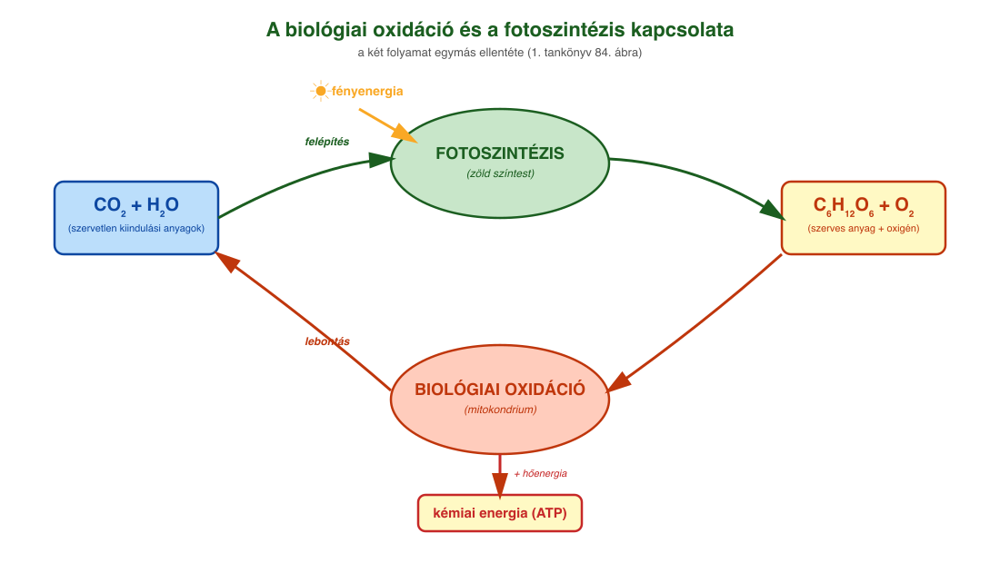
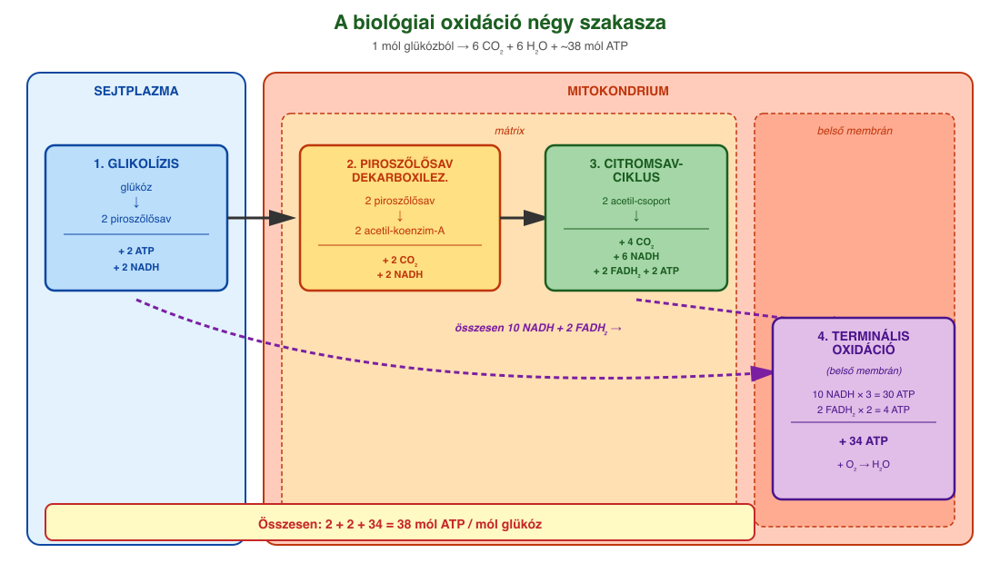
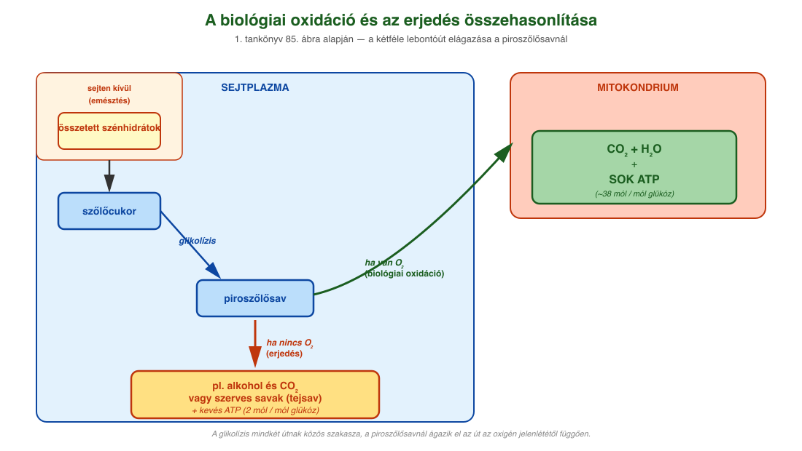

# 15. Biológiai oxidáció

## A lebontó folyamatok lényege

A **lebontó folyamatok** során a sejtek nagyobb méretű, magasabb energiaszintű szerves molekulákat alakítanak át **kisebb méretű, alacsonyabb energiatartalmú részecskékké**. A lebontás során felszabaduló energia egy része **ATP képzésére** fordítódik, másik része **hőenergiává** alakul.

A szerves anyagok energianyerés céljából történő lebontása **két alapvető úton** mehet végbe a sejtekben:

- **Oxigén jelenlétében (aerob feltételek mellett)** a sejtek többségében zajlik a **biológiai oxidáció**.
- **Oxigén hiányában (anaerob feltételek mellett)** képesek egyes élő szervezetek vagy bizonyos szöveti sejtek szerves anyagok lebontásából energiát nyerni **erjedéssel**.

## A biológiai oxidáció lényege

A biológiai oxidáció eukarióta sejtek döntő többségében, illetve számos prokariótában is sejtlégzés. A több lépésben zajló biokémiai átalakulás során a szerves anyagok szénatomjai **szén-dioxiddá oxidálódnak**, miközben hidrogéntartalmuk szállítómolekulákra (NAD⁺ koenzim) kerül. A hidrogénnel feltöltött szállítómolekulák (NADH+H⁺, röviden NADH₂) a **terminális oxidáció**nak nevezett folyamatban egy enzimrendszer segítségével oxidálódnak, miközben hidrogénjük egyesül a légzésből származó **oxigénnel (O₂)**, és vizet képeznek. A teljes folyamat során jelentős mennyiségű **ATP** keletkezik. Eukarióta sejtekben a biológiai oxidáció színtere a **mitokondrium**.

A folyamat lényege: az **első 3 részfolyamatban** a molekulákban lévő H-ek egy része hidrogénszállítókra kerül, míg a **4. folyamatban** a H-ek oxidációjával ATP keletkezik.

## 1. Glikolízis

A folyamat első szakasza a **glikolízis**, melynek enzimjei a **sejtplazmában** találhatók. A folyamat során a szőlőcukor több egymást követő lépésben **három szénatomos piroszőlősavra** bomlik. A folyamatban **1 mól glükózból bruttó 2 mól ATP és 2 mól NADH** keletkezik.

A glikolízis egyszerűsített egyenlete:

**C₆H₁₂O₆ + 2 NAD⁺ + 2 ADP + 2 Pᵢ → 2 CH₃-CO-COOH + 2 NADH₂ + 2 ATP**

(szőlőcukor → 2 piroszőlősav)

## 2. Piroszőlősav dekarboxileződése

Aerob feltételek mellett a piroszőlősav oxidációja a **mitokondrium**ban folytatódik. A piroszőlősav egy szén-dioxid-molekula leadásával (**piroszőlősav dekarboxileződése**) és egy NAD⁺ redukálásával **acetilcsoport formájában** egy koenzim-A-molekulára kerül, így **acetil-koenzim-A** jön létre.

Összesítve:

**2 CH₃-CO-COOH + 2 KoA + 2 NAD⁺ → 2 CH₃-CO-KoA + 2 CO₂ + 2 NADH₂**

## 3. Citromsavciklus (Szent-Györgyi–Krebs-ciklus)

A mitokondrium alapállományában (**mátrix**) az acetil-koenzim-A a **citromsavciklus**ba kerül. A folyamatban 1 mól acetilcsoport több lépésben oxidálódik 2 mól szén-dioxiddá, a hidrogénatomok pedig **3 mól NAD⁺-** és **1 mól FAD-** (nukleotid típusú hidrogénszállító molekula) molekulát redukálnak. Közvetve **1 mól ATP is keletkezik** a folyamatban.

A citromsavciklus a biológiai oxidáció **olvasztótégelye**: alapvetően a glükóz lebontásával keletkező acetilcsoportokkal működik, de glükóz hiányában más molekulák is acetilcsoportokká alakíthatók (pl. zsírsavak, aminosavak).

## 4. Terminális oxidáció

Az utolsó lépés a **terminális oxidáció**, ahol az egy mól glükózból eddig (glikolízis, piroszőlősav oxidációja, citrátkör) keletkezett **10 mól NADH és 2 mól FADH₂** oxidálódik. Az elektronok a mitokondrium belső membránjában található **elektrontranszport-rendszeren** végighaladva elősegítik a hidrogénionok szállítását a mátrixból a két membrán közötti térbe. Az így létrejött **hidrogénionkoncentráció-különbség** lesz az ATP-szintézis alapja. A hidrogénionok az **ATP-szintáz enzimen** keresztül a koncentrációkülönbségnek megfelelően a mátrix felé mozognak. Eközben meghajtják az ATP-szintáz enzimet (forgó motorfehérje!), ami így elegendő energiával rendelkezik, és aktiválja, hogy az ADP-ből és foszfátcsoportból **ATP képződjön**. **Egy NADH-molekula 3 ATP, egy FADH₂ 2 ATP** szintéziséhez szükséges energiát biztosít. A folyamat végén az áthaladó hidrogénionok egyesülnek a légzésből származó és az elektronszállító rendszer által aktivált **oxigénnel (O₂)**, és vizet képeznek.

## Az ATP-mérleg

**1 mól glükózból**:
- a **glikolízisben** 2 mól ATP,
- a **citromsavciklusban** 2 mól ATP,
- a **terminális oxidációban** pedig — a 10 mól NADH-ból és 2 mól FADH₂-ből — **34 mól ATP** keletkezik.

**Összesen: 38 mól ATP**. A folyamat során az oxigénből víz keletkezik.

**Megjegyzések az ATP mennyiségére vonatkozóan:**

1. A biológiai oxidációban **36, illetve 38 mól ATP** is képződhet. Ennek az az oka, hogy a glikolízisben képződő NADH **kétféle úton is beléphet a terminális oxidációba**.
2. Újabb források szerint az aerob légzés során az ATP-hozam nem 36–38 mól, hanem csak kb. 30–32 mól ATP-molekula / 1 mól glükózmolekula. Az elméletileg 38 mól ATP / 1 mól glükóz a sejt élettani feltételei és a transzportfolyamatok okozta veszteségek miatt nem valósul meg. Egy NADH, illetve FADH₂ oxidációja nem 3, illetve 2 ATP-t eredményez a terminális oxidációban, hanem csak 2,5, illetve 1,5 ATP-t.

**Szubsztrátszintű foszforiláció:** 2 ATP a glikolízisből + 2 ATP (közvetlenül GTP) a citromsavciklusból.

**Oxidatív foszforiláció:**
- 2 NADH + H⁺ a glikolízisből: 2 × 1,5 ATP (ha a glicerin-foszfát transzfer hidrogénatomokat továbbít) vagy 2 × 2,5 ATP (malát–aszpartát transzfer).
- 2 NADH + H⁺ a piruvát oxidatív dekarboxileződéséből és 6 a Krebs-ciklusból: 8 × 2,5 ATP.
- 2 FADH₂ a Krebs-ciklusból: 2 × 1,5 ATP.
- Összesen 4 + 3 (vagy 5) + 20 + 3 = 30 (vagy 32) ATP / glükózmolekula.

## A szerves anyagok lebontási útvonalai

Más szerves vegyületek is becsatlakoznak a lebontó folyamatokba:

- A **zsírok** zsírsavakra és glicerinre bomlanak. A páros szénatomszámú zsírsavakból — mintha télisalámit szeletelnénk — csak **acetilcsoportok keletkeznek**. A páratlan szénatomszámú vegyületek (mint a glicerin) vagy a páratlan szénatomszámú zsírsavak acetilcsoportokká alakítása már több lépést igényel, de a szervezet megvalósítja.
- A **fehérjék** aminosavakra bomlanak. A C-tartalmú rész piroszőlősavvá vagy acetilcsoporttá alakulhat. A **nitrogéntartalmú vegyületek** kezelését el kell végezni (**nitrogén-anyagcsere**) — legegyszerűbb a nitrogéntől ammóniává alakítani, de ez mérgező, ezért a szárazföldi szervezetek karbamiddá vagy húgysavvá alakítják. Az aminosavak nitrogéntartalma karbamiddá, a nukleotidok purinbázisaié pedig húgysavvá alakul, amelyek a vizelettel ürülnek ki.
- A **nukleinsavak** nukleotidokra bomlanak.

A szerves vegyületek energiatartalma a bennük található **C–H-kötések számával egyenesen arányos**. Ennek tudatában a legnagyobb energiatartalmúak (energiasűrűségűek) a **zsírok**, ezt követik a **fehérjék**, és csak ezután következnek a **cukrok**.

## Erjedés

Egyes élő szervezetek, illetve bizonyos szöveti sejtek **oxigén hiányában (anaerob feltételek mellett)** képesek szerves anyagok lebontásából energiát nyerni **erjedéssel**.

**Alkoholos erjedés.** Az élesztőgombákra jellemző. Termékei az **etil-alkohol (etanol)** és a **szén-dioxid**. Egy mól szőlőcukor alkoholos erjedése összességében **2 mól ATP** képződését eredményezi. Alkoholos erjedéssel bort, sört állítanak elő, és kelt tésztát készítenek. Az erjedést katalizáló enzimek a **sejtplazmában** találhatók, így ezek a folyamatok ott játszódnak le.

A piroszőlősavból egy dekarboxileződés (szén-dioxid kihasadása) után **etil-alkohol** keletkezik. A folyamat egyszerűsített egyenlete:

**2 CH₃-CO-COOH + 2 NADH₂ → 2 CH₃-CH₂-OH + 2 CO₂ + 2 NAD⁺**

**Tejsavas erjedés.** Ez megy végbe oxigén hiányában a **gerincesek intenzíven működő vázizomrostjaiban**, a **baktériumok** és **egysejtű gombák** is ezzel a folyamattal nyernek energiát. A glikolízist követően a piroszőlősavból **tejsav** és **két mól ATP** képződik. A tejsavbaktériumok gazdasági szempontból is jelentősek, mivel közreműködésükkel állítanak elő savanyított élelmiszereket (pl. savanyú káposzta, tejföl, joghurt, sajtok).

Erjedés játszódik le — dekarboxileződés nélkül — a piroszőlősav redukciójával. Ekkor a piroszőlősavból **tejsav** keletkezik. Egyenlete:

**2 CH₃-CO-COOH + 2 NADH₂ → 2 CH₃-CH(OH)-COOH + 2 NAD⁺**

Ezekben a folyamatokban **1 mól glükózból csak 2 mól ATP** keletkezik, és a szerves termék még tartalmaz C–H-kötéseket, de az oxigén hiánya miatt ezek nem oxidálhatók.

## A biológiai oxidáció és az erjedés összehasonlítása

| Szempont | Biológiai oxidáció | Erjedés |
| --- | --- | --- |
| **Oxigén** | szükséges (aerob) | nem szükséges (anaerob) |
| **Helye** | mitokondrium (a glikolízis a sejtplazmában) | sejtplazma |
| **Termékek** | CO₂ + H₂O + sok ATP | etil-alkohol és CO₂ vagy szerves savak + kevés ATP |
| **ATP / mól glükóz** | ~38 mól | 2 mól |

## A szervezet anyagcseréje és a környezet

Az élőlények környezetüktől függően meg tudják változtatni az anyagcseréjüket. A **növények napközben párhuzamosan folytatnak fotoszintézist és biológiai oxidációt**. Ekkor az oxigéntermelésük nagyobb mértékű, mint az oxigénfogyasztásuk. **Éjszaka viszont csak biológiai oxidációt folytatnak.** A mag csíráztatáskor még nem tud fotoszintetizálni, sőt a csíra sejtjei a maghéj miatt oxigént sem tudnak megfelelő mértékben felvenni, ezért egészen a maghéj felrepedéséig **alkoholos erjedés** megy végbe.

A hasadóélesztőben is eltérő anyagcsere-utak aktiválódnak a környezet hatására. Oxigén hiányában alkoholos erjedést folytat (ezt használjuk ki az alkoholos italok és a kelt tészta készítésénél), oxigén jelenlétében viszont biológiai oxidációt folytat.

Az állati szervezet vázizmai is képesek az oxigénellátottságtól függően eltérően működni: oxigén jelenlétében biológiai oxidációt folytatnak, hiányában **tejsavas erjedés** történik. Azonban erjedéssel a szervezet nem képes elegendő energiát előállítani, ezért hosszú távon nem viseli el az oxigénhiányt.

---

## Ábrák

*A két folyamat egymás ellentéte. A fotoszintézis (zöld színtestben) fényenergiát használ, CO₂-ot és H₂O-t alakít szőlőcukorrá és O₂-vé. A biológiai oxidáció (mitokondriumban) a szőlőcukrot és az O₂-t bontja CO₂-ra és H₂O-ra, és kémiai energiát (ATP) szabadít fel. A tankönyv 84. ábrája alapján.*

*A glükóz teljes lebontása négy szakaszban: 1) glikolízis a sejtplazmában (glükóz → 2 piroszőlősav, 2 ATP, 2 NADH); 2) piroszőlősav dekarboxileződése a mitokondriumban (2 acetil-koenzim-A, 2 CO₂, 2 NADH); 3) citromsavciklus a mitokondrium mátrixában (4 CO₂, 6 NADH, 2 FADH₂, 2 ATP); 4) terminális oxidáció a belső membránon (a NADH és FADH₂ oxidációjával 34 ATP, a végén H₂O keletkezik). Összesen 38 mól ATP / mól glükóz.*

*A tankönyv 85. ábrája alapján: a szőlőcukor lebontása a sejtplazmában glikolízissel piroszőlősavra. Innen ha van O₂ (biológiai oxidáció), akkor a folyamat a mitokondriumban folytatódik, és CO₂ + H₂O + sok ATP keletkezik. Ha nincs O₂ (erjedés), akkor a sejtplazmában maradva alkohol és CO₂ vagy szerves savak (tejsav) keletkeznek kevés ATP-vel.*

---

*Az anyag az 1. tankönyv 80, 81, 82, 83. oldalain található.*
