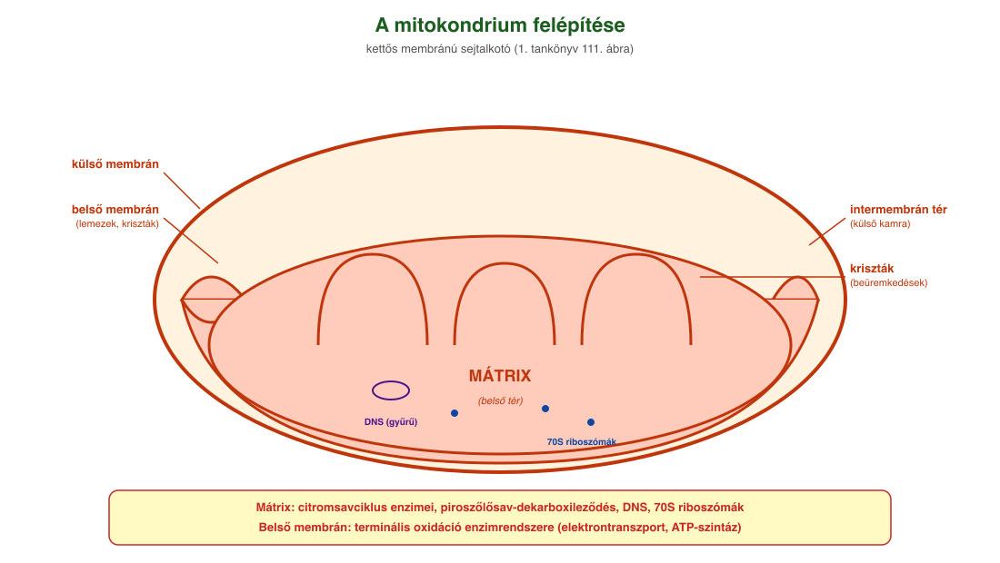
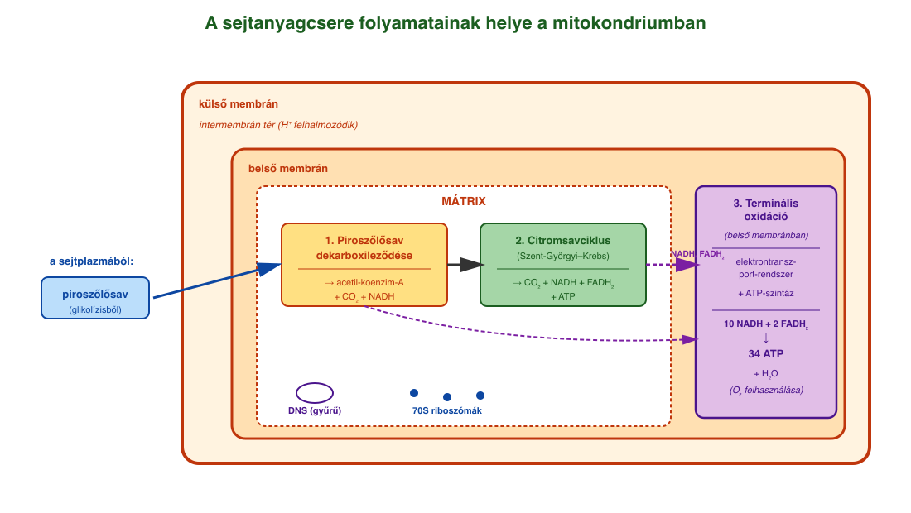
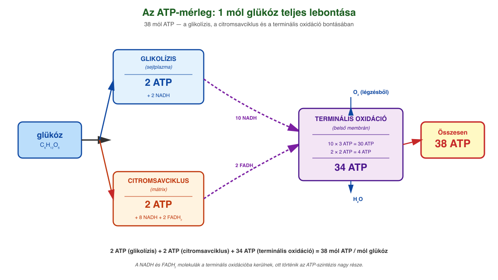

# 16. A sejtanyagcsere és a mitokondrium

## A sejtanyagcsere

A sejtekben az anyagok felvételéhez, leadásához, felhasználásához, átalakításához szükséges biokémiai folyamatokat **anyagcserének** nevezzük. Az anyagcsere két alapvető folyamatból áll:

- A **felépítő (szintetizáló) folyamatok** során az élőlények saját, magas energiatartalmú szerves anyagaikat előállítják szervetlen vagy szerves anyagokból. Ide tartozik a fotoszintézis, amely fényenergiát használ, és a Calvin-ciklus során a CO₂-ből szőlőcukor keletkezik.
- A **lebontó folyamatok** során a sejtek nagyobb méretű, magasabb energiaszintű szerves molekulákat alakítanak át kisebb méretű, alacsonyabb energiatartalmú részecskékké. A felszabaduló energia egy része **ATP képzésére** fordítódik, másik része hőenergiává alakul.

A szerves anyagok energianyerés céljából történő lebontása két alapvető úton mehet végbe:

- **Oxigén jelenlétében** (aerob feltételek mellett) a sejtek többségében **biológiai oxidáció** zajlik.
- **Oxigén hiányában** (anaerob feltételek mellett) egyes élő szervezetek vagy bizonyos szöveti sejtek **erjedéssel** nyernek energiát.

A glikolízis a sejtplazmában játszódik le. Innentől fogva — oxigén jelenlétében — a piroszőlősav további oxidációja a **mitokondrium**ban folytatódik.

## A mitokondrium felépítése

A **mitokondrium** egy külső és egy kesztyűujjszerűen beüremkedő belső membránból álló sejtalkotó. A két membrán között van az **intermembrán tér** (külső kamra), a belső membrán által határolt belső tér pedig a **mátrix**.

A mitokondrium fő részei:

- **Külső membrán** – sima felületű, körülveszi a sejtszervet.
- **Belső membrán** – kesztyűujjszerű beüremkedéseket képez (lemezek, kriszták). Itt találhatók a **terminális oxidáció enzimrendszerei** (elektrontranszport-rendszer, ATP-szintáz).
- **Intermembrán tér** – a két membrán közötti tér, ahol a **hidrogénionok felhalmozódnak** a terminális oxidáció során.
- **Mátrix** – a belső membránon belüli plazma, itt található a piroszőlősav dekarboxileződésének és a **citromsavciklus**nak az enzimrendszere. A mátrix tartalmazza a mitokondrium saját, **gyűrű alakú DNS**-ét és a **bakteriális típusú riboszómákat (70S)**.

A mátrixban a gyűrű alakú DNS-ről történik a transzkripció, a riboszómákon pedig a fehérjeszintézis. **A mitokondriumok az őket tartalmazó sejttől függetlenül osztódással sokszorozódnak.** Fehérjéik egy része viszont a citoplazma riboszómáin szintetizálódik.

A mitokondriumok száma sejttípustól függ, nagy számban találhatók például a **májsejtek**ben és az **idegsejtek**ben.

## A mitokondriumban zajló folyamatok

Oxigén jelenlétében a mitokondriumban történik meg a **piroszőlősav oxidációja**. A folyamat során jelentős mennyiségű energia (38 ATP) keletkezik 1 mól glükózból.

### Piroszőlősav dekarboxileződése (a mátrixban)

A piroszőlősav egy szén-dioxid-molekula leadásával (dekarboxileződés) és egy NAD⁺ redukálásával **acetilcsoport formájában** egy koenzim-A-molekulára kerül, így **acetil-koenzim-A** jön létre.

### Citromsavciklus (a mátrixban)

A mátrixban az acetil-koenzim-A a **citromsavciklus**ba kerül. A folyamatban 1 mól acetilcsoport több lépésben oxidálódik 2 mól szén-dioxiddá, a hidrogénatomok pedig 3 mól NAD⁺- és 1 mól FAD-molekulát redukálnak. Közvetve 1 mól ATP is keletkezik a folyamatban.

### Terminális oxidáció (a belső membránban)

Az utolsó lépés a **terminális oxidáció**, ahol a glikolízisből, a piroszőlősav-oxidációból és a citromsavciklusból származó **10 mól NADH és 2 mól FADH₂** oxidálódik. Az elektronok a belső membránban található **elektrontranszport-rendszeren** végighaladva elősegítik a hidrogénionok szállítását a mátrixból az intermembrán térbe. A létrejövő **hidrogénionkoncentráció-különbség** lesz az ATP-szintézis alapja.

A hidrogénionok az **ATP-szintáz enzimen** keresztül a koncentrációkülönbségnek megfelelően a mátrix felé mozognak. Eközben meghajtják az ATP-szintáz enzimet (forgó motorfehérje!), ami az ADP-ből és foszfátcsoportból ATP-t állít elő. Egy NADH-molekula 3 ATP, egy FADH₂ 2 ATP szintéziséhez szükséges energiát biztosít. A folyamat végén az áthaladó hidrogénionok egyesülnek a légzésből származó **oxigénnel (O₂)**, és **vizet képeznek**.

## Az ATP-mérleg

1 mól glükózból:

- a glikolízisben (sejtplazma) 2 mól ATP,
- a citromsavciklusban (mátrix) 2 mól ATP,
- a terminális oxidációban (belső membrán) 34 mól ATP keletkezik.

**Összesen: 38 mól ATP / 1 mól glükóz.** A folyamat során az oxigénből víz keletkezik.

## A mitokondrium endoszimbionta eredete

Az **endoszimbionta elmélet** szerint az eukarióta sejtek ősi prokarióta sorozatos egyesülésével és szimbiózisával fejlődtek ki. A prokarióta sejtek elvesztették sejtfalukat, majd a sejt méretének növekedése miatt csökkent a fajlagos felületük. Ezt a sejt membránjának betüremkedésével és leszakadásával kialakuló önálló belső membránrendszer kompenzálta. Kialakult egy proteoeukarióta sejt, amely egyes sejtalkotókhoz bekebelezett, de meg nem emésztett prokarióták útján jutott. A bekebelezett kékbaktériumokból a zöld színtest, a **mitokondrium pedig egy proteobaktériumból alakulhatott ki**.

**Bizonyítékok:** ezeknek a sejtalkotóknak a mérete a baktériumok mérettartományába esik, belső membránjuk összetétele (lipid–fehérje arány) szintén hasonló, illetve saját zárt (gyűrűs) DNS-sel rendelkeznek, mint a baktériumok.

---

## Ábrák

*A mitokondrium kettős membránú sejtalkotó: külső membrán, intermembrán tér, kesztyűujjszerűen beüremkedő belső membrán (lemezek/krisztákkal), és a belső membrán által határolt mátrix. A mátrixban találhatók a gyűrű alakú DNS és a 70S-es bakteriális típusú riboszómák. A tankönyv 111. ábrája alapján.*

*A piroszőlősav-oxidáció lépéseinek térbeli elhelyezkedése. A piroszőlősav dekarboxileződése és a citromsavciklus a mátrixban játszódik le. A terminális oxidáció enzimrendszere (elektrontranszport-rendszer, ATP-szintáz) a belső membránban található. Az intermembrán térben halmozódnak fel a hidrogénionok, ezek visszaáramlása a mátrixba az ATP-szintázon keresztül adja az ATP-szintézis energiáját.*

*1 mól glükóz teljes lebontásából 38 mól ATP keletkezik: 2 a glikolízisből (sejtplazma), 2 a citromsavciklusból (mátrix), és 34 a terminális oxidációból (belső membrán). A NADH és FADH₂ molekulák a terminális oxidációba kerülnek, ahol oxidálódásukból ATP-szintézis történik.*

---

*Az anyag az 1. tankönyv 80, 81, 82, 90. oldalain és a 115. oldalon (endoszimbionta elmélet) található.*
