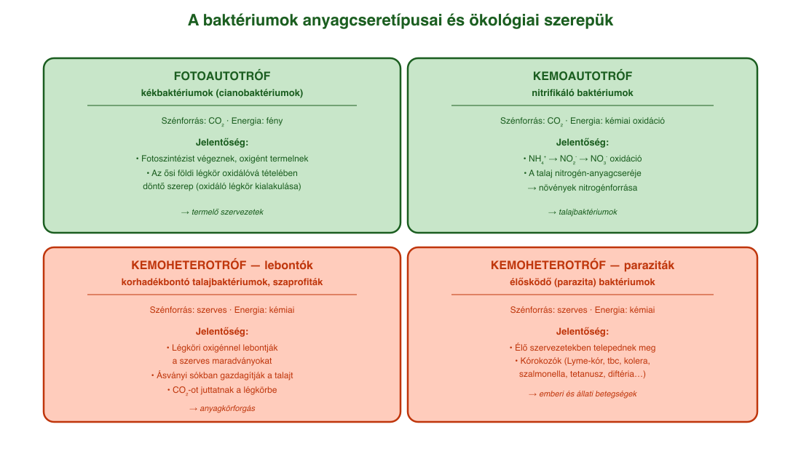
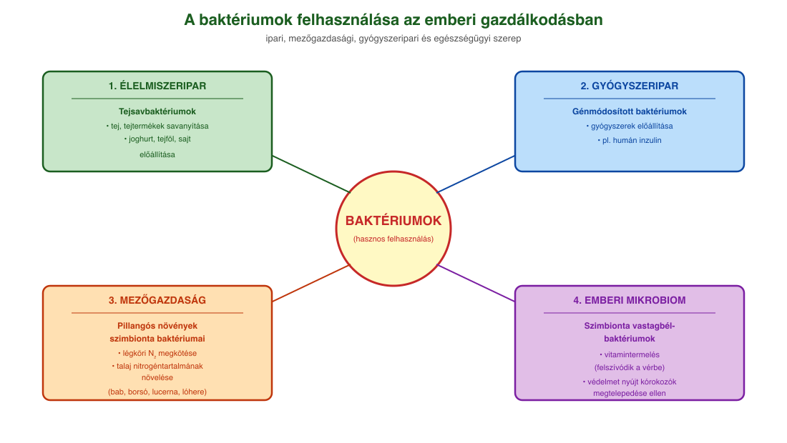
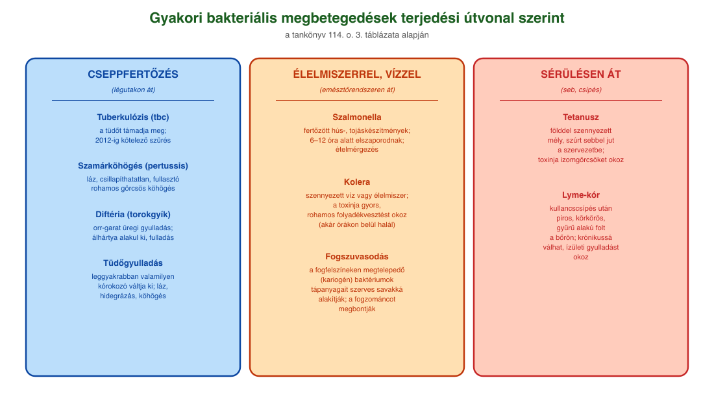

# 17. A baktériumok jelentősége

## A baktériumok általános jellemzői

Az élőlényeket sejtjeik felépítése szerint két nagy csoportra osztjuk: **prokarióták** (sejtmag nélküliek) és **eukarióták** (valódi sejtmaggal rendelkezők). A prokarióták közé tartoznak a **baktériumok** (valódi és ősbaktériumok). Sejtjeik kis méretűek (1 μm körüliek), és **nincs sejten belüli membránrendszerük**.

A sejtjeiket sejthártya határolja, ezen kívül **sejtfal** (peptidoglikán/murein), egyeseknél további védőréteg (**tok**) található. Bizonyos baktériumok kedvezőtlen körülmények között (szárazság, nagy nyomás, magas hőmérséklet) örökítőanyaguk védelmére vastag falat képeznek – ez a **spóra**, amely **kitartóképződmény**, nem szaporítósejt.

A baktériumok örökítőanyaga jellemzően **kör alakú, zárt láncú DNS**, a sejtplazmában szabadon helyezkedik el. Mellette kis méretű, kör alakú DNS-molekulák, **plazmidok** is lehetnek, amelyek pl. **antibiotikum-rezisztenciát** nyújthatnak, és ivaros jellegű szaporodásukat is segítik.

## A baktériumok anyagcseretípusai

A baktériumok között mind a négy anyagcseretípus megtalálható:

- A **heterotróf** baktériumok többségének szénforrása szerves anyag. Ide tartoznak a **lebontók (szaprofiták)** és az **élősködő (parazita)** baktériumok.
- Az **autotróf** baktériumok szénforrása szervetlen (CO₂). A **fotoautotróf kékbaktériumok** fotoszintetizálnak és oxigént termelnek; a **kemoautotróf nitrifikáló baktériumok** ammóniumionokat oxidálnak nitrátokká, és a kémiai reakciók energiáját hasznosítják.

## A baktériumok jelentősége az ökoszisztémában

A baktériumok hatalmas szerepet játszanak az élővilág egyensúlyában. A **lebontó talajbaktériumok** a légköri oxigén felhasználásával lebontják a talajba került szerves maradványokat, ezzel ásványi sókban gazdagítják a talajt, és szén-dioxidot juttatnak a légkörbe – a **természetes anyagkörforgás** fontos résztvevői.

A **pillangós virágú növényekkel** (bab, borsó, lucerna, lóhere) együtt élő **(szimbionta) nitrogéngyűjtő baktériumok** különleges anyagcseréjüknek köszönhetően a légköri nitrogént a növény számára felhasználhatóvá teszik, miközben a növény szerves tápanyagokkal látja el a baktériumokat.

A **kékbaktériumok** (cianobaktériumok) fotoszintézise a magasabb rendű növényekéhez hasonlóan **oxigént termel**. A földtörténet korai időszakában a kékbaktériumok által több milliárd évig végzett fotoszintézis emelte meg a légkör oxigéntartalmát, létrehozva az oxidáló légkört.

## A baktériumok jelentősége az ember számára

A baktériumok ipari, mezőgazdasági és egészségügyi szempontból egyaránt jelentősek.

**Ipari és élelmiszer-ipari felhasználás.** A **tejsavbaktériumok**at az élelmiszeriparban a tej és a tejtermékek **savanyítására**, a joghurt, tejföl, sajt előállítására használják fel.

**Gyógyszeripar.** A gyógyszeripar számára nagyon fontosak a **génmódosított baktériumok**, amelyekkel **gyógyszereket (pl. humán inzulint)** állítanak elő.

**Mezőgazdaság.** A mezőgazdaságban elsősorban a növényi és állati kórokozók jelentenek problémát. Például a gyümölcsfák hajtásainak gyors elszáradásával járó, ún. **tűzelhalásos megbetegedés**. A talajban lévő nitrogénkötő, illetve lebontó baktériumok az **anyagkörforgás** fontos részét képezik. A talajbaktériumok a termesztés során felhasznált növényvédő szerek és műtrágyák káros hatásait képesek tompítani, hosszabb távon megszüntetni.

**Az emberi mikrobiom.** Az emberi mikrobiom baktériumok, valamint vírusok és gombák közösségéből áll, számuk meghaladja az emberi sejtek számát. Az emberi mikrobiom egyszerre jelenti az emberi testen, illetve testben megtalálható mikrobák összességét, azok genetikai állományát és kölcsönhatásait. A szimbionta vastagbél-baktériumok közreműködésükkel **vitaminokat termelnek**, amelyek a keringési rendszerünkbe felszívódnak, és eljutnak sejtjeinkhez. Egyúttal védelmet is nyújtanak, mert megakadályozzák más, kórokozó baktériumok elszaporodását.

## A kórokozó (parazita) baktériumok

A heterotrófok közé tartozó **élősködő (parazita) baktériumok** az élő szervezetekben megtelepedő, azok anyagaival táplálkozó baktériumok. Minden bizonnyal ezek a legismertebbek, hiszen sok emberi kórokozó tartozik közéjük. Baktériumfertőzés következménye többek között a **Lyme-kór**, a **gümőkór** (tuberkulózis, tbc), a **tüdőgyulladás**, a **kolera**, a **szalmonella**, a **tetanusz**, a **szamárköhögés** és a **diftéria**.

Az állati kórokozók közül emberre is veszélyt jelent többek között a **szarvasmarhákban élősködő tüdőbajt okozó baktérium**, valamint a lépfenét (**anthrax**) okozó baktérium.

A baktériumok kórokozó hatásának lehetséges kiváltói a **baktériumtoxinok**. Ezeket a baktériumok vagy oldható fehérjék formájában kiválaszthatják, vagy csak a baktériumsejt károsodásakor szabadulnak ki (LPS, lipopoliszacharidok). A baktériumtoxinok lehetnek az **idegi jelátviteli folyamatokat megzavaró neurotoxinok**, a sejtek enzimműködését károsító **citotoxinok**, a bélműködés zavarát (pl. felszívási zavarokat) okozó **enterotoxinok**, de az immunrendszer túlműködése miatt okozhatnak zavarokat (sokkot) és szepszist is.

## Néhány gyakori bakteriális megbetegedés

| Betegség | Fő jellemzők |
| --- | --- |
| **szalmonella** | fertőzött hús-, tojáskészítményekkel jut a szervezetbe; 6–12 óra alatt elszaporodik, ételmérgezés |
| **tuberkulózis (tbc)** | a kórokozó a tüdőt támadja meg; Magyarországon 2012-ig kötelező volt a szűrése |
| **Lyme-kór** | kullancscsípés után piros, körkörös, gyűrű alakú folt; krónikussá válhat, ízületi gyulladást okoz |
| **tetanusz** | földdel szennyezett sebbel jut a szervezetbe; toxinja izomgörcsöket okoz |
| **szamárköhögés (pertussis)** | láz, csillapíthatatlan rohamokban jelentkező görcsös köhögés; cseppfertőzés |
| **diftéria (torokgyík)** | a torokgyík álhártyát okozó gyulladás az orr-garat üregben; a hártya leválása fulladást okoz |
| **kolera** | szennyezett víz vagy élelmiszer; a kórokozó toxinja rövid idő alatt halálhoz vezet |
| **fogszuvasodás** | a fogfelszíneken (plakk) megtelepedő (kariogén) baktériumok a lepedék tápanyagait szerves savakká alakítják, ami megbontja a fogzománcot |

---

## Ábrák

*A baktériumok négy anyagcseretípusa és néhány jellemző példája az ökoszisztémában betöltött szerepükkel: kemoheterotróf lebontók a talajban (szerves maradványok bontása), kemoheterotróf paraziták (kórokozók), kemoautotróf nitrifikálók (nitrogén-anyagcsere), fotoautotróf kékbaktériumok (oxigéntermelés).*

*Az ipari, mezőgazdasági és gyógyszeripari felhasználási területek áttekintése: tejsavbaktériumok az élelmiszeriparban, génmódosított baktériumok a gyógyszergyártásban (pl. humán inzulin), pillangós növények szimbionta baktériumai a mezőgazdaságban, valamint a vastagbél mikrobiomjának szerepe a vitamintermelésben és a védelemben.*

*A leggyakoribb bakteriális betegségek áttekintése és terjedési útvonalaik a tankönyv 3. táblázata (114. o.) alapján: cseppfertőzéssel terjedők (tbc, szamárköhögés, diftéria, tüdőgyulladás), élelmiszerrel/vízzel terjedők (szalmonella, kolera), sérülésen át bejutók (tetanusz, Lyme-kór).*

---

*Az anyag az 1. tankönyv 112, 113, 114, 115. oldalain található.*
