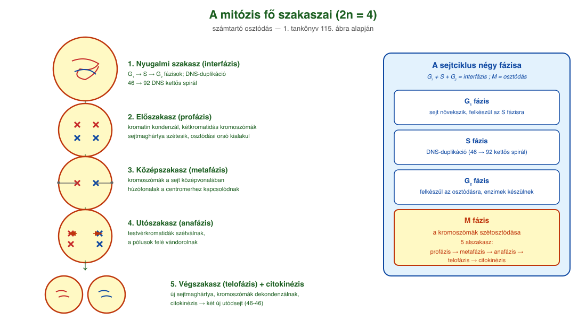
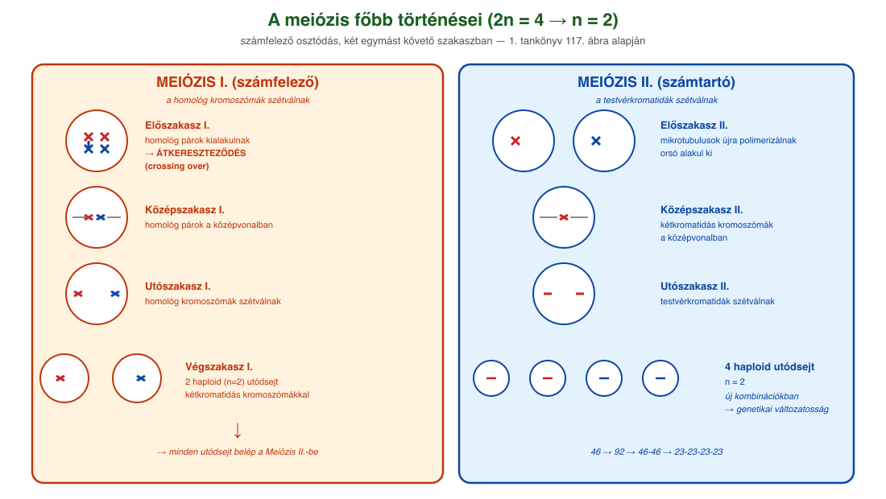
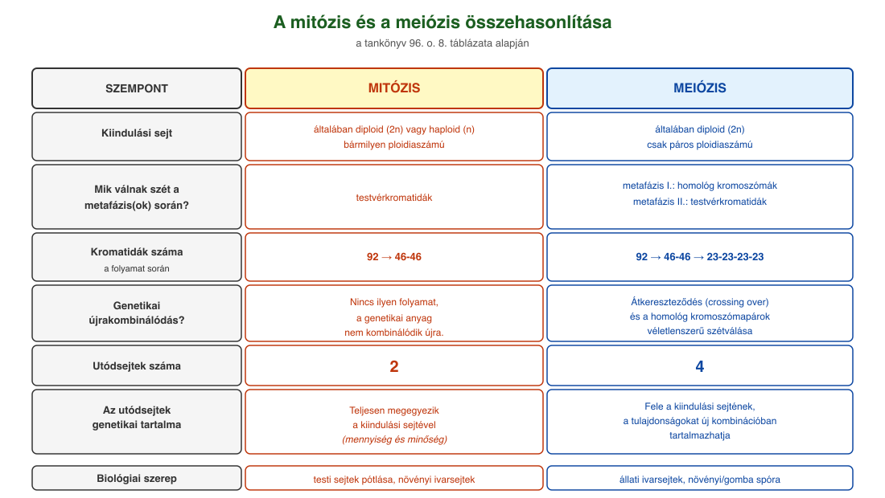

# 18. Sejtosztódások

## A sejtciklus

A **sejtciklus** egy körfolyamat. Alapvetően négy fázisból áll: **G₁, S, G₂ és M**. A G₁, S és G₂ az **interfázis** részeit képezik, az M betű jelölheti a **mitózis** és a **meiózis** nevű osztódási folyamatot is.

Sejtjeinkben a DNS nem önmagában van jelen: fehérjékhez kapcsolódik (hisztonok), amikre fel tud tekeredni. A DNS–fehérje-együttest nevezzük **kromoszómának**, ami a sejtosztódás során még tömörebb állapotú (így mikroszkóp alatt láthatóvá válik), mint a nem osztódó sejtben.

Alapvetően kétféle sejttípusunk van: **testi sejtek** és **ivarsejtek**. Az ivarsejtek egyesülésével keletkező sejt osztódásai során alakul ki az emberi test. Az ivarsejtek kromoszómaszáma 23, az egyszeres kromoszómakészletnek is nevezzük, és **n betűvel** jelöljük. Két ivarsejt egyesülésével testi sejt alakul ki. A testi sejtek **2n-es sejtek**, kromoszómaszámuk 46, azaz tartalmazzák az anyai eredetű (petesejt) és az apai eredetű (hímivarsejt) információkat is: kétszeres kromoszómakészletűek. Az ivarsejtek egyesülése, a megtermékenyítés az a folyamat, amikor ezek az információk összeadódnak.

### Az interfázis három szakasza

Az interfázishoz tartozik a G₁, S és G₂ fázis:

- **G₁ fázis:** a sejt növekszik, felkészül az S fázisra. Megtörténik a DNS-duplikációhoz szükséges mRNS-ek és fehérjék szintézise.
- **S fázis:** a sejtmag teljes DNS-mennyisége megduplázódik, 46 darab DNS kettős spirálból 92 darab DNS kettős spirál jön létre.
- **G₂ fázis:** a sejt felkészül az osztódásra: ismét intenzív RNS- és fehérjeszintézis folyik, kialakulnak a sejtosztódáshoz szükséges enzimek. A sejtközpont ebben a fázisban osztódik ketté, és mindkét mikrotubulus-komplex kiegészítője létrejön.

## A mitózis

A **mitózis** vagy számtartó osztódás az élőlények testi sejtjeire, illetve a növények ivarsejtképzésére jellemző. A folyamathoz már az S fázison átesett, megduplázódott genetikai anyaggal rendelkező sejtre van szükség. Ebben **46 darab két DNS kettős spirálból álló kromatinfonal** található. A G₂ fázist követően az M fázisban elindul a mitózis.

**Előszakasz (profázis).** Megtörténik a kromatin kondenzációja (rövidül és vastagodik, feltekeredik), és kialakulnak a **kétkromatidás kromoszómák** (metafázisos kromoszómák, 46 darab), amelyek két testvérkromatidából állnak. A sejtmagvacska eltűnik. A sejtmaghártya kis darabokra (hólyagokra) esik szét. A már kettéosztódott sejtközpontok a sejt két ellentétes pólusára vándorolnak, és elkezdődik a tubulin polimerizációjával a húzófonalak és az osztódási orsó kialakulása.

**Középszakasz (metafázis).** A sejtközpont irányításával — a mikrotubulusokból létrejött hálózat összekapcsolja a két sejtközpontot, vagy a sejtközpont és a kétkromatidás kromoszómák (centromer régiónál kialakuló kinetochor) között alakít ki kapcsolatot (osztódási orsó). Egy kétkromatidás kromoszómához az egyik és másik sejtközpontból is kapcsolódik egy-egy mikrotubulus (húzófonal). A mikrotubulusok a sejt középvonalában egy oszlopba rendezik a kromoszómákat.

**Utószakasz (anafázis).** Megindul a kromatidák szétválása, és vándorlásuk a két sejtközpont irányába. A kromatida és a mikrotubulus közötti motorfehérje húzza a kromatidát a sejtközpont irányába.

**Végszakasz (telofázis).** A sejt két pólusánál lévő kromoszómák körül a profázisban létrejött membrándarabok fúziójából kialakul a két új sejtmaghártya. A megmaradt mikrotubulusok depolimerizálnak. Mindkét sejtmagban dekondenzálódnak (megnyúlnak, vékonyodnak, kitekerednek) a kromoszómák, és újra megjelenik a sejtmagvacska. Eközben zajlik a **sejtosztódás (citokinézis)**, ez zárja a mitózist. A folyamat eredményeként a kiindulási sejttel teljesen megegyező (46 → 92 → 46–46) genetikaiinformáció-tartalmú utódsejtek jönnek létre.

## A meiózis

A **meiózis** vagy számfelező osztódás az állatok ivarsejtképzésére és a növények és gombák spóraképzésére jellemző sejtosztódási folyamat. A genetikai anyag felezése mellett a **genetikai változatosság kialakításában** is szerepe van a folyamatnak. Egy testi diploid (2n) sejtből indul a folyamat, ami átesett a G₁, S és G₂ fázisokon, és így 46 darab két DNS kettős spirálból álló kromatinfonal található benne. A meiózis **két főszakaszra** bontható: az **első főszakaszban** a homológ (azonos szerkezetű, azonos géneket tartalmazó, egyik apai, másik anyai eredetű) kromoszómák válnak szét, a **második főszakaszban** pedig a kromatidák szétválása történik meg.

### Az első főszakasz profázisa

Az első főszakasz profázisa során majdnem ugyanazok a változások mennek végbe, mint a mitózisnál. A kialakuló kromoszómák viszont eltérően viselkednek: a homológ kromoszómák párokba rendeződnek, és ezt követően végbemehet az **átkereszteződés (crossing over)**. Ekkor a homológ kromoszómák karjai akár több ponton is átkereszteződnek. Az enzimek a két szálat ugyanazon a ponton hidrolizálják, majd egyes szakaszok kicserélődése után kondenzálják azokat. Az így létrejövő két kromatida keverten tartalmazza a szülőktől kapott örökítőanyagot.

### A meiózis további menete

A **metafázis I.** során a homológ kromoszómák a sejt középvonalában 23 homológ párba rendezetten találhatók. Az **anafázis I.** során a homológ párok a motorfehérjék segítségével eltávolodnak egymástól. Véletlenszerű, hogy az egyik és másik sejtközpont felé a 23 kromoszómából hány apai és hány anyai eredetű fog vándorolni.

A **telofázis I.** során a sejt két pólusán egy-egy haploid kétkromatidás kromoszómákból álló kromoszómakészlet található. A sejt kettéosztódik (citokinézis), a két utódsejtben elkezdődik a sejtközpontok duplikációja. Elindul a **második főszakasz**. A **profázis II.**-ben az utódsejtekben a sejtközpontok ismét elkezdik a mikrotubulusok polimerizációját. A **metafázis II.**-ben testvérkromatidákból álló kétkromatidás kromoszómákhoz hozzákapcsolódnak a mikrotubulusok, a kromoszómák (23-23 darab) a sejt középvonalába rendeződnek, kialakul az osztódási orsó. Az **anafázis II.**-ben a testvérkromatidák szétválnak, és a sejt két pólusa felé vándorolnak. A **telofázis II.**-ben bekövetkezik a mikrotubulusok depolimerizációja, a kromoszómák dekondenzálnak, a sejtmagok újra kialakulnak. A sejtek kettéosztódnak.

A folyamat eredményeként **négy haploid utódsejt** alakul ki. A genetikai anyag a kiindulási mennyiség fele (46 → 92 → 46-46 → 23-23-23-23). Az átkereszteződések és a homológ kromoszómapárok véletlen szétválása miatt az utódsejtek a tulajdonságokat új kombinációban tartalmazzák. A folyamat hozzájárul a genetikai változatosság kialakulásához, és alapvető fontosságú az evolúció szempontjából.

## A mitózis és a meiózis összehasonlítása

Mitózissal osztódnak az élőlények testi sejtjei, így a szervezet sejtjei azonos minőségben és mennyiségben tartalmazzák a genetikai anyagot. A növényeknél haploid sejtekből mitózissal képződnek a haploid ivarsejtek. Most is zajlik bennünk mitózis: a bőrben, a vörös csontvelőben, a bélfalban. A mitózis funkciója az elpusztult sejtek pótlása. Meiózissal jönnek létre az állatok ivarsejtjei.

| Szempont | Mitózis | Meiózis |
| --- | --- | --- |
| **Kiindulási sejt** | általában diploid (2n) vagy haploid (n) bármilyen ploidiaszámú | általában diploid (2n), csak páros ploidiaszámú |
| **Megelőzi-e DNS-duplikáció?** | igen | igen |
| **Mik válnak szét a metafázis(ok) során?** | testvérkromatidák | metafázis I.: homológ kromoszómák; metafázis II.: testvérkromatidák |
| **Kromatidaszám változása** | 92 → 46-46 | 92 → 46-46 → 23-23-23-23 |
| **Genetikai újrakombinálódás** | nincs, a genetikai anyag nem kombinálódik újra | átkereszteződés (crossing over) és homológ kromoszómapárok véletlenszerű szétválása |
| **Utódsejtek száma** | 2 | 4 |
| **Utódsejtek genetikai tartalma** | teljesen megegyezik a kiindulási sejtével (mennyiség, minőség) | fele a kiindulási sejtének, és a tulajdonságokat új kombinációban tartalmazhatja |

---

## Ábrák

*A mitózis öt fő szakasza vázlatosan a tankönyv 115. ábrája alapján: 1. nyugalmi szakasz (interfázis), 2. előszakasz (profázis – kromoszómák kondenzációja, osztódási orsó kialakulása), 3. középszakasz (metafázis – kromoszómák a sejt középvonalában), 4. utószakasz (anafázis – testvérkromatidák szétválnak és a pólusok felé vándorolnak), 5. végszakasz (telofázis – új sejtmaghártyák, citokinézis). 2n = 4 példa.*

*A meiózis a tankönyv 117. ábrája alapján: két egymást követő osztódás. Meiózis I. (számfelező): nyugalmi szakasz → előszakasz (homológ párok kialakulása + átkereszteződés) → középszakasz → utószakasz (homológ kromoszómák szétválnak) → végszakasz (két haploid utódsejt). Meiózis II. (számtartó): előszakasz → középszakasz → utószakasz (testvérkromatidák szétválnak) → végszakasz. Végeredmény: 4 utódsejt, n = 2.*

*A két folyamat lényegi különbségei egymás mellett: kiindulási kromoszómakészlet (2n vagy n), mit választanak szét (testvérkromatidák vs. először homológok, majd kromatidák), utódsejtek száma (2 vs. 4), a genetikai változatosság forrásai (a meiózisban van átkereszteződés és a homológ párok véletlenszerű szétválása), valamint a biológiai szerepük (mitózis: testi sejt pótlása; meiózis: ivarsejt/spóra létrehozása).*

---

*Az anyag az 1. tankönyv 94, 95, 96. oldalain található.*
