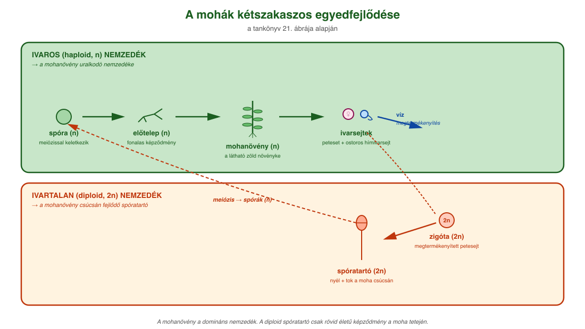
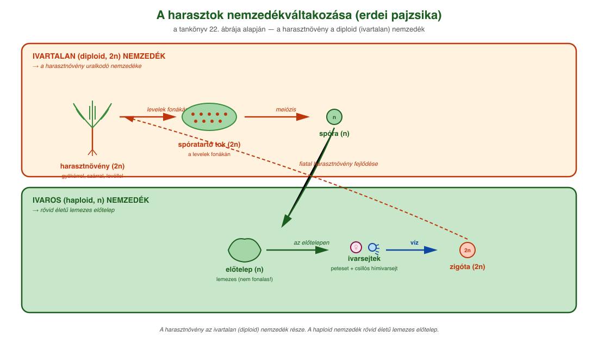
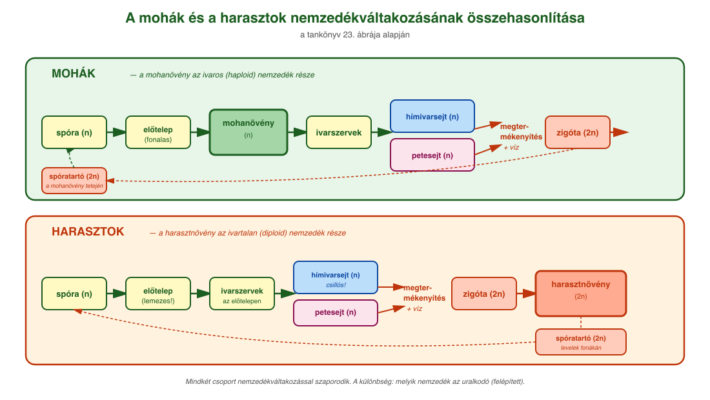

# 19. Mohák és harasztok

## A mohák

A mohák **telepes testfelépítésűek**, teleptestükben nincsenek valódi szövetek, a szerveknek látszó képleteik csak **gyökérszerű, szárszerű és levélszerű képződmények**. Szilárdítószövetek és sejtek híján legfeljebb **10-15 cm-es** méretet érhetnek el.

A mohák **változó vízállapotú növények**: vízfelvételüket és -leadásukat nem tudják szabályozni, ezért testük víztartalma környezetük vízállapotától függ. Többségük jól tűri a kiszáradást, ilyenkor anyagcseréjük lelassul, majd kellő csapadék esetén gyorsan felveszik az életműködésük helyreállításához elegendő vízmennyiséget. A vizet egész testfelületükön veszik fel és párologtatják el, emiatt a mohanövények **mohapárnákat** alkotnak. Ezzel csökken az összfelületük és a párologtatásuk.

A talaj mohagyepjei lassítják a csapadék talajba jutását, mivel szivacsként magukba szívják az esővizet, és testükből csak szivárogtatva engedik tovább a talajba. Nagyobb esőzésekkor mérséklik a talaj elhordását, az eróziót, szárazabb időszakokban pedig képesek vizet tárolni egy ideig az életközösségek számára. A szukcesszió során elősegítik a talajképződést, részt vesznek a kőzetek mállasztásában.

### A mohák nemzedékváltakozása

A mohákra **nemzedékváltakozás** jellemző. A meiózissal keletkező egyszeres kromoszómakészletű (haploid, n) **spórából** először szintén haploid fonalas **előtelep**, majd abból **mohanövény** fejlődik. Az egyes mohanövények csúcsi részén mitózissal jönnek létre a **hímivarsejtek** és a **petesejtek**. A megtermékenyítéshez **vízre van szükségük**, mert a hímivarsejtek ostorosak, és csak vízben úszva tudnak eljutni a petesejthez. A **zigóta** (megtermékenyített petesejt) már kétszeres kromoszómakészlettel rendelkezik (**diploid, 2n**), belőle fejlődik a mohanövény csúcsán a szintén diploid **spóratartó**, melynek spóratokjában keletkeznek a spórák.

A haploid nemzedéket hívjuk **ivaros nemzedéknek** (hiszen ivarsejteket termel), a diploid nemzedéket pedig **ivartalan nemzedéknek** (mivel spórákat, ivartalan szaporítóképleteket hoz létre). A spóraképzés és a spórák széllel történő szétszóródása lehetővé teszi a mohafajok szélesebb körű szárazföldi elterjedését, az ivaros szaporodással pedig lehetővé válik a fajon belül az eltérő génkészletű egyedek kombinálódása, új genotípusok kialakulása, ami növeli a faj alkalmazkodóképességét a változó környezeti feltételekhez.

## A harasztok

Összehasonlításképpen a harasztok kétszakaszos egyedfejlődése részben hasonlít, részben eltér a mohákétól.

**Hasonlóságok a mohákkal:**

- haploid (ivaros) és diploid (ivartalan) szakasza is van;
- spórákat és ivarsejteket is termelnek;
- a megtermékenyítéshez még vízre van szükségük.

**Különbségek a mohákhoz képest:**

- a harasztok előtelepe lemezes, és nem fonalas;
- az ivarsejtek termelése az előtelepen zajlik;
- a hímivarsejt csillókkal mozog;
- **a harasztnövény az ivartalan, diploid nemzedék része.**

A harasztok tehát **szövetekkel és szervekkel rendelkező, virágtalan növények**. Gyökerük, száruk és levelük van, de nincs virágjuk, magjuk és termésük.

A szárazföldi növények közül elsőként a harasztok csoportjába tartozó növényeknél alakultak ki a **szövetek** és a **szervek**. A **bőrszövet** lehetővé tette a kiszáradás elleni védelmet, a benne található **gázcserenyílások** és **párologtatás** révén biztosítják a **szállítószövetekben** a víz áramlását a gyökértől a hajtáscsúcs irányába. A szállítószövet segítségével valóra vált a növényekben a **nedvkeringés** lehetősége, a **szilárdítószövet** megjelenése pedig a mohákénál nagyobb méretű növények kialakulását eredményezte. A szövetek szervekké szerveződése még hatékonyabbá tette az egyes, a szárazföldi léthez szükséges élettani folyamatok véghezvitelét. Így a **gyökér** feladata a rögzítés, valamint a víz és a benne oldott ásványi anyagok felvétele, a **szár**é és a **levelek**é tartása és az anyagszállítás, a **levél**é pedig a gázcsere, a párologtatás és a fotoszintézis.

## Áttekintő összehasonlítás

| Tulajdonság | Mohák | Harasztok |
| --- | --- | --- |
| **Testszerveződés** | telepes; gyökér-, szár- és levélszerű képletek | szövetekkel és szervekkel rendelkező növények |
| **Szállítószövet, szilárdítószövet** | nincs | van |
| **Méret** | legfeljebb 10–15 cm | nagyobb méretű |
| **Előtelep** | fonalas | lemezes |
| **Ivarsejtek termelése** | mohanövény csúcsán | előtelepen |
| **Hímivarsejt mozgása** | ostoros | csillós |
| **Megtermékenyítéshez víz?** | szükséges | szükséges |
| **Harasztnövény / mohanövény** | a mohanövény az ivaros nemzedék része | a harasztnövény az ivartalan, diploid nemzedék része |

---

## Ábrák

*A tankönyv 21. ábrája alapján. A haploid (n) ivaros nemzedék: spóra → előtelep (fonalas) → mohanövény → ivarsejtek (hímivarsejt és petesejt). A megtermékenyítéshez víz szükséges, mert a hímivarsejt ostoros. A diploid (2n) ivartalan nemzedék: zigóta → spóratartó nyél és tok a mohanövény csúcsán → meiózissal újra spórák keletkeznek.*

*A tankönyv 22. ábrája alapján. A haploid (n) ivaros nemzedék: spóra → lemezes előtelep → ivarsejtek (hím- és petesejtképzés). A diploid (2n) ivartalan nemzedék: zigóta → harasztnövény (gyökérrel, szárral, levéllel) → spóratartó tok a levelek fonákán → meiózissal spórák.*

*A tankönyv 23. ábrája alapján. Mindkét csoport nemzedékváltakozással szaporodik. A mohák esetében a mohanövény az ivaros (haploid) nemzedék része, a harasztoknál a harasztnövény az ivartalan (diploid) nemzedék része.*

---

*Az anyag az 1. tankönyv 121, 122, 126. oldalain található.*
