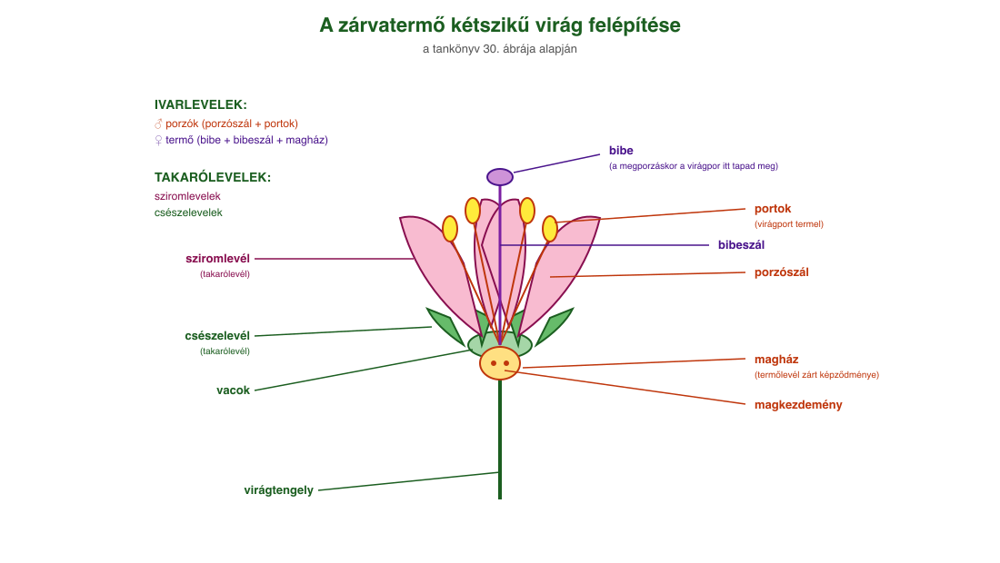
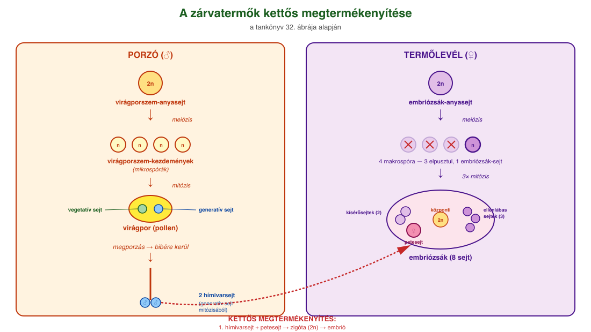
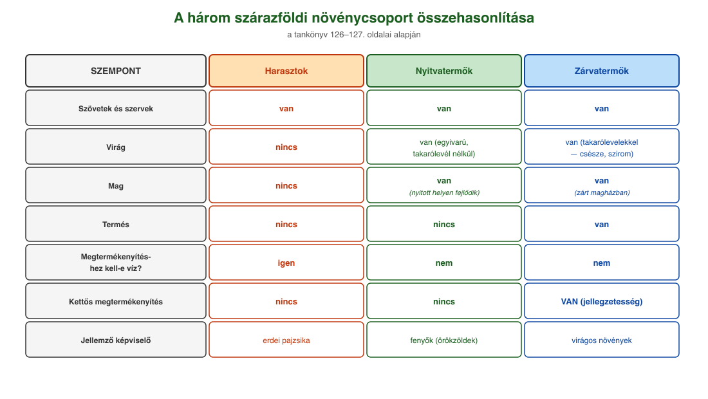

# 20. Szárazföldi növények és a kettős megtermékenyítés

## A növényvilág főbb csoportjai

Az evolúció során a szárazföldön a növényeknek más feltételekhez kellett alkalmazkodniuk, mint vízi környezetben. A vízben élő telepes szerveződésű moszatok (és még a szárazföldi mohák is) a tápanyagokat és a vízben oldott gázokat teljes testfelületen veszik fel. A szárazföldön a növényeknek meg kell kapaszkodniuk a talajban, és onnan kell felszívniuk a vizet és a vízben oldott ásványi anyagokat. A szén-dioxidhoz és az oxigénhez a levegőből tudnak hozzájutni. Védekezniük kell a kiszáradás ellen, valamint a fényért való küzdelem is megnyilvánul: a magasabbra növő növény több fényhez juthat.

A szárazföldi feltételekhez való alkalmazkodás a növényi testszerveződés ugrásszerű fejlődését, a szövetek és a szervek kialakulását eredményezte.

A közös eredetű, hasonló alakú és azonos feladatra differenciálódott sejtek alkotják a **szöveteket**. A különféle szövetek adott élettani feladatok elvégzéséhez **szervekbe** csoportosulnak. A növény önfenntartó működéseiben szerepet kapó vegetatív szervei a **gyökér, a szár és a levél**. A szár és a levél együttesen a **hajtást** alkotja. Azokat a növényeket, amelyek testét valódi szervek építik fel, **hajtásos növények**nek nevezzük. Hajtásos növények a harasztok, a nyitvatermők és a zárvatermők. Utóbbi két csoport **fajfenntartó működéséért** felelős szaporítószervei a **virág és mag**, ezért összefoglaló nevük: **virágos növények**.

## Harasztok

A harasztok szövetekkel és szervekkel rendelkező, **virágtalan növények**. A harasztoknak van gyökerük, száruk és levelük, de nincs virágjuk, magjuk és termésük.

A szárazföldi növények közül elsőként a harasztok csoportjába tartozó növényeknél alakultak ki a szövetek és a szervek. A **bőrszövet** lehetővé tette a kiszáradás elleni védelmet, a benne található **gázcserenyílások** és **párologtatás** révén biztosítják a **szállítószövetek**ben a víz áramlását a gyökértől a hajtáscsúcs irányába. A szállítószövet segítségével valóra vált a növényekben a **nedvkeringés** lehetősége, a **szilárdítószövet** megjelenése pedig a mohákénál nagyobb méretű növények kialakulását eredményezte. Így a gyökér feladata a rögzítés, valamint a víz és a benne oldott ásványi anyagok felvétele, a száré és a leveleké a tartás és az anyagszállítás, a levélé pedig a gázcsere, a párologtatás és a fotoszintézis.

## Nyitvatermők

A nyitvatermők a szárazföldi létformához még a harasztoknál is jobban alkalmazkodtak. Új szervként jelenik meg a **virág** és a **mag**. A virág módosult levelekből álló, korlátolt növekedésű, rövid szártagú szaporítóhajtás. A **mag** a virágos növények magkezdeményéből fejlődő nyugalmi állapotú szaporítószerv, ami tartalmazza a csírát (embriót), valamint az azt körülvevő táplálószövetet és a maghéjt. A virág és a mag lehetővé teszi a víztől független szaporodást, és sokkal jobban biztosítja az új növényegyed embriójának a védelmét.

A nyitvatermők nevüket onnan kapták, hogy a virágaikban a termőlevelek nem zárulnak magházzá, a magkezdemények nyitott helyen, a termőlevelek tövében fejlődnek maggá. **Termésük nincs.** Virágaik egyivarúak, csak ivarlevelet tartalmaznak, takaróleveleik nincsenek. A szaporodásuk a víztől független (nem kell víz a megtermékenyítéshez). Jellemzően szárazföldi növények.

A nyitva termő növények legismertebb képviselői a **fenyők** osztályába tartoznak. Kiterjedt erdőségeket alkotnak a tajgában és a magashegységekben, ahol nagyon zord éghajlaton kell megélniük. A faszerzet fagyásgátló gyanta itatja át, a fa koronájának alakja olyan, hogy a hó könnyen lecsússzon róla. A levelek a lehető legkisebb felszínű **tűlevelek**, amelyeket vastag viaszréteg von be. A fenyők osztályába tartozó fajok döntő többsége **örökzöld**, azaz leveleiket folyamatosan hullajtják, cserélik.

## Zárvatermők

A **zárvatermők** virágaiban a termőlevél már zárt **magházat** alakít ki, ezzel is biztosítva a mag még védettebb helyen történő fejlődését. A záródó termőlevél csúcsi része a **bibe**, itt tapad meg megporzáskor a virágpor (pollen). A virágban az ivarlevelek (porzólevelek, termőlevél) mellett **takarólevelek** (csészelevelek, sziromlevelek vagy lepellevelek) is megjelennek, ezek védik az ivarleveleket, illetve a színes takarólevelek segíthetik a megporzás folyamatát a rovarok csalogatásával.

A zárvatermők magjait **termés** is védi. A termés a zárva termő virág termőjéből a megtermékenyítés után kialakuló képződmény, mely magába zárva hordozza a magokat, és az elterjesztésükben is fontos szerepet játszik. A magok széllel, vízzel vagy állatokkal történő terjesztéséhez a terméseken különféle segítő képletek alakulhatnak ki.

A zárvatermők evolúciós újításai közé tartozik még a **szállítószövetekben a vízszállító csövek és a rostacsövek megjelenése** (még hatékonyabb tápanyagszállítást tesznek lehetővé), valamint a **hajszálgyökerek bőrszövetén a gyökérszőrök kialakulása**. Általuk nagyobb felületen képesek a növények a víz és a tápanyag felvételére.

## A zárvatermők kettős megtermékenyítése

A zárvatermők fejlődésmenetére is jellemző a mohákról és a harasztoknál már megismert kétszakaszos egyedfejlődés. A zárvatermőknél azonban nemcsak egyféle spóra jön létre, hanem kisebb (**mikrospóra**) és nagyobb spórák (**makrospóra**) is keletkeznek. Az ivaros (haploid) nemzedék nagyon lerövidül, előtelep már nem fejlődik, a teljes ivaros szakasz csak pár osztódásból és néhány sejt keletkezéséből áll.

A **porzókban** az ún. **virágporszem-anyasejtek** (diploid, 2n) hozzák létre meiózissal a mikrospórákat, másnéven virágporszem-kezdeményeket (haploid, n). Ezekből jön létre a **virágpor** (pollen), ami a mikrospóra mitózisa révén egy **vegetatív** és egy **generatív sejtet** tartalmaz. A virágpor rovarok segítségével vagy a szél útján rákerül a bibére (**megporzás**). A vegetatív sejt enzimekkel egy tömlőt képez a magház irányába, a magkezdeményhez, melyen a generatív sejt leereszkedik, miközben mitózissal két **hímivarsejt**re osztódik.

A termőlevélben az **embriózsák-anyasejt** (diploid, 2n) meiózissal osztódva négy **makrospórát** (embriózsáksejt) hoz létre, de ezek közül csak egy marad életben, a többi három elpusztul. Az embriózsáksejt mitózissal háromszor osztódik, így jön létre a nyolc sejtből álló **embriózsák**. A nyolc sejt: 1 **petesejt**, 2 kísérősejt, 3 ellenlábas sejt és 2 központi sejt. Utóbbiak egybeolvadnak, és végül egy diploid sejtet alkotnak.

A tömlőn érkező **első hímivarsejt megtermékenyíti a petesejtet**, ebből lesz a **zigóta** (diploid, 2n), majd az embrió. A **második hímivarsejt pedig a diploid központi sejttel egyesül**, belőlük fejlődik a mag **táplálószövete** (**triploid, 3n**). Ezt a folyamatot nevezzük **kettős megtermékenyítés**nek, ami a zárvatermő növények jellegzetessége. A magkezdemény burkából alakul ki a **maghéj**, ami körülveszi a táplálószövetet és az embriót.

---

## Ábrák

*A tankönyv 30. ábrája alapján. A zárvatermő virág részei: csészelevelek és sziromlevelek (takarólevelek), porzószál és portok (porzó/hímivarlevél), bibe, bibeszál, magház és magkezdemények (termőlevél). A magház a magot védő zárt képződmény, csúcsi része a bibe — ide tapad meg megporzáskor a virágpor.*

*A tankönyv 32. ábrája alapján. Bal oldalon: virágporszem-anyasejt (2n) meiózissal 4 virágporszem-kezdeményt (n) hoz létre, ebből lesz a virágpor (pollen), ami mitózissal vegetatív és generatív sejtből áll. Jobb oldalon: embriózsák-anyasejt (2n) meiózissal 4 sejtet, ebből 1 él tovább, és háromszori mitózissal jön létre a 8 sejtből álló embriózsák (petesejt, 2 kísérősejt, 3 ellenlábas sejt, 2 központi sejt). A pollentömlőn érkező két hímivarsejt egyike a petesejtet termékenyíti meg (zigóta 2n → embrió), a másik a központi sejtet (táplálószövet 3n).*

*A harasztok, nyitvatermők és zárvatermők összehasonlítása a szövet, szerv, virág, mag, termés, megtermékenyítéshez szükséges víz szempontjából.*

---

*Az anyag az 1. tankönyv 126, 127, 128. oldalain található.*
