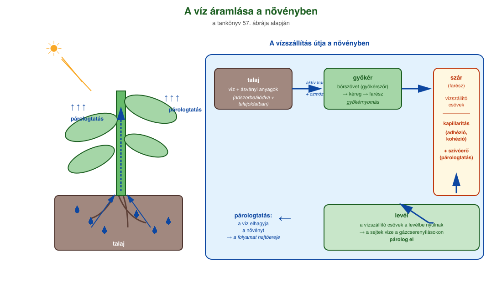
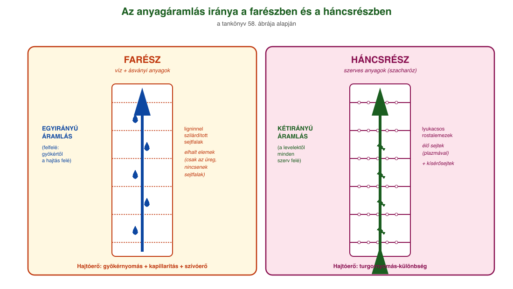
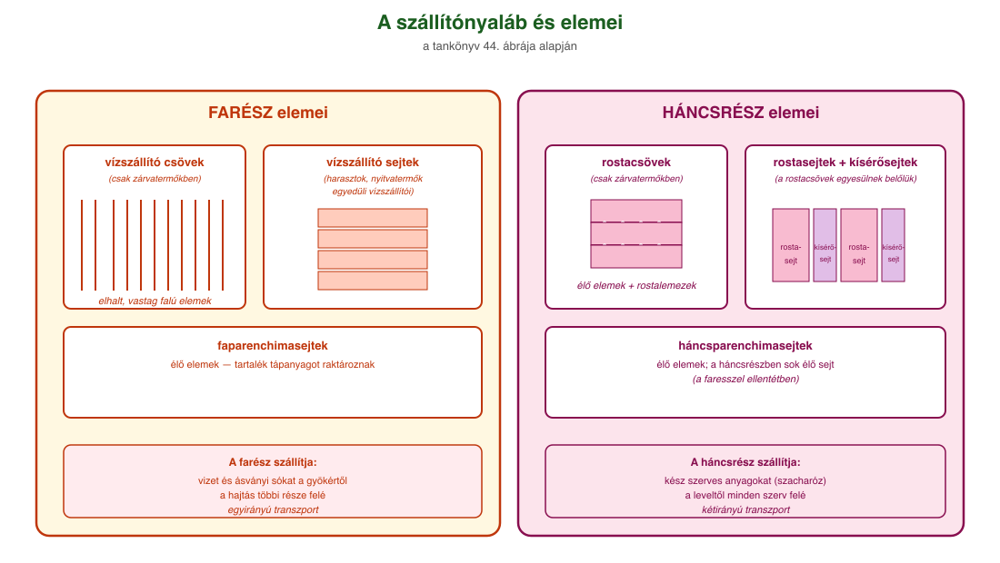

# 21. Folyadékáramlás növényekben

## A szállítószövet

A szállítószövet feladata a növényen belüli anyagmozgatás. A vizet és az ásványi sókat a **farész** szállítja a gyökértől a hajtás többi része felé. A **háncsrész**ben a fotoszintézis során keletkezett szerves anyag mozog (általában szacharózoldat formájában) a felhasználási helyek felé.

| FARÉSZ | HÁNCSRÉSZ |
| --- | --- |
| víz + ásványi anyagok | kész szerves anyagok |
| gyökerek → levél (felfelé, egyirányú transzport) | levél → minden szerv (kétirányú transzport) |
| elemei: faparenchima, vízszállító sejtek, vízszállító csövek | elemei: háncsparenchima, rostasejtek, rostacsövek |

### A farész elemei

A farész keresztmetszeti képén nagy méretű lyukak láthatók, ezek az elhalt, vastag falú **vízszállító csövek**, amelyek vízszállító sejtek egyesüléséből jönnek létre. A vízszállító csövek csak a **zárvatermők**ben fordulnak elő. A **vízszállító sejtek** a harasztok és a nyitvatermők egyedüli vízszállító elemei. A farész élő elemei a faparenchimasejtek, ezek tartalék tápanyagot raktároznak.

### A háncsrész elemei

A háncsrészben **rostasejteket, rostacsöveket és kísérősejteket** láthatunk. A rostacsövek a rostasejtek egyesüléséből jönnek létre, és csak a zárva termő növényekre jellemzők. Mindkét háncselemben sejtplazma található, tehát a faresszel ellentétben sok élő elemet tartalmaz a háncsrész. A rostacsöveket a lyukacsos **rostalemezek** választják el egymástól, ezeken keresztül történik a szerves anyagok átadása két rostacsőtag között. A kísérősejtek a háncsrészben zajló transzportfolyamatokat szabályozzák: a fotoszintetizáló sejtek felől a háncsrostok felé adják tovább a szacharózt.

### Edénynyalábok

A szállítószövetek a hajtásos növényekben **edénynyalábokat** alkotnak. Az edénynyalábok szervenként eltérő felépítésűek lehetnek. A gyökerekben egyszerű edénynyalábot találunk, ezek vagy farészt, vagy háncsrészt tartalmaznak. A szárban az edénynyalábok összetettek, fa- és háncsrészt is tartalmaznak.

## A gyökérnyomás

A gyökér víz- és ásványianyag-felvétele a **gyökérszőrök** segítségével történik. A talaj ionjainak egy része a talajkolloidok felületén adszorbeálódik, másik része pedig a talajoldatban van. Az oldott ásványi anyagok a talajoldatból **diffúzióval** jutnak a növény bőrszöveti sejtjeihez. A növény az ionokat a felszívási zónában a talajoldatból veszi fel. A gyökér bőrszöveti sejtjeinek sejthártyájában olyan fehérjemolekulák találhatók, melyek képesek a talajoldatban lévő ionok szelektív megkötésére és **aktív transzporttal** való felvételére.

Ennek következtében megnő a sejtek ozmotikus koncentrációja, ami a víz **ozmózissal** történő passzív beáramlását eredményezi a gyökérbe. Az oldott ásványi anyagok először a gyökér alapszövetébe jutnak. Ha a gyökér sejtjei kellőképpen telítettek vízzel, akkor folyadéktartalmuk egy részét a **vízszállító csövekbe nyomják**. Ez a **gyökérnyomás**, amely képes a vizet a levelek irányába hajtani. Ez a magyarázata a gyökér közelében elvágott szár keresztmetszetén megjelenő cseppeknek. A gyökérnyomás jelentős energiabefektetést igényel a növénytől.

## Anyagszállítás a szárban

A gyökérnyomás nem feltétlenül elegendő ahhoz, hogy a gyökérben felvett víz és a benne oldott ionok eljussanak a hajtás felsőbb részein található szervekhez. A farészben a **víz áramlásának** fenntartásában segít a **kapillaritás** és a **párologtatásból fakadó szívóerő**.

### Kapillaritás

A **kapillaritás** (hajszálcsövesség) azt jelenti, hogy a folyadékok keskeny átmérőjű csövekben képesek a gravitációs erő ellenében mozogni. A hajszálcsövesség egyrészt a vízmolekulák és a vízszállító cső falának részecskéi között fellépő vonzó kölcsönhatáson (**adhézió**), másrészt a vízmolekulák egymás között kialakuló vonzóhatásán (**kohézió**) alapszik.

### Párologtatásból fakadó szívóerő

A vízoszlop felső mozgatója a **párologtatásból adódó szívóerő**, amely nem igényel jelentősebb energiát, hisz elsősorban fizikai jelenség. A levél sejtjei víztartalmuk egy részét elpárologtatják. Ennek következtében ozmotikus nyomásuk nagyobb lesz, ezért a párologtató sejt a környező sejtekből vizet vesz fel. E folyamat során egyre távolabbi sejtekből diffundál a víz a párologtatás helye felé. A szívóhatás eléri a vízszállító csöveket, és azok tartalmát is megmozdítja. Ezáltal egy **összefüggő vízoszlop mozgása indul meg a gyökértől a levelek felé.**

## A szerves anyagok szállítása a háncsrészben

A szerves anyagok szállítása a háncsrészben zajlik. A szállítandó cukor (szacharóz) a fotoszintetizáló alapszöveti sejtekből **aktív transzporttal** a kísérősejtek közreműködésével kerül a rostacsövekbe. A rostacsövekben így megemelkedik az ozmotikus nyomás, ami **vízbeáramlást** idéz elő, megnövelve a háncsban a **turgornyomást** (a sejtplazmának a sejtfalra gyakorolt hidrosztatikai nyomása).

A szerves anyagok felhasználási helyén (nem fotoszintetizáló szövetek, raktározószervek: pl. gyökér, termés) a szacharóz az alapszöveti sejtek felé szállítódik, szintén aktív transzporttal, mérsékelve ezzel a rostacsövek folyadéktartalmának ozmotikus nyomását. Emiatt a háncsrészből vízkiáramlás is történik, ami miatt a turgornyomás most csökken a rostacsövekben. A szerves anyagok áramlását így a növény egyes pontjai között kialakuló **turgornyomás-különbség** váltja ki. **A háncsrészben az áramlás kétirányú.**

---

## Ábrák

*A tankönyv 57. ábrája alapján: a víz felvétele a gyökérszőrökön keresztül a talajból, a felszívási zónán át a bőrszövetbe, majd a kéregen át a központi henger farészébe. A vízoszlop a kapillaritás és a párologtatásból fakadó szívóerő révén jut felfelé a szárban, majd a levelekben elpárolog a gázcserenyílásokon át.*

*A farészben egyirányú a víz és az ásványi anyagok áramlása a gyökértől a hajtás felé (gyökérnyomás + kapillaritás + párologtatási szívóerő). A háncsrészben kétirányú a szerves anyagok áramlása: a fotoszintézis termékei a levelektől a növény egyes pontjai felé, a turgornyomás-különbség hajtja. A ligninnel szilárdított sejtfalú farész és a lyukcsos sejtfalú háncsrész szerkezetében is eltér.*

*A szállítónyalábban a vízszállító sejtek (harasztok, nyitvatermők) és a vízszállító csövek (zárvatermők) szállítják a vizet és az ásványi anyagokat a farészben. A háncsrészben a rostasejtek és rostacsövek (zárvatermőkben) szállítják a szerves anyagokat, a kísérősejtek segítségével.*

---

*Az anyag az 1. tankönyv 132, 134, 136. oldalain található.*
