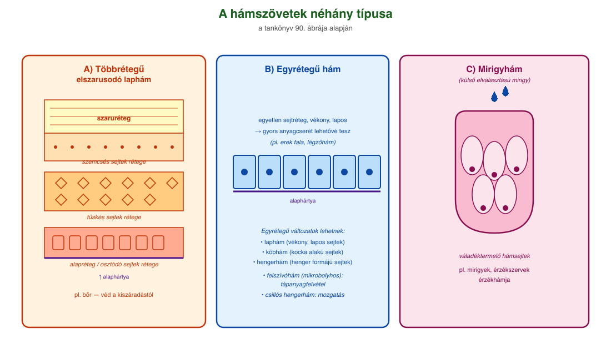
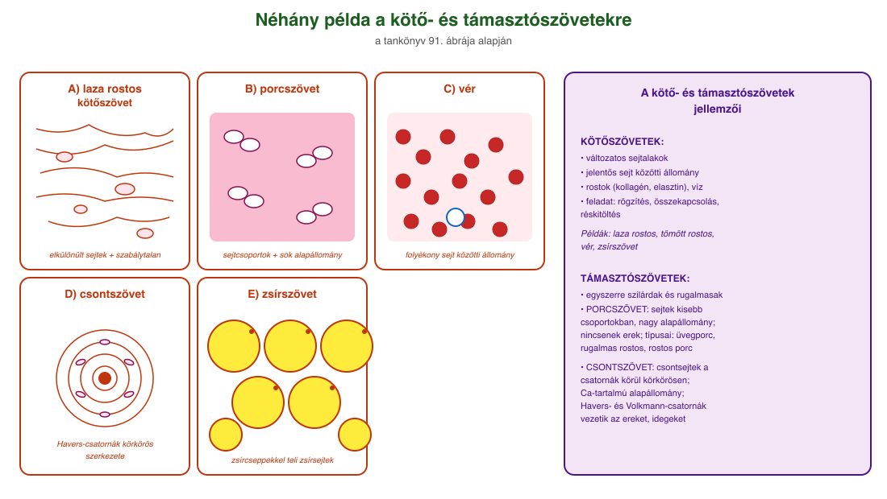
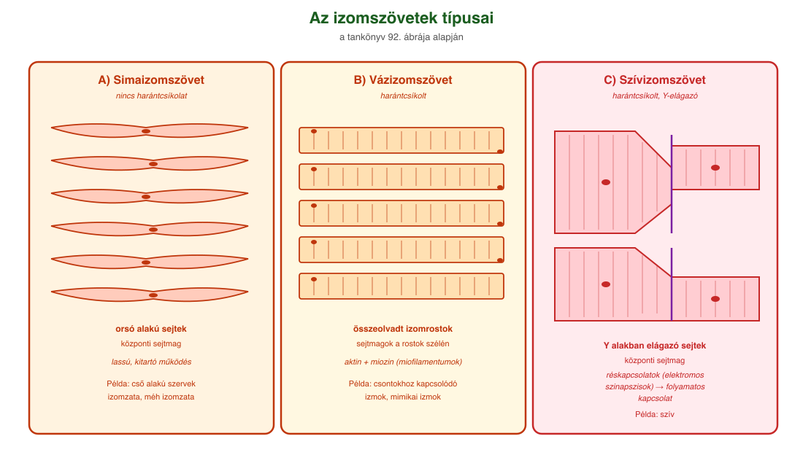

# 22. Állati szövetek

A **szövet** azonos feladat ellátására kialakult, hasonló alakú, (általában) közös eredetű sejtek együttese. Az állati alapszövetek több alaptípusát különböztethetjük meg.

## A hámszövetek

A hámszövetek külső vagy belső felszíneket borítanak (**fedőhám**). Szorosan (sejtkapcsoló struktúrákkal) záródó sejtek, amelyek a sejtek által termelt **alaphártyához** rögzülnek. Sejt közötti állományuk kevés. Feladataik az **elhatárolás és a védelem**.

A hámszöveteknek más funkciói is lehetnek, ami a felépítésükben is tükröződik. Lehetnek **egyetlen sejtrétegből felépülők**, illetve **többrétegűek** is. Lehetnek **laposak (laphám)**, **kocka alakúak (köbhám)**, **henger formájúak (hengerhám)**, egy rétegben elhelyezkedők, illetve **többrétegűek**.

Ahol a hámszövetek vékonyak, laposak (pl. erek fala, légzőhám), ott az anyagok gyors átengedése a cél. A **felszívóhám** a tápanyagmonomerek hatékony felvételét segíti elő (mikrobolyhos hengerhám). A csillós hengerhámnak (petevezeték, légcső) a mozgatásban van szerepe. A gerinces magzatburkosok többrétegű elszarusodó hámja hatékonyan véd a kiszáradástól. A hámsejtek módosulhatnak a váladék termelésére (**mirigyhám**) vagy akár az ingerek hatékony felvételére is (érzékszervek **érzékhámja**).

## A kötő- és támasztószövetek

### Kötőszövetek

Sejtjei változatos alakúak, sejt közötti állománya jelentős, sok benne a rost (pl. kollagén, elasztin) és a víz. A szerveket rögzítik, összekapcsolják, kitöltik a réseket. A **laza rostos kötőszövet**re jellemző, hogy sejtjeik egymástól elkülönülnek. A sejt közötti állományban szabálytalan lefutású fehérjerostok találhatók. Szervezetünkben hártyákat, lemezeket hoznak létre. Gazdag érhálózatával táplálni tudja az erekkel nem rendelkező szöveteket, a hám- és porcszöveteket. Körülveszi az izomszöveteket, az általa létrehozott hártyákban futnak az erek és idegek. A **tömött rostos kötőszövet** a nevében hordozza, hogy sok, egymás mellett elhelyezkedő rostot tartalmaz, például az inakban a kollagénrostot (nagy a szakítószilárdsága). Különleges kötőszövet a **vér**, sejt közötti állománya nagyrészt folyékony. A **zsírszövet** szintén kötőszövet, a zsírsejteket nagyrészt zsírcseppek töltik ki. Sejt közötti állománya nincs. Hőszigetelő, mechanikai védelmet nyújt, a zsírban oldódó vitaminok (A, D, E, K) raktározóhelye és tartalék tápanyag is.

### Támasztószövetek

Egyszerre szilárdak és rugalmasak. A **porcszövet** esetében a sejtek kisebb csoportokban helyezkednek el, ezek között van a jelentős mennyiségű sejt közötti állomány (amely főként fehérjerostokat, fehérjéket, szénhidrátláncokat és vizet tartalmaz). Nincsenek benne erek, a sejtek diffúzióval táplálkoznak és kapnak oxigént. Sejt közötti állományában található rostokat az **üvegporc** esetében az alapállomány (pl. kondroitin-szulfát, hialuronsav nagy vízmegkötő képessége miatt) elfedi. Az üvegporc ízületi felszíneket borít, a légcső, a borda porcát alkotják. **Rugalmas rostos porc** található a fülporcban, itt jól láthatók a rostok. **Rostos porc** található a csigolya közti porckorong szélében: duzzadt állapotú sejteket tartanak egyben kollagénrostok, így biztosítják a csigolyatestek közötti rugalmas kapcsolatot.

A **csontszövet** sejtjeit főként csontsejtek alkotják, ezek nyúlványosak, a csontállomány üregeiben helyezkednek el; a keresztmetszeti képen a csatornák körül körkörösen rendeződnek el. Sejt közötti alapállományában viszonylag sok szervetlen (Ca-tartalmú) vegyület található, de szerves anyagok is előfordulnak: például a jellemző lefutású kollagénrostok. A felszínnel párhuzamos Havers-csatornákban és az erre merőleges Volkmann-csatornákban erek és idegek futnak.

## Az izomszövetek

Egyes izomszövetek fénymikroszkópos képén sötét és világos sávokat láthatunk egymás mellett (ezek fényelnyelő és fényáteresztő részek). Ezt **harántcsíkolatnak** nevezzük. A harántcsíkolatot mutató izomszövetnek **két típusa** van: a **vázizomszövet** és a **szívizomszövet**.

A **vázizomszövet** építi fel például a csontokhoz kapcsolódó izmainkat, az arcunkon található mimikai izmokat, a gerincesek vázizmait és a rovarok izmait is. A szövetet a sejtek összeolvadásából létrejött **izomrostok** építik fel. A sejtmagok a rostok szélén találhatók. A rostok rostkötegeket alkotnak. A roston belül találhatók az **izomfonalak (miofibrillumok)**, amelyeken belül az izom két fő fehérjéje, az **aktin és a miozin** helyezkedik el párhuzamos szálak (**miofilamentumok**) formájában.

A **szívizomszövet** Y alakban elágazó sejtekből épül fel. Hosszú időn át nagy erőkifejtésre képes. A sejtek között szinte folytonos a kapcsolat (ezért rostnak is nevezik), mert réskapcsolatokkal (elektromos szinapszis) összekötöttek. A sejtmag központi helyzetű.

A **simaizomszövet** nem mutat harántcsíkolatot. Orsó alakú sejtekből épül fel. Az izomsejtek összehúzódásai viszonylag lassú, de kitartó működést eredményeznek. A sejtmag központi helyzetű. Például a cső alakú szervek, illetve a méh izomzatát is simaizomszövet építi fel.

## Az idegszövet

Jellegzetes sejtjei az **idegsejtek** és a **gliasejtek**. Az idegsejt nyúlványokkal (**dendrit**, **axon**) rendelkező sejttípus. Fő feladatai az információ (inger) felvétele, feldolgozása, továbbítása és átadása. A gliasejt feladatai: az idegsejt táplálása, védelme, az agy-gerincvelői folyadék termelése, az idegsejt leghosszabb nyúlványának (axon) a szigetelése. Az idegsejtek más idegsejttel **szinapszis** útján kapcsolódnak, ami lehet elektromos szinapszis vagy kémiai szinapszis.

---

## Ábrák

*A többrétegű elszarusodó laphám (A): szaruréteg, szemcsés sejtek rétege, tüskés sejtek rétege, alapréteg/osztódó sejtek rétege. Az egyrétegű hám (B): egyetlen sejtrétegből álló, alaphártyához rögzülő hámsejtek. A mirigyhám (C): külső elválasztású mirigy.*

*Néhány példa: (A) laza rostos kötőszövet — szabálytalan lefutású fehérjerostokkal; (B) porcszövet — sejtek kisebb csoportokban, jelentős alapállománnyal; (C) vér — folyékony sejt közötti állománnyal; (D) csontszövet — Havers-csatornákkal; (E) zsírszövet — zsírcseppekkel teli zsírsejtekkel.*

*A három izomszövet-típus összehasonlítása: (A) simaizomszövet — orsó alakú sejtek, központi sejtmag, nincs harántcsíkolat; (B) vázizomszövet — összeolvadt izomrostok, szélen elhelyezkedő sejtmagok, harántcsíkolt; (C) szívizomszövet — Y alakban elágazó sejtek, központi sejtmag, harántcsíkolt, réskapcsolatokkal.*

---

*Az anyag az 1. tankönyv 152, 153. oldalain található.*
