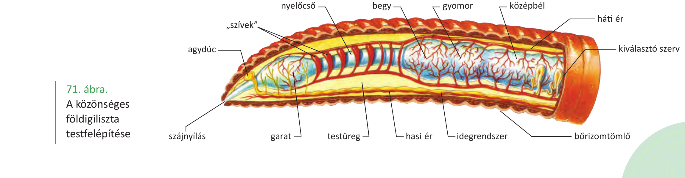
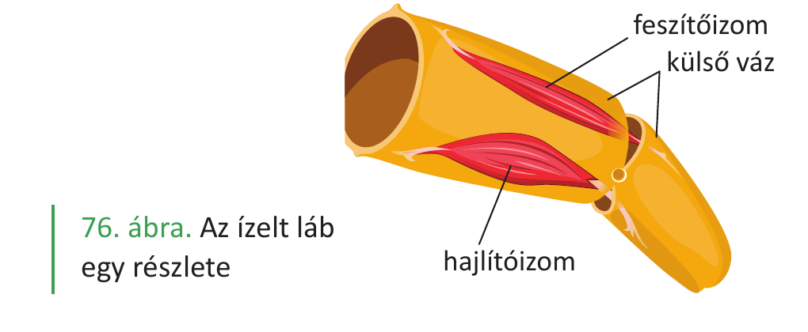

# 23. Rovarok és gyűrűsférgek

A rovarok és a gyűrűsférgek két különböző gerinctelen állatcsoport: a gyűrűsférgek a férgek közé, a rovarok az ízeltlábúak közé tartoznak. Mindkét csoport **szelvényes testfelépítésű**, ami az evolúciós előnyük is: viszonylag kevés genetikai információval létre lehet hozni nagy testet.

## A gyűrűsférgek

A gyűrűsférgek testében **ismétlődő egységek (testrészek, szervek)** találhatók, emiatt **szelvényes testfelépítésűek**. Az ember is szelvényes testfelépítésű élőlény (pl. a csigolyák ismétlődnek). A gyűrűsférgek közé tartozó fajok: **orvosi pióca, közönséges földigiliszta**.

A férgek **kétoldali szimmetriával és szervekkel** rendelkező élőlények. Ezek a testfelépítésbeli tulajdonságok az emberre is jellemzők. Szimmetrikusan elhelyezkedő szerveik (pl. szemek) segítik a jobbról és a balról érkező ingerek feldolgozását, ami nagymértékben segít a tájékozódásban. A szervek egy adott életműködést (pl. tápanyagok lebontását) nagy hatékonysággal tudnak elvégezni.

Mindegyik féregcsoportban közös, hogy **kültakarójukat egyrétegű hám borítja**, ami összenő az alatta lévő simaizomréteggel, együttesen a **bőrizomtömlőt** hozzák létre. A bőrizomtömlő az állat mozgásszerve. Az izomzat működéséhez rá kell feszülnie valamire, ami ebben az esetben a testfolyadékkal telt testüreg (**hidrosztatikai váz**). Elkülönült légzőszervük nincs (**diffúz légzés**), kültakarón át lélegeznek, feji és farki véggel rendelkeznek, hasi és hátoldaluk van.

### A közönséges földigiliszta

A gyűrűsférgek egyik képviselője a közönséges földigiliszta. **Bőrizomtömlője** a hám-, az izom- és kötőszövet egysége. Az izomrétegek lefutásának (külső körkörös és belső hosszanti), illetve a kapaszkodásra szolgáló **kitinsertéknek** fontos szerepe van az állat mozgásában. A **kültakaróban** mirigyek vannak, amelyek váladéka nyálkássá teszi a földigilisztát. A nyálka elősegíti az állat mozgását (súrlódáscsökkentő), de a légzését is. A levegő oxigénje a nyálkába, onnan az állat piros színű testfolyadékába, a vérébe jut. Bőrizomtömlője erekben dús.

A földigilisztának **zárt keringési rendszere** van, folyamatos csőrendszerben (véredényekben, erekben) kering a vére. Háti, hasi és harántvéredények (5 pár = "szív") egyaránt vannak, billentyűket tartalmaznak. A háti érben a fej felé áramlik a vér. A vér piros színe a plazmában oldott **hemoglobintól** származik, amely az oxigént szállítja.

**Előbelének** szakaszai: szájüreg, garat, nyelőcső, begy (a nyelőcső tágulata), gyomor. Ezután következik a **középbél**, majd az **utóbél**. A talajban található tápanyagokat bontja le és hasznosítja (**szaprofita**).

A földigiliszta **hímnős** állat: női és hím ivarszervei is vannak. Nem önmagát termékenyíti meg, egy másik földigilisztával kölcsönösen cserélnek hímivarsejteket. A megtermékenyítés az állat ún. **nyerge** által termelt váladékban történik (külső megtermékenyítés). A nyereg olyan szelvények csoportja, melyek szélesebbek és vastagabbak a többinél: jóval több mirigyet tartalmaznak, mint a kültakaró többi része. A termelt váladék összefüggően, gyűrűszerűen veszi körbe a földigilisztát. Ebből kibújik a földigiliszta, így a gyűrűszerű váladék lecsúszik az állatról, közben belekerülnek a saját petesejtjei és a párzótárs által korábban átjuttatott hímivarsejtek is. Fejlődésük közvetlen.

A közönséges földigilisztának **nincs szeme**. Fényérzékeny sejtek elszórtan vannak a kültakaróban. A fény elől menekülnek (**negatív fototaxis**). **Idegdúcok** nemcsak a fej területén, hanem a test hasoldalán is találhatók. Talajlakó élőlények, rendkívül fontos szerepet töltenek be az anyagok körforgásában.

A gyűrűsférgek kiemelt csoportjai: **soksertéjűek** (pl. az ehető palolóféreg), **kevéssertéjűek** (pl. a közönséges földigiliszta), módosult gyűrűsférgek, piócák (pl. **orvosi pióca** nyálában véralvadásgátló **hirudin** van).

## A rovarok

A rovarok az **ízeltlábúak** közé tartoznak. Az ízeltlábúak a Föld fajokban leggazdagabb csoportja, legalább 1 millió faj tartozik ide. Nevüket onnan kapták, hogy lábuk tagolt, több kisebb részből (ízekből) áll, amelyeket vékony rugalmas kitinhártya köt össze. A lábaknak saját izomzata van, így az ízek csuklósan mozgathatók. Nagyobb csoportjaik az **öt pár lábbal rendelkező rákok**, a **nyolc lábbal rendelkező pókszabásúak**, illetve a **hat lábbal rendelkező rovarok**.

### A rovarok testfelépítése

A rovaroknak **három fő testtája** van: a **fej, a tor és a potroh**. Szelvényes élőlények, de a fejen (6 szelvény) és a toron (3 szelvény) a szelvények összenőttek, a potrohon (12 szelvény) azonban jól láthatók.

A fejen található az **1 pár csáp** (a tapintásban és a szaglásban szerepük van), az **összetett, illetve egyszerű szemek**. A **szájszervük láberedetű** (3 pár lábból alakult ki), ez különösen a **rágó szájszervek** esetén figyelhető meg jól. Részei az 1 pár rágó, 1 pár állkapocs és 1 pár alsó ajak (összenőtt). A szájszervek az életmódnak megfelelően módosulhatnak: szívó szájszerv (lepke), rágó szájszerv (sáska), nyaló szájszerv (légy), szúró-szívó szájszerv (szúnyog).

### A rovarok kültakarója és mozgása

A torról erednek a **mozgásszervek**: a 3 pár ízelt láb és a 2 pár szárny. **Kültakarójuk egyrétegű hengerhám**, amely egy védőréteget, az ún. **kutikulát** termeli a felszín felé, ennek fő anyaga a **kitin** (N-tartalmú poliszacharid). A kitinkutikula véd a mechanikai behatásoktól, a kiszáradástól, és izmok is tapadnak hozzá (**külső váz**). A víztől való elszakadást a kiszáradást megakadályozó kültakaró tette lehetővé, így a rovarok a víztől távolabbi élőhelyeken is elterjedhettek. A kitinváz nem növekszik az állattal, növekedés előtt le kell vedleni. A vedlés hormonálisan szabályozott folyamat. A rovarok gyors mozgása a külső, kemény kitinvázhoz tapadó harántcsíkolt vázizmoknak köszönhető. Izmai ún. **kiegyénült izmok**, ami azt jelenti, hogy különállóak, és apró, finom mozgásokat is lehetővé tesznek (nem olyan egységes izom, mint a bőrizomtömlő). A külső váz megjelenése tette lehetővé az elemelkedést a földről, a helyváltoztatást.

### Légzés és keringés

**Nyílt keringési rendszerük** van, amiben **vérnyirok** kering. Ez alig tartalmaz oxigént, mert a rovarok légzőszerve egy olyan csőrendszer (**légcsövek, tracheák rendszere**), amely a potrohon és a toron elhelyezkedő zárható **légzőnyílásokból** ered, rendkívül elágazók, és a sejtekig szállítják az oxigént. A rovarok esetében a kilégzés aktív, a belégzés passzív folyamat.

A rovarok szíve a potroh hátoldalán elhelyezkedő **kamrás szív**, amely a tor főerébe folytatódik. A szív hátul zárt, oldalt nyitott, és billentyűket tartalmaz.

### Tápcsatorna

A rovarok tápcsatornája **tagolt, nyálmirigyeik vannak**. A szájüreg után következik a nyelőcső, a begy, a gyomor (kitinfogakat tartalmazhat), a középbél (az emésztés és a felszívás helye, emésztésük sejten kívüli) és az utóbél. A középbél kezdetén felületnövelő **vakbélágak** vannak. A rovaroknak speciális szerve a zsírtest, amely tápanyagraktár. Sejtjeinek működése hasonlít a gerincesek májának működéséhez.

### Szaporodás és fejlődés

Szaporodásuk: **váltivarúak** (más-más egyedben van a hímivarszerv és a női ivarszerv), **ivari kétalakúság** (meg lehet különböztetni az eltérő nemű egyedeket), **belső megtermékenyítés** jellemző.

A rovaroknál a következő egyedfejlődés-típusokat lehet megfigyelni:

- **Teljes átalakulás**: pete-lárva-báb-imágó (kifejlett rovar), például bogarak, legyek.
- **Kifejlés**: pete-lárva-imágó, például sáskák. A lárva hasonlít a kifejlett rovarra, csak egyes testrészei később fejlődnek ki (ivarszervek, szárny).
- **Átváltozás**: pete-lárva-imágó, például szitakötők. A lárva nem hasonlít a kifejlett rovarra.

### Idegrendszer és érzékelés

A rovaroknak **dúcidegrendszerük** van. Érzékelésük: egyszerű pontszemeik irányítást, illetve fényerősség-érzékelést, összetett szemük mozaiklátást tesz lehetővé. Utóbbi a tárgyak alakját jól látja, a képfelbontása jóval kisebb, mint az emberi szemé, de az időbeli felbontóképessége jobb. Csápjaikkal a szaglási, tapintási, hallás-rezgési információkat érzékelhetik. Hallószervük a torban, potrohban vagy a lábszárban helyezkedhet el. Hangadásra képesek lehetnek, például úgy, hogy a rovar egymáshoz dörzsöli egyes testrészeit: a lábat a szárnyhoz vagy a szárnyat a szárnyhoz (sáskák, tücskök).

---

## Ábrák

*A tankönyv 71. ábrája alapján. A földigiliszta szervei: szájnyílás, garat, nyelőcső, begy, gyomor, középbél, "szívek" (5 pár harántvéredény), agydúc, háti ér, hasi ér, kiválasztó szerv, idegrendszer, testüreg, bőrizomtömlő.*

*A tankönyv 76. ábrája alapján. Egy ízelt láb részlete: külső váz, feszítőizom, hajlítóizom — a saját izomzattal rendelkező ízek csuklósan mozgathatók.*

*A tankönyv 79. ábrája alapján. A rovarok tápcsatornája: nyálmirigy, nyáltartály, nyelőcső, begy, rágógyomor, vakbelek, középbél, Malpighi-csövek, végbél, utóbél. Nyílt keringési rendszer: aorta elülső folytatása, legyezőizmok, szívkamrák.*

---

*Az anyag az 1. tankönyv 143, 145, 146, 147. oldalain található.*
