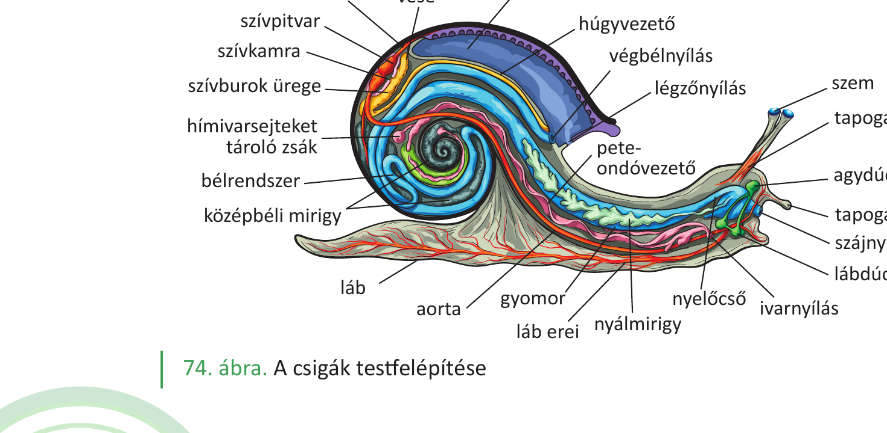
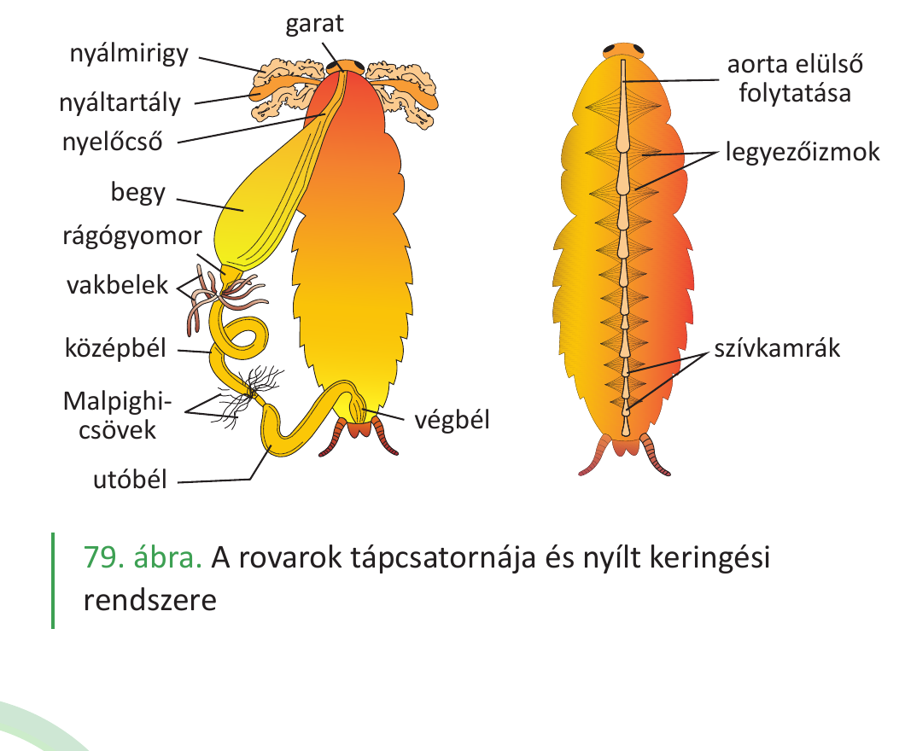
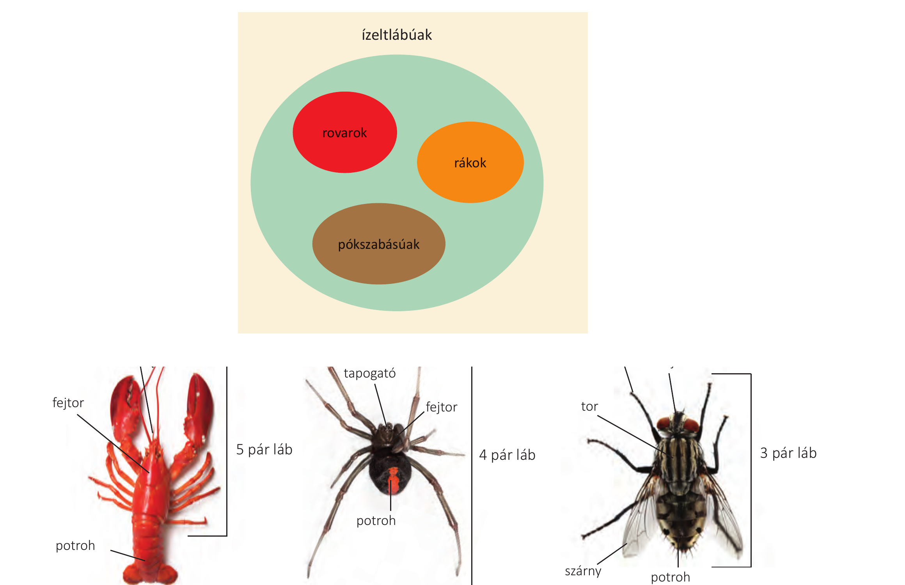

# 24. Rovar és csiga összehasonlítása

A rovarok és a csigák két különböző gerinctelen állatcsoport képviselői. A **csigák a puhatestűek** közé tartoznak (pl. éticsiga, kerti csiga, óriás meztelencsiga), a **rovarok az ízeltlábúak** közé. Mindkét csoport eltérő testfelépítési és életműködési megoldásokat mutat, amelyeket az alábbiakban a tankönyvi ismeretek alapján hasonlítunk össze.

## Testfelépítés

A **csigák** testének nincs belső szilárd váza, testük viszonylag lágy, puha (innen ered a puhatestűek elnevezés). Az éticsiga teste három fő részre tagolódik: **fej, láb és zsigerzacskó**. Jellemző szervük a **köpeny**, ami kültakarókettőzet. Kültakaróját egyrétegű hengerhám alkotja, mirigyekkel van tele. A köpeny nyálka-, fehérje- és mészmirigyei létrehozzák az állat **külső meszes vázát** (csigaházat). A csigák aszimmetrikus élőlények, de csak másodlagosan, őseik kétoldali szimmetriával rendelkeztek. A részaránytalanná válás három alapvető folyamat eredménye: a test visszahajlása, csavarodása, visszacsavarodása.

A **rovarok** az ízeltlábúak közé tartoznak. Lábuk tagolt, több kisebb részből (ízekből) áll, amelyeket vékony rugalmas kitinhártya köt össze. A rovaroknak **három fő testtája** van: **fej, tor és potroh**. Szelvényes élőlények, de a fejen (6 szelvény) és a toron (3 szelvény) a szelvények összenőttek, a potrohon (12 szelvény) azonban jól láthatók. Kültakarójuk **egyrétegű hengerhám**, amely egy védőréteget, az ún. **kutikulát** termeli a felszín felé, ennek fő anyaga a **kitin** (N-tartalmú poliszacharid). A kitinkutikula véd a mechanikai behatásoktól, a kiszáradástól, és izmok is tapadnak hozzá (**külső váz**).

## Mozgás

A **csiga** **bőrizomtömlővel** mozog, amelynek izomrétegét **simaizom** alkotja. A csigaház tengelyét alkotó oszlophoz kapcsolódik az a kiegyénült izom, ami visszahúzza az élőlényt a házába.

A **rovarok**nak a torról erednek a mozgásszerveik: a **3 pár ízelt láb** és a **2 pár szárny**. A lábaknak saját izomzata van, így az ízek csuklósan mozgathatók. A rovarok gyors mozgása a külső, kemény kitinvázhoz tapadó **harántcsíkolt vázizmoknak** köszönhető. Izmaik ún. **kiegyénült izmok**, ami azt jelenti, hogy különállóak, és apró, finom mozgásokat is lehetővé tesznek (nem olyan egységes izom, mint a bőrizomtömlő). A külső váz megjelenése tette lehetővé az elemelkedést a földről, a helyváltoztatást. A kitinváz nem növekszik az állattal, növekedés előtt le kell vedleni; a **vedlés** hormonálisan szabályozott folyamat.

## Légzés

A **csiga** légzése **tüdővel** valósul meg, ami a **köpenyüreg** (a kültakaró) gazdagon erezett fala.

A **rovarok** légzőszerve egy olyan csőrendszer (**légcsövek, tracheák rendszere**), amely a potrohon és a toron elhelyezkedő zárható **légzőnyílásokból** ered, rendkívül elágazó, és a sejtekig szállítja az oxigént. A rovarok esetében a kilégzés aktív, a belégzés passzív folyamat.

## Keringés

Mindkét csoport **nyílt keringési rendszerrel** rendelkezik, és a keringő testfolyadékot mindkét esetben **vérnyirok**nak nevezzük (mivel csak a zárt keringési rendszerben keringő folyadékot nevezzük vérnek).

A **csiga** szíve **kétüregű** (1 pitvar és 1 kamra), a szívből kilépő erek a verőerek, a szívbe menő erek a gyűjtőerek. A verőerek és a gyűjtőerek nincsenek összeköttetésben egymással, ezért nyílt a keringési rendszerük. A csiga vérnyirkának színe a benne lévő réztartalmú festék (**hemocianin**) miatt **kék**.

A **rovarok** szíve a potroh hátoldalán elhelyezkedő **kamrás szív**, amely a tor főerébe folytatódik. A szív hátul zárt, oldalt nyitott, és billentyűket tartalmaz. A vérnyirok áramoltatását a **legyezőizmok** segítik, a folyadék a szív oldalnyílásain jut be a szívbe. A rovarok vérnyirka alig tartalmaz oxigént, mert a tracheák közvetlenül a sejtekhez szállítják azt.

## Tápcsatorna és táplálkozás

A **csiga** táplálkozásában jellemző szerve a szájüreg alsó részén található **reszelőnyelv**. A reszelőnyelv felszínén apró kitinfogak találhatók. Az állkapcsa szintén kitines. A szájüreg után a garat, a nyelőcső (ide nyílnak a nyálmirigyek) és a gyomor képezi az előbelet. A **középbél** feladata az emésztés és a felszívás. A középbélhez csatlakozó mirigy a **középbéli mirigy**, ami a máj és a hasnyálmirigy funkcióit tölti be. Az utóbél elöl nyílik a szabadba a légzőnyílás mellett. Az éticsiga **növényevő** faj.

A **rovarok** tápcsatornája **tagolt, nyálmirigyeik vannak**. A szájüreg után következik a nyelőcső, a begy, a gyomor (kitinfogakat tartalmazhat), a középbél (az emésztés és a felszívás helye, emésztésük sejten kívüli) és az utóbél. A középbél kezdetén felületnövelő **vakbélágak** vannak. A rovaroknak speciális szerve a **zsírtest**, amely tápanyagraktár; sejtjeinek működése hasonlít a gerincesek májának működéséhez. A szájszervük **láberedetű** (3 pár lábból alakult ki), és az életmódnak megfelelően módosulhat: szívó (lepke), rágó (sáska), nyaló (légy), szúró-szívó (szúnyog).

## Érzékelés és idegrendszer

A **csigá**nak az éticsiga példáján: a fején helyezkednek el a páros tapogatók. A hosszabbik pár tapogatón találhatók a szemek (**fotoreceptorok**), a rövidebb párnak a **szaglásban** (**kemoreceptorok**) van szerepe. A helyzetérzékelő szerve a lábában található (az érzékelés mechanizmusa az emlősök helyzetérzékelő szervének működéséhez hasonló). A csigának dúcidegrendszere van: agydúc, lábdúc.

A **rovarok**nak is **dúcidegrendszerük** van. Érzékelésük: egyszerű pontszemeik iránylátást, illetve fényerősség-érzékelést, **összetett szemük** **mozaiklátást** tesz lehetővé. Utóbbi a tárgyak alakját jól látja, a képfelbontása jóval kisebb, mint az emberi szemé, de az időbeli felbontóképessége jobb. Csápjaikkal a szaglási, tapintási, hallás-rezgési információkat érzékelhetik. Hallószervük a torban, potrohban vagy a lábszárban helyezkedhet el.

## Szaporodás és fejlődés

Az **éticsiga hímnős** élőlény. A párzási időszak a június–július, de ekkor még nem történik meg a megtermékenyítés. Az átjuttatott hímivarsejtek egy tartályban tárolódnak, később van a (**belső**) megtermékenyítés, július–augusztusban. A hímnős mirigyben termelődnek az ivarsejtek; a hímivarsejtek termelése szinte folyamatos. A petesejtek érése a kölcsönös megtermékenyítés során a párzótársból átjuttatott hímivarsejtek egy részének lebontásából származó anyagok hatására történhet. Fejlődése **közvetlen** (nincs köztes alak, nincs lárva).

A **rovarok** szaporodása: **váltivarúak** (más-más egyedben van a hímivarszerv és a női ivarszerv), **ivari kétalakúság** (meg lehet külsőleg is különböztetni az eltérő nemű egyedeket), **belső megtermékenyítés** jellemző. A rovaroknál a következő egyedfejlődés-típusokat lehet megfigyelni:

- **Teljes átalakulás**: pete-lárva-báb-imágó (kifejlett rovar), például bogarak, legyek.
- **Kifejlés**: pete-lárva-imágó, például sáskák. A lárva hasonlít a kifejlett rovarra, csak egyes testrészei később fejlődnek ki (ivarszervek, szárny).
- **Átváltozás**: pete-lárva-imágó, például szitakötők. A lárva nem hasonlít a kifejlett rovarra.

## Összefoglaló táblázat

| Szempont | Csiga (éticsiga) | Rovar |
|---|---|---|
| Törzs/csoport | puhatestűek | ízeltlábúak |
| Testtájak | fej, láb, zsigerzacskó | fej, tor, potroh |
| Szimmetria | aszimmetrikus (másodlagosan) | kétoldali |
| Váz | külső meszes váz (csigaház) | külső kitinváz |
| Mozgás szerve | bőrizomtömlő (simaizom) | 3 pár ízelt láb, 2 pár szárny (harántcsíkolt vázizom) |
| Légzés | tüdő (köpenyüreg fala) | tracheák (légcsőrendszer) |
| Keringés | nyílt, kétüregű szív, vérnyirok (hemocianin → kék) | nyílt, kamrás szív, vérnyirok |
| Tápcsatorna jellegzetessége | reszelőnyelv, középbéli mirigy | nyálmirigy, begy, vakbélágak, zsírtest |
| Szájszerv | reszelőnyelv, kitines állkapocs | láberedetű, módosult típusok |
| Idegrendszer | dúcidegrendszer | dúcidegrendszer |
| Érzékszervek | tapogatók (fotoreceptor, kemoreceptor) | összetett szem (mozaiklátás), csápok |
| Ivar | hímnős | váltivarú, ivari kétalakúság |
| Megtermékenyítés | belső, késleltetett | belső |
| Fejlődés | közvetlen | teljes átalakulás / kifejlés / átváltozás |

---

## Ábrák

*Az éticsiga szervei: tüdővéna, vese, tüdő, szívpitvar, szívkamra, szívburok ürege, húgyvezető, végbélnyílás, légzőnyílás, hímivarsejteket tároló zsák, pete-ondóvezető, bélrendszer, középbéli mirigy, láb, aorta, gyomor, nyálmirigy, nyelőcső, ivarnyílás, szájnyílás, lábdúc, agydúc, tapogató, szem.*

*A rovarok tápcsatornája: nyálmirigy, nyáltartály, nyelőcső, begy, rágógyomor, vakbelek, középbél, Malpighi-csövek, végbél, utóbél. Nyílt keringési rendszer: garat, aorta elülső folytatása, legyezőizmok, szívkamrák.*

*Az ízeltlábúak három fő csoportja és lábszámuk: rákok (5 pár láb, fejtor + potroh), pókszabásúak (4 pár láb, fejtor + potroh), rovarok (3 pár láb, fej + tor + potroh, szárnyakkal).*

---

*Az anyag az 1. tankönyv 144, 145, 146, 147. oldalain található.*
