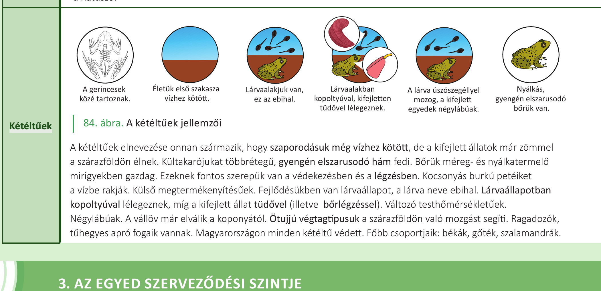
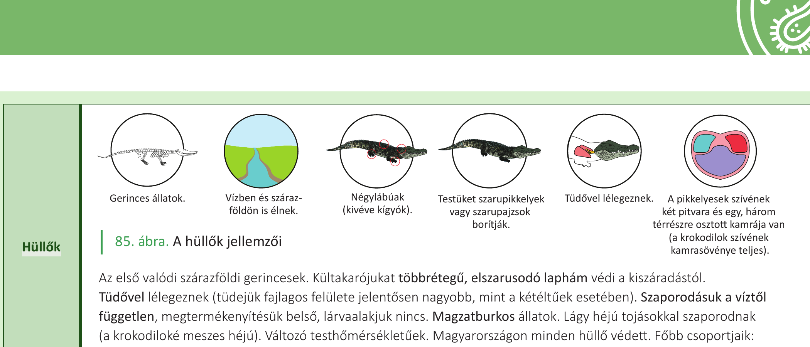
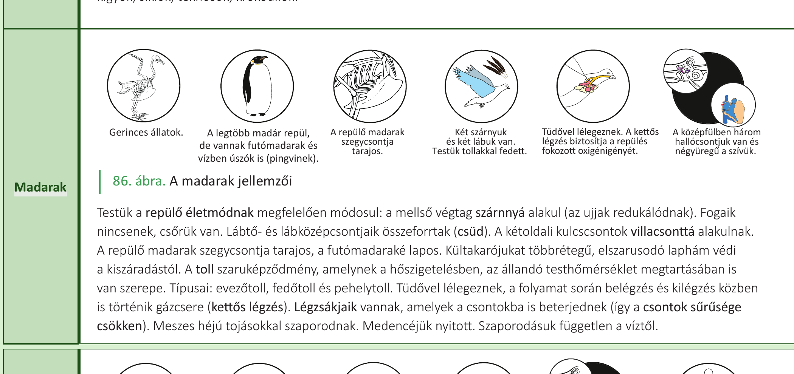

# 25. Kétéltűek, hüllők, madarak

A gerinces állatok fő csoportjai a halak, a kétéltűek, a hüllők, a madarak és az emlősök. A gerinces elnevezés egyrészt utal arra, hogy **belső vázuk** van, amit általában szilárd és kemény csont vagy néhány csoportnál porc alkot. Másrészt utal arra is, hogy **szelvényes élőlényekről** van szó, hiszen a gerincoszlop ismétlődő egységekből, csigolyákból épül fel. Kialakul az **állkapocs**. Kültakarójuk a **bőr**, amely több rétegből áll, és amelynek külső rétege minden gerincesnél **többrétegű hám**. A szárazföldi gerinceseknél a bőr legfelső rétege elhalt **szaruréteg**, amely a kiszáradástól véd.

**Bélcsatornájuk háromszakaszos**: az előbélnek a táplálék felaprításában, a középbélnek az emésztésben és felszívásban, míg az utóbélnek a salakanyagok kialakításában és eltávolításában van szerepe. **Kloakának** nevezzük a kiválasztó-, a szaporító- és az emésztőrendszer közös kivezető csatornáját (közös húgy-, ivar- és végbélkivezető), hátsó testnyílással nyílik a külvilágba. Szinte minden gerinces csoportnál előfordul, de az emlősökre már nem jellemző. **Keringési rendszerük zárt**, amelyben vér kering. Légzőszervük a **kopoltyú**, illetve a **tüdő** (a gerinceseknél ezek a szervek a bélből alakultak ki, míg gerincteleneknél a kültakaró származékai). A gerincesek lehetnek **külső** (halak, kétéltűek) és **belső megtermékenyítésűek** (hüllők, madarak, emlősök) is. A víztől független szaporodás, a kiszáradástól védő vastag szaruréteg tette lehetővé, hogy a hüllők váltak az első valódi szárazföldi, gerinces élőlényekké.

A halak, kétéltűek és a hüllők **változó testhőmérsékletűek**, tehát testhőmérsékletük nagymértékben függ a külső környezet hőmérsékletétől. A madarak és az emlősök **állandó testhőmérsékletűek**.

## Kétéltűek

A kétéltűek elnevezése onnan származik, hogy szaporodásuk még vízhez kötött, de a kifejlett állatok már zömmel a szárazföldön élnek. Kültakarójukat **többrétegű, gyengén elszarusodó hám** fedi. Bőrük **méreg- és nyálkatermelő mirigyekben gazdag**. Ezeknek fontos szerepük van a védekezésben és a légzésben. **Kocsonyás burkú petéiket a vízbe rakják**. **Külső megtermékenyítésűek**. Fejlődésükben van **lárvaállapot, a lárva neve ebihal**. Lárvaállapotban **kopoltyúval lélegeznek**, míg a kifejlett állat **tüdővel** (illetve **bőrlégzéssel**). **Változó testhőmérsékletűek**. Négylábúak. A **vállöv már elválik a koponyától**. **Ötujjú végtagtípusuk** a szárazföldön való mozgást segíti. **Ragadozók, tűhegyes apró fogaik** vannak. Magyarországon minden kétéltű védett.

**Főbb csoportjaik: békák, gőték, szalamandrák.**

## Hüllők

**Az első valódi szárazföldi gerincesek.** Kültakarójukat **többrétegű, elszarusodó laphám** védi a kiszáradástól. Testüket **szarupikkelyek vagy szarupajzsok** borítják. **Tüdővel lélegeznek** (tüdejük fajlagos felülete jelentősen nagyobb, mint a kétéltűek esetében). Szaporodásuk a víztől független, **megtermékenyítésük belső, lárvaalakjuk nincs**. **Magzatburkos állatok**. **Lágy héjú tojásokkal** szaporodnak (a krokodiloké meszes héjú). **Változó testhőmérsékletűek**. A pikkelyesek szívének **két pitvara és egy, három térrészre osztott kamrája van** (a krokodilok szívének kamrasövénye teljes). Vízben és szárazföldön is élnek. **Négylábúak** (kivéve kígyók). Magyarországon minden hüllő védett.

**Főbb csoportjaik: kígyók, siklók, teknősök, krokodilok.**

## Madarak

Testük a **repülő életmódnak** megfelelően módosul: a mellső végtag **szárnnyá** alakul (az ujjak redukálódnak). **Fogaik nincsenek, csőrük van**. Lábtő- és lábközépcsontjaik összeforrtak (**csüd**). A kétoldali kulcscsontok **villacsonttá** alakulnak. A repülő madarak **szegycsontja tarajos**, a futómadaraké lapos. Kültakarójukat **többrétegű, elszarusodó laphám** védi a kiszáradástól. A **toll szaruképződmény**, amelynek a hőszigetelésben, az **állandó testhőmérséklet** megtartásában is van szerepe. Típusai: **evezőtoll, fedőtoll és pehelytoll**. **Tüdővel lélegeznek**, a folyamat során belégzés és kilégzés közben is történik gázcsere (**kettős légzés**). **Légzsákjaik** vannak, amelyek a csontokba is beterjednek (így a csontok sűrűsége csökken). **Meszes héjú tojásokkal** szaporodnak. Medencéjük nyitott. **Szaporodásuk független a víztől**. A középfülben **három hallócsontjuk van** és **négyüregű a szívük**. A kettős légzés biztosítja a repülés fokozott oxigénigényét. Két szárnyuk és két lábuk van.

A legtöbb madár repül, de vannak **futómadarak és vízben úszók is (pingvinek)**.

## Az állandó testhőmérsékletűség alapjai

A madarak és az emlősök állandó testhőmérsékletűek, amely köszönhető:

- a **kiváló hőszigetelő rendszerüknek** (bőraljában zsír, illetve a madaraknál a toll, emlősöknél a szőr),
- **fejlett idegrendszerüknek** (hipotalamusz, hőszabályozó központ),
- a **hatékony oxigénellátást biztosító keringési rendszerüknek** (nem keveredik az oxigéndús és a szén-dioxid-dús vér).

Érzékszerveik változatosak és nagymértékben elősegítik a tájékozódást, a védekezést vagy a támadást.

---

## Ábrák

*A kétéltűek főbb jellemzői: a gerincesek közé tartoznak, életük első szakasza vízhez kötött, lárvaalakjuk van (ebihal), lárvaalakban kopoltyúval, kifejletten tüdővel lélegeznek, a lárva úszószegéllyel mozog, a kifejlett egyedek négylábúak, nyálkás, gyengén elszarusodó bőrük van.*

*A hüllők főbb jellemzői: gerinces állatok, vízben és szárazföldön is élnek, négylábúak (kivéve kígyók), testüket szarupikkelyek vagy szarupajzsok borítják, tüdővel lélegeznek, a pikkelyesek szívének két pitvara és egy, három térrészre osztott kamrája van (a krokodilok szívének kamrasövénye teljes).*

*A madarak főbb jellemzői: gerinces állatok, a legtöbb madár repül, de vannak futómadarak és vízben úszók is (pingvinek), a repülő madarak szegycsontja tarajos, két szárnyuk és két lábuk van, testük tollakkal fedett, tüdővel lélegeznek, a kettős légzés biztosítja a repülés fokozott oxigénigényét, a középfülben három hallócsontjuk van és négyüregű a szívük.*

---

*Az anyag az 1. tankönyv 148, 149, 150. oldalain található.*
