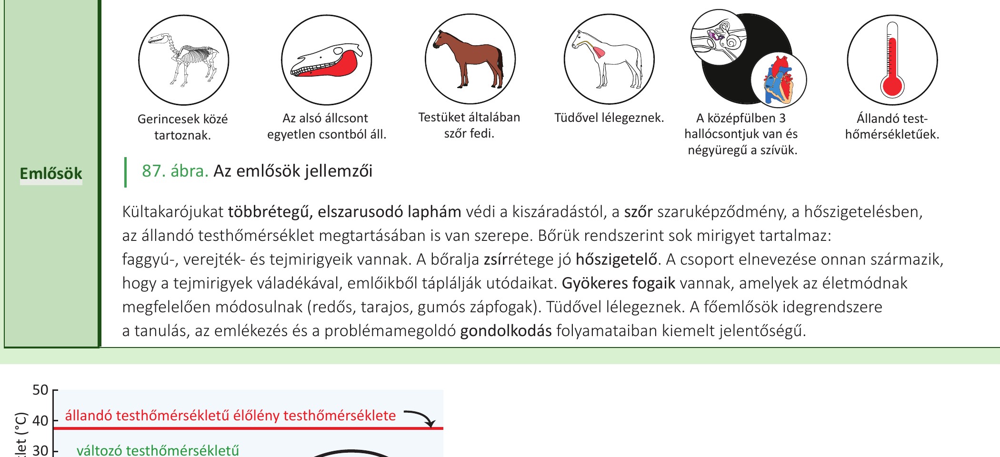
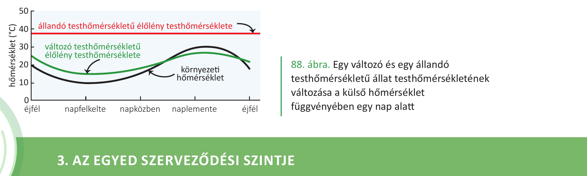

# 26. Emlősök és hüllők

A hüllők és az emlősök egyaránt **gerinces állatok**, így van **belső vázuk** (csont vagy porc), **szelvényes testfelépítésűek** (gerincoszlopuk csigolyákból áll), **állkapcsuk** van, **kültakarójuk a bőr** (külső rétege többrétegű hám). A szárazföldi gerinceseknél a bőr legfelső rétege elhalt **szaruréteg**, amely a kiszáradástól véd. **Bélcsatornájuk háromszakaszos**: az előbél a táplálék felaprításában, a középbél az emésztésben és felszívásban, az utóbél a salakanyagok kialakításában és eltávolításában játszik szerepet. **Keringési rendszerük zárt**, amelyben vér kering. **Tüdővel lélegeznek**.

Eltérő viszont sok más jellemzőjük — testhőmérsékletük, kültakarójuk típusa, szaporodásuk és fejlettségük. Az alábbiakban ezeket a különbségeket vesszük sorra.

## Hüllők

**Az első valódi szárazföldi gerincesek.** Kültakarójukat **többrétegű, elszarusodó laphám** védi a kiszáradástól. Testüket **szarupikkelyek vagy szarupajzsok** borítják. **Tüdővel lélegeznek** (tüdejük fajlagos felülete jelentősen nagyobb, mint a kétéltűek esetében). Szaporodásuk a víztől független, **megtermékenyítésük belső, lárvaalakjuk nincs**. **Magzatburkos állatok**. **Lágy héjú tojásokkal** szaporodnak (a krokodiloké meszes héjú). **Változó testhőmérsékletűek** — testhőmérsékletük nagymértékben függ a külső környezet hőmérsékletétől.

A **pikkelyesek szívének két pitvara és egy, három térrészre osztott kamrája van** (a krokodilok szívének kamrasövénye teljes). Vízben és szárazföldön is élnek. **Négylábúak** (kivéve kígyók). Magyarországon minden hüllő védett.

**Főbb csoportjaik: kígyók, siklók, teknősök, krokodilok.**

## Emlősök

Kültakarójukat **többrétegű, elszarusodó laphám** védi a kiszáradástól, a **szőr szaruképződmény**, a hőszigetelésben, az **állandó testhőmérséklet megtartásában** is van szerepe. Bőrük rendszerint sok mirigyet tartalmaz: **faggyú-, verejték- és tejmirigyeik** vannak. A **bőralja zsírrétege** jó hőszigetelő. A csoport elnevezése onnan származik, hogy a **tejmirigyek váladékával, emlőikből táplálják utódaikat**.

**Gyökeres fogaik** vannak, amelyek az életmódnak megfelelően módosulnak (**redős, tarajos, gumós zápfogak**). **Tüdővel lélegeznek**. A **főemlősök idegrendszere** a **tanulás, az emlékezés és a problémamegoldó gondolkodás** folyamataiban kiemelt jelentőségű.

További jellemzők (ábra alapján): **Gerincesek közé tartoznak. Az alsó állcsont egyetlen csontból áll. Testüket általában szőr fedi. A középfülben 3 hallócsontjuk van** és **négyüregű a szívük**. **Állandó testhőmérsékletűek.**

## Összehasonlítás

### Testhőmérséklet és hőszabályozás

A **hüllők változó testhőmérsékletűek**, testhőmérsékletük a külső környezet hőmérsékletétől függ. Az **emlősök állandó testhőmérsékletűek**, amely köszönhető:

- a **kiváló hőszigetelő rendszerüknek** (bőraljában zsír, illetve a szőr),
- **fejlett idegrendszerüknek** (hipotalamusz, hőszabályozó központ),
- a **hatékony oxigénellátást biztosító keringési rendszerüknek** (nem keveredik az oxigéndús és a szén-dioxid-dús vér).

### Kültakaró

A **hüllők** kültakaróját többrétegű, elszarusodó laphám védi, testüket **szarupikkelyek vagy szarupajzsok** borítják. Bőrük szegény mirigyekben.

Az **emlősök** kültakarója szintén többrétegű, elszarusodó laphám, de testüket általában **szőr** (szaruképződmény) fedi. Bőrük **mirigyekben gazdag**: faggyú-, verejték- és tejmirigyek vannak benne. Bőralját zsírréteg béleli.

### Szív- és keringési rendszer

A **hüllők** (pikkelyesek) szívének **két pitvara és egy, három térrészre osztott kamrája van** (a krokodilok szíve teljes kamrasövényű). Ez azt jelenti, hogy a hüllők szívében részben még keveredik az oxigéndús és a szén-dioxid-dús vér.

Az **emlősök** szíve **négyüregű** (két pitvar, két kamra teljes kamrasövénnyel), ezáltal az oxigéndús és a szén-dioxid-dús vér teljesen elkülönül, ami a hatékony oxigénellátáshoz és az állandó testhőmérséklet fenntartásához szükséges.

### Szaporodás és utódgondozás

A **hüllők** szaporodása **a víztől független**, megtermékenyítésük **belső**, **lárvaalakjuk nincs**. **Magzatburkos állatok**. **Lágy héjú tojásokkal** szaporodnak (a krokodiloké meszes héjú).

Az **emlősök** **tejmirigyeik váladékával, emlőikből táplálják utódaikat** — innen ered a csoport elnevezése is. Az emlősökre a kloáka már nem jellemző (a többi gerincesnél a kiválasztó-, szaporító- és emésztőrendszer közös kivezető csatornája, a kloáka előfordul). Az emlősök vörösvérsejtjei **nem tartalmaznak sejtmagot**, a többi gerincesnél (így a hüllőknél is) ez megtalálható.

### Fogazat

A **hüllőknél** a fogak típusosan kiegyenlített szerkezetűek (a tankönyv külön nem részletezi). Az **emlősök gyökeres fogai** az életmódnak megfelelően módosulnak: **redős, tarajos, gumós zápfogak**.

### Hallócsontok és állcsont

Az **emlősöknél** a **középfülben 3 hallócsont** van, és **az alsó állcsont egyetlen csontból áll**. (A hüllőknél a középfülben kevesebb hallócsont van, és az alsó állcsont több csontból tevődik össze.)

### Idegrendszer

A **főemlősök idegrendszere** a **tanulás, az emlékezés és a problémamegoldó gondolkodás folyamataiban kiemelt jelentőségű**. A hüllőknél a tankönyv ilyen jellegű kiemelést nem ad.

## Összefoglaló táblázat

| Szempont | Hüllők | Emlősök |
|---|---|---|
| Kültakaró | szarupikkely / szarupajzs | szőr |
| Bőrmirigyek | szegény | gazdag (faggyú-, verejték-, tejmirigy) |
| Testhőmérséklet | változó | állandó |
| Szív szerkezete | 2 pitvar + 1 kamra (3 térrészre osztva; krokodilnál teljes sövény) | 2 pitvar + 2 kamra (4 üreg, teljes sövény) |
| Vörösvérsejt | sejtmagos | sejtmag nélküli |
| Szaporodás | tojásrakás (lágy héjú; krokodilnál meszes) | utódot emlőikből táplálják |
| Megtermékenyítés | belső | belső |
| Lárvaalak | nincs | nincs |
| Magzatburok | van | van |
| Kloáka | van | nincs |
| Fogazat | (kiegyenlített) | gyökeres, módosult (redős, tarajos, gumós zápfogak) |
| Alsó állcsont | több csontból | egyetlen csontból |
| Hallócsontok a középfülben | kevesebb | 3 |
| Idegrendszer | — | főemlősöknél tanulás, emlékezés, problémamegoldás |
| Példák | kígyók, siklók, teknősök, krokodilok | — |

---

## Ábrák

*A hüllők főbb jellemzői: gerinces állatok, vízben és szárazföldön is élnek, négylábúak (kivéve kígyók), testüket szarupikkelyek vagy szarupajzsok borítják, tüdővel lélegeznek, a pikkelyesek szívének két pitvara és egy, három térrészre osztott kamrája van (a krokodilok szívének kamrasövénye teljes).*

*Az emlősök főbb jellemzői: gerincesek közé tartoznak, az alsó állcsont egyetlen csontból áll, testüket általában szőr fedi, tüdővel lélegeznek, a középfülben 3 hallócsontjuk van és négyüregű a szívük, állandó testhőmérsékletűek.*

*Egy változó és egy állandó testhőmérsékletű állat testhőmérsékletének változása a külső hőmérséklet függvényében egy nap alatt. Az állandó testhőmérsékletű élőlény (pl. emlős) testhőmérséklete kiegyenlített marad, a változó testhőmérsékletű élőlény (pl. hüllő) testhőmérséklete együtt változik a környezeti hőmérséklettel.*

---

*Az anyag az 1. tankönyv 149, 150. oldalain található.*
