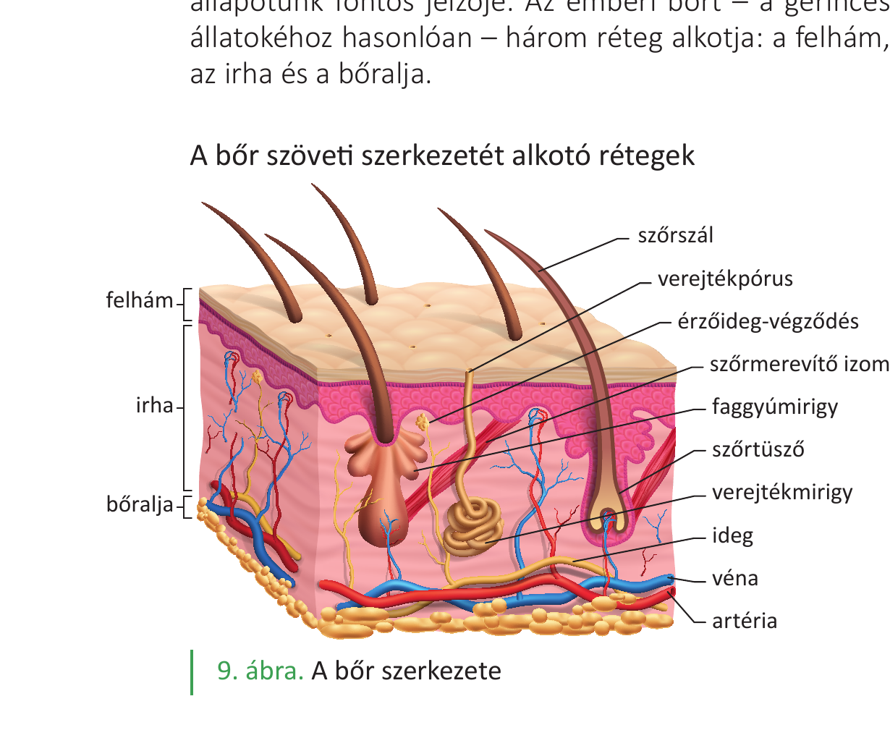
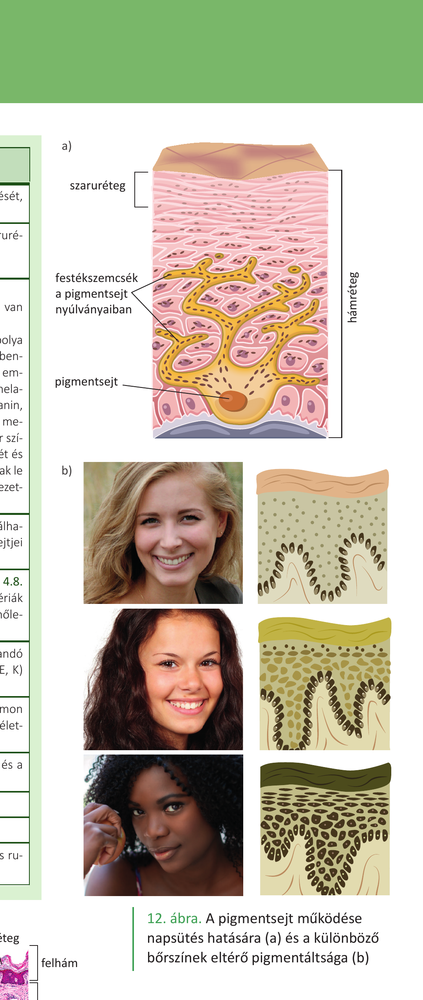
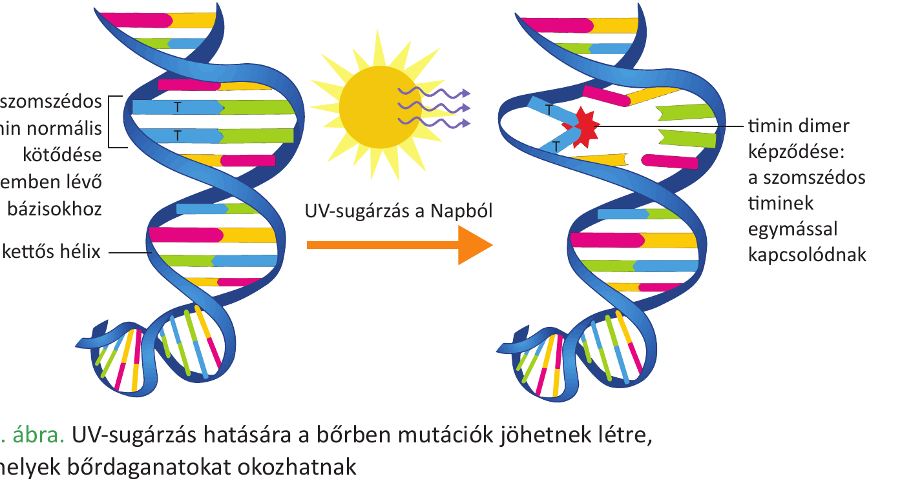

# 27. Emberi bőr és állati kültakaró

A bőr/kültakaró az élőlények első védelmi vonala a külvilág felé. Az emberi bőr a gerinces állatok bőrének (három rétegű) felépítését követi, az állati kültakarók viszont csoportonként eltérő szerkezetűek és módosulásúak.

## Az emberi bőr

A bőr testünk első védelmi vonala, össztömege teljes tömegünk **10-15%-a**. Egy átlagos termetű felnőtt bőrfelülete **2 m²**. A bőr védi szervezetünket a károsító külső hatásokkal szemben, emellett részt vesz az anyagcsere-folyamatokban és felfogja a külvilágból érkező ingereket. Óv a mechanikai hatásoktól, a hidegtől, a melegtől, a káros sugárzásoktól, a kórokozóktól és a kiszáradástól. Zsírokat raktároz, és részt vesz egyes anyagcseretermékek kiválasztásában is. Alapvető szerepe van a **hőszabályozásban** is. Színe, teltsége, tapintása egészségi állapotunk fontos jelzője.

Az emberi bőrt – a gerinces állatokéhoz hasonlóan – **három réteg** alkotja: a **felhám, az irha és a bőralja**.

### 1. Felhám (epidermis)

- Szövettanilag **többrétegű, elszarusodó laphám** építi fel.
- A **szaru (keratin)** az elhalt részek fő fehérjéje (a körömben, a hajban is megtalálható fehérje).
- Alsó rétegében **festéksejtek (pigmentsejtek)**, **osztódó sejtek (őssejtek)**, szabad idegvégződésekkel körülvett **tapintósejtek** (módosult hámsejtek) találhatók.
- A felhámrétegben (és az irhában) kötőszövetes burok nélküli, csupasz, gazdagon elágazó idegvégződések, ún. **fájdalomérző receptorok** is találhatók. Ezek a túlságosan erős, károsító hatású ingerekre érzékenyek, és ingerületük az agykéregben fájdalomérzetet kelt.
- A hámban **nincsenek erek**, sejtjei az irhából **diffúzióval** kapnak tápanyagokat.
- A hám megújulása **mitózissal** (számtartó osztódás) történik, a hám legalsó rétege pótolja a felette lévő rétegeket.

### 2. Irha (dermis)

- **Ereket, idegeket** tartalmaz.
- A benne található idegvégződések típusai: **tapintó, hideg-, meleg-, nyomás- és fájdalomérző**.
- A **faggyúmirigy** a szőrtüszőbe nyílik, a bőr felszínét és a szőrt ellátja faggyúval, így vízhatlanítja.
- A **verejtékmirigy** a bőr felszínére nyílik, a párologtatásban, és így a test hűtésében van szerepe.
- Ebben a rétegben találhatók főként a **kötőszöveti sejtek**, valamint a **kötőszöveti fehérjerostok (kollagén, elasztin)**.

### 3. Bőralja (subcutis)

- Nagyrészt speciális kötőszövetből, **zsírszövetből** épül fel.
- A bőralja zsírrétege jó **hőszigetelő**, és a **zsírban oldódó vitaminok (A, D, E, K) raktározó helye**.

### A bőr funkciói

- **Védelem**: mechanikai (rugalmasság), hideg/meleg, kórokozók (fizikai immunvédelem: nem engedi be a kórokozókat), kiszáradás (a szaruréteg nem engedi át a vizet: vízzáró barrier).
- **Biológiai immunvédelem**: a bőrön saját baktériumflóra van, amely megakadályozza a kórokozó baktériumok megtelepedését, elszaporodását.
- **UV-védelem**: a **melanin** (barna színű festékanyag) a pigmentsejtekben szemcsék formájában van jelen, jól elnyeli az UV-sugárzást. Az UV-sugárzás mutációt okoz, rákkeltő. A pigmentsejtek takarják az UV-sugárzásra érzékeny osztódó sejteket: **nem a pigmentsejtek száma nő meg, hanem bennük a pigmentszemcsék száma**, és jobban szétterülnek a sejtek nyúlványaiban. Az emberi bőrben kétféle melanin van: a sárgásvörös **feomelanin** és a barnásfekete **eumelanin**.
- **Hőszabályozás**: a bőr erei melegben kitágulnak, a hajszálerekben nő a véráramlás, ez hőleadást eredményez. A párologtatás (verejték) hőelvonással jár.
- **Érzékelés**: a hőmérséklet-változás, a fájdalom, a tapintás és a nyomás érzékelése. Bőrben található receptortípusok: hő-, fájdalom- és mechanoreceptorok.
- **D-vitamin képződés**: a 7-dehidrokoleszterolból UV-B sugárzás (290–315 nm) hatására D-vitamin/hormon képződik. Képződését a bőr színe, az életkor, a fényvédő krémek, a ruházkodási és életviteli szokások befolyásolják.
- **Raktározás**: zsírok és zsírban oldódó vitaminok.

### A bőr egyéb képletei

A **köröm** és a **szőr** a felhám **szaruképződményei**. Az ujjak végén a bőr irhába nyúló hámrétege hozza létre a körmöket. A szőrszálak a **szőrtüszőkben** képződnek. A szőrtüsző hámsejtjei mélyen behatolnak az irhába, esetenként a bőraljába is. A szőrtüszőt a hám alsó felszínével **szőrmerevítő izom** köti össze, amely hidegben összehúzódik, a szőrszálat felmereszti.

A **tejet termelő emlőmirigyek módosult verejtékmirigyek**.

## Állati kültakarók

A gerinces állatok kültakarójának külső rétege minden gerincesnél **többrétegű hám**. A szárazföldi gerinceseknél a bőr legfelső rétege elhalt **szaruréteg**, amely a kiszáradástól véd. Az egyes csoportok kültakarója csoportspecifikus módosulásokat mutat.

### Kétéltűek

Kültakarójukat **többrétegű, gyengén elszarusodó hám** fedi. Bőrük **méreg- és nyálkatermelő mirigyekben gazdag**. Ezeknek fontos szerepük van a védekezésben és a **légzésben** (a kifejlett egyedek bőrlégzéssel is lélegeznek a tüdő mellett).

### Hüllők

**Az első valódi szárazföldi gerincesek.** Kültakarójukat **többrétegű, elszarusodó laphám** védi a kiszáradástól. Testüket **szarupikkelyek vagy szarupajzsok** borítják. A kiszáradástól védő vastag szaruréteg tette lehetővé, hogy a hüllők váltak az első valódi szárazföldi gerinces élőlényekké.

### Madarak

Kültakarójukat **többrétegű, elszarusodó laphám** védi a kiszáradástól. A **toll szaruképződmény**, amelynek a **hőszigetelésben**, az **állandó testhőmérséklet** megtartásában is van szerepe. Típusai: **evezőtoll, fedőtoll és pehelytoll**.

### Emlősök

Kültakarójukat **többrétegű, elszarusodó laphám** védi a kiszáradástól. A **szőr szaruképződmény**, a hőszigetelésben, az **állandó testhőmérséklet** megtartásában is van szerepe. Bőrük rendszerint sok mirigyet tartalmaz: **faggyú-, verejték- és tejmirigyeik** vannak. A bőralja **zsírrétege** jó hőszigetelő. A csoport elnevezése onnan származik, hogy a **tejmirigyek váladékával, emlőikből táplálják utódaikat**.

### Gerinctelenek (rovarok, csigák — összehasonlításul)

A gerincteleneknél a légzőszervek a kültakaró származékai (a gerinceseknél viszont a bélből alakultak ki). A **rovaroknál** a kültakaró egyrétegű hengerhám, amely egy védőréteget, a **kutikulát** termeli; fő anyaga a **kitin** (N-tartalmú poliszacharid). A **csigáknál** a köpeny létrehozza az állat külső **meszes vázát** (csigaházat).

## Összehasonlítás

| Csoport | Kültakaró felépítése | Speciális képletek | Mirigyek | Szerep |
|---|---|---|---|---|
| Ember (emlős) | többrétegű elszarusodó laphám + irha + bőralja | szőr, köröm | faggyú-, verejték-, tej- (emlőmirigy) | védelem, hőszab., UV-véd., érzékelés, D-vit. |
| Kétéltűek | gyengén elszarusodó hám | – | méreg-, nyálkamirigy | védekezés, légzés |
| Hüllők | elszarusodó laphám | szarupikkely/szarupajzs | – | kiszáradás elleni védelem |
| Madarak | elszarusodó laphám | toll (evező-, fedő-, pehely-) | – | hőszigetelés, repülés |
| Emlősök | elszarusodó laphám | szőr | faggyú-, verejték-, tej- | hőszigetelés, állandó hőm., utódgondozás |
| Rovarok | egyrétegű hengerhám + kitinkutikula | külső váz | – | mechanikai védelem, vízzárás |
| Csigák | egyrétegű hengerhám + köpeny | meszes csigaház | nyálka-, fehérje-, mészmirigy | mechanikai védelem |

---

## Ábrák

*A tankönyv 9. ábrája alapján. A bőr három rétege és képletei: felhám, irha, bőralja. Az ábrán látható szerkezetek: szőrszál, verejtékpórus, érzőideg-végződés, szőrmerevítő izom, faggyúmirigy, szőrtüsző, verejtékmirigy, ideg, véna, artéria.*

*A tankönyv 12. ábrája alapján. A pigmentsejt működése napsütés hatására (a) és a különböző bőrszínek eltérő pigmentáltsága (b). A festékszemcsék a pigmentsejt nyúlványaiban szétterülve takarják az UV-sugárzásra érzékeny osztódó sejteket.*

*A tankönyv 13. ábrája alapján. UV-sugárzás hatására a bőrben mutációk jöhetnek létre, amelyek bőrdaganatokat okozhatnak. A két szomszédos timin normális kötődése a szemben lévő bázisokhoz vs. a timin dimer képződése (a szomszédos timinek egymással kapcsolódnak).*

---

*Az anyag a 2. tankönyv 16, 17, 18. oldalain (emberi bőr), és az 1. tankönyv 148, 150. oldalain (állati kültakarók) található.*
