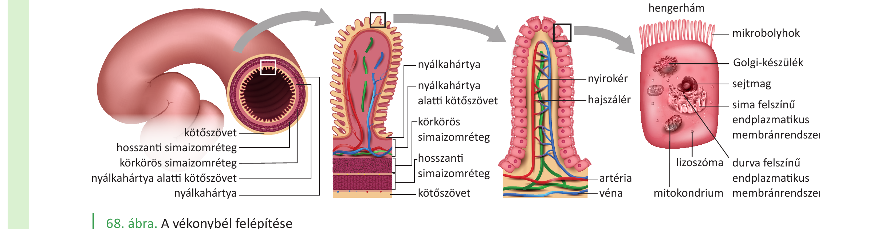

# 29. A szénhidrátok útja a szervezetben

A szénhidrátok az emberi szervezet legfontosabb gyors energiaforrásai. Fajlagos energiatartalmuk **17 kJ/g**. Az étkezéssel felvett szénhidrátok (pl. keményítő, glikogén, szacharóz, laktóz) hosszú utat tesznek meg a szájüregtől a sejtek mitokondriumáig, és különböző tárolóhelyeket érinthetnek. Ezt az utat tárgyalja ez a tétel.

## 1. Emésztés — a poliszacharidoktól a monoszacharidokig

A szénhidrátok emésztése **a szájüregben kezdődik**: a nyálmirigyek által termelt **nyálamiláz** enzim megkezdi az összetett szénhidrátok – **keményítő, glikogén** – bontását. A nyál kémhatása semleges/enyhén lúgos, ami optimális a nyálamiláznak.

A **gyomorban** a szénhidrát-emésztés szünetel: a savas pH (0,9–1,5) inaktiválja a nyálamilázt.

A **vékonybélben** (patkóbél, éhbél, csípőbél) folytatódik és fejeződik be az emésztés:

- A **hasnyálmirigy** által termelt **hasnyálamiláz** a keményítőt és a glikogént **maltózegységekre** és **α-dextrinekre** hasítja.
- A **bélhámsejtek felszínén** elhelyezkedő enzimek végzik a befejező lebontást:
  - **maltáz**: maltóz → 2 glükóz,
  - **laktáz**: laktóz → glükóz + galaktóz,
  - **szacharáz**: szacharóz → glükóz + fruktóz,
  - **α-dextrináz**: α-dextrinek → glükóz.

A végeredmény: **monoszacharidok** (főként glükóz, kisebb mennyiségben fruktóz és galaktóz).

## 2. Felszívás — a bélhámsejtekbe és a vérbe

A felszívás fő helye a **vékonybél**. A nyálkahártya felületét a **körkörös redők** háromszorosára, a **bélbolyhok** harmincszorosára, a **mikrobolyhok** hatszázszorosára növelik — összesen akár **200 m²** felszívófelület.

A monoszacharidok felszívása:

- **Glükóz, galaktóz**: együtt szállítás nátriumionokkal (**másodlagosan aktív transzport**) → a bélhámsejtbe,
- **Fruktóz**: könnyített diffúzióval,
- Innen a kapillárisvérbe lépnek **a bolyhokban**.

A felszívott monoszacharidok a **májkapuvénán** keresztül elsőként a **májba** jutnak — nem közvetlenül a többi szervhez, hanem a máj „szűrőjén" át.

## 3. A máj szerepe a szénhidrát-anyagcserében

A máj a központi raktár- és szabályozó szerv a szénhidrát-anyagcserében.

- **Glikogénraktározás**: a vérből felvett glükózból **glikogént** állít elő (inzulin hatására). A májsejtek és a vázizomsejtek glikogén formájában tárolják a szénhidrátot.
- **Glikogénlebontás**: a glikogénből **glükózt** szabadít fel (adrenalin, glukagon hatására) és a véráramba juttatja — ez a **vércukorszint-emelés**.
- **Glukoneogenezis**: nem szénhidrátból (pl. tejsavból) is képes glükózt előállítani. A vázizomsejtekben a glükóz anaerob lebontása során keletkezik tejsav, ez a véráramba kerül, és a máj újra glükózzá alakítja. Ezt a folyamatot **Cori-körnek** nevezzük.
- **Zsírrá alakítás**: a többletglükózból zsírokat is előállít (inzulinhatás).

## 4. Felhasználás a sejtekben

A vér a monomereket a tápcsatornából a szövetekig szállítja. A sejtekbe jutva a glükóz többféle sorsra juthat:

- **Energiát szolgáltat** a **biológiai oxidáció** folyamatában (a sejt mitokondriumában) — a glükóz teljesen lebomlik szén-dioxiddá és vízzé, **ATP** szabadul fel,
- **Glikogénné** alakul (raktározás a májban, vázizomszövetben),
- **Zsírokká** alakul a zsírszövetben,
- A vázizomsejtekben oxigénhiányos állapotban **erjedéssel** tejsavvá bomlik (kevés ATP).

## 5. A vércukorszint szabályozása

A vér glükózszintje (vércukorszint) szűk határok között mozog: **éhgyomri normálértéke 3,9–5,6 mmol/l** (kb. 70–100 mg/dl). A szabályozást két hasnyálmirigy-hormon végzi, amelyeket a **Langerhans-szigetek** termelnek:

- **Inzulin** (a **β-sejtek** terméke): **csökkenti** a vércukorszintet. Hatására a máj és az izomsejtek felveszik a glükózt, glikogénné alakítják; serkenti a zsírképzést is.
- **Glukagon** (az **α-sejtek** terméke): **emeli** a vércukorszintet. Hatására a máj glikogéntartalma lebomlik glükózzá, ami a vérbe kerül.
- További emelő hatású hormon: az **adrenalin** (mellékvesevelő-hormon).

A vércukorszint **akut emelkedését** elsősorban a táplálkozás (különösen a magas **glikémiás indexű** ételek) okozza, amelyek gyorsan és nagymértékben megemelik a vércukrot — emiatt az inzulinelválasztás jelentősen fokozódik. Mivel az inzulin csökkenti a vércukrot, étkezést követően 1-2 órával **hipoglikémia** alakulhat ki, ami erős éhségérzetet kelt.

## 6. A glikémiás index

Egy adott élelmiszer vércukorszintre gyakorolt hatását a **glikémiás indexszel** (0–100-ig terjedő skála) lehet jellemezni. Az értékét két dolog határozza meg:

- az élelmiszer szénhidráttartalmának **emészthetősége**,
- a felszabaduló egyszerű cukrok **felszívódásának sebessége**.

A magas indexű tápanyagok gyors, magas vércukor-csúcsot okoznak; az alacsony indexűek (pl. teljes kiőrlésű gabona, hüvelyesek) lassabb, kiegyenlítettebb emelkedést.

## Összefoglalás — a glükóz útja

1. **Szájüreg**: nyálamiláz megkezdi a keményítő bontását.
2. **Gyomor**: szünet (savas pH).
3. **Vékonybél**: hasnyálamiláz + bélhámsejt-enzimek → monoszacharidok.
4. **Bélhámsejtek**: aktív transzport / könnyített diffúzió → vérkapillárisok.
5. **Májkapuvéna**: glükóz a májba.
6. **Máj**: glikogénraktározás vagy átengedés a véráramba.
7. **Sejtek**: biológiai oxidáció (ATP), glikogén- vagy zsírképzés, esetleg erjedés.
8. **Szabályozás**: inzulin (csökkent), glukagon (emel), adrenalin (emel).

---

## Ábrák

*Az emberi tápcsatorna áttekintése: szájüreg → nyelőcső → gyomor → vékonybél → vastagbél, a kapcsolódó nagy mirigyekkel (nyálmirigyek, máj, epehólyag, hasnyálmirigy). A szénhidrátok ezt az utat járják be az emésztés során.*

*A vékonybél keresztmetszete és a bélboholy nagyítása: nyálkahártya redői, bélbolyhok, mikrobolyhos hengerhám, hajszálérhálózat és centrális nyirokér. A felszívófelület akár 200 m². A monoszacharidok itt szívódnak fel a vérbe.*

---

*Az anyag a 2. tankönyv 42–51. oldalain található.*
