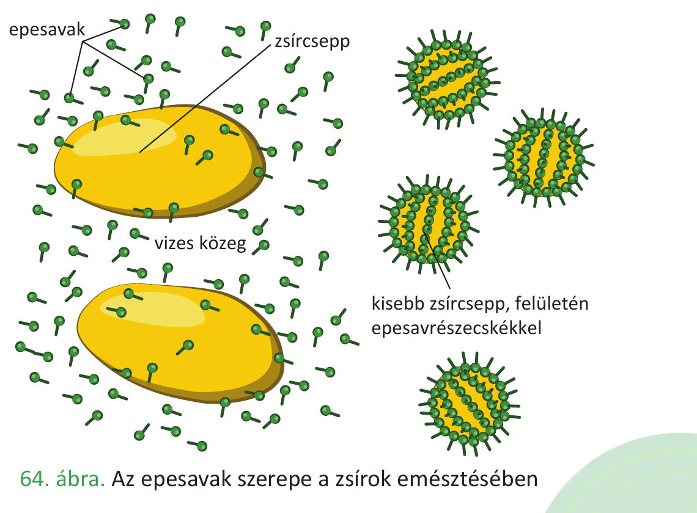

# 30. Szénhidrátok és lipidek emésztése

Az **emésztés** a tápanyagok hidrolízissel történő monomerekre bontása. A szénhidrátok és a lipidek emésztési útja a tápcsatornában más-más szakaszokon zajlik, eltérő enzimekkel és segédanyagokkal. Ezt a két folyamatot tárgyaljuk párhuzamosan.

## A szénhidrátok emésztése

A szénhidrátok fajlagos energiatartalma kb. **17 kJ/g**. A táplálékkal felvett szénhidrátok főleg poliszacharidok (keményítő, glikogén) és diszacharidok (szacharóz, laktóz). Az emésztés végterméke a monoszacharidok (glükóz, fruktóz, galaktóz).

### A szájüregben

Az emésztés a szájüregben kezdődik. A nyálmirigyek (fültőmirigy, nyelv alatti, állkapocs alatti) napi 500-600 ml semleges/enyhén lúgos nyálat termelnek, amely tartalmazza:

- **nyálamiláz** enzimet, amely az összetett szénhidrátok – **keményítő, glikogén** – emésztésének megindítását végzi (diszacharidokra/triszacharidokra),
- **mucint**, amely a táplálékpép összeragasztását, a falatképzést és a nyál viszkozitásának növelését szolgálja.

### A gyomorban

A gyomorban a szénhidrátemésztés szünetel: a savas pH (0,9–1,5) inaktiválja a nyálamilázt. A gyomor nem termel szénhidrátbontó enzimet.

### A vékonybélben

A szénhidrátemésztés a vékonybélben fejeződik be.

A **hasnyálmirigy** külső elválasztású része által termelt hasnyál (napi 1,2–1,5 l, pH ≈ 8) tartalmazza a **hasnyálamilázt**, amely a nyálamilázhoz hasonlóan a **keményítőt és a glikogént maltózegységekre** (és α-dextrinekre, maltotriózra) hasítja.

A **bélhámsejtek felszínén** elhelyezkedő enzimek végzik a befejező lebontást a monoszacharidokig:

| Enzim | Szubsztrát | Termék |
|---|---|---|
| **maltáz** | maltóz (malátacukor) | szőlőcukor (glükóz) |
| **laktáz** | laktóz (tejcukor) | glükóz + galaktóz |
| **szacharáz** | szacharóz (répacukor) | glükóz + fruktóz |
| **α-dextrináz** | α-dextrinek | szőlőcukor |

A keletkező monoszacharidok (glükóz, fruktóz, galaktóz) felszívódnak a bélhámsejteken keresztül, és a kapillárisvérbe lépnek a bolyhokban, majd a **májkapuvénán** át a májba jutnak.

## A lipidek emésztése

A lipidek (zsírok) fajlagos energiatartalma a legnagyobb a tápanyagok közül: kb. **38 kJ/g**. A táplálékkal felvett zsírok főként trigliceridek (glicerin + 3 zsírsav). Az emésztés végtermékei a monogliceridek és a szabad zsírsavak.

A lipidek emésztésének sajátossága, hogy a zsírok **vízben rosszul oldódnak**, így az emésztésük csak akkor hatékony, ha előbb **emulzióba** kerülnek (apró cseppekre oszlanak a vizes közegben).

### A szájüregben

A nyelvmirigyek által termelt **nyelvi lipáz** kis mértékben már a szájüregben elkezdi a trigliceridek bontását (szabad zsírsavakra és monogliceridekre). Hatása csekély.

### A gyomorban

A gyomor fősejtjei termelnek egy **gyomorlipázt**, amely szintén megkezdi a trigliceridek bontását zsírsavakra és monogliceridekre. Ennek hatása is kicsi a többi enzimhez képest.

### A vékonybélben — itt zajlik a fő lipid-emésztés

A vékonybélben a lipidek emésztése két szervezetnek a váladékaitól függ: a **máj** termeli az **epét**, a **hasnyálmirigy** pedig a **lipázt** tartalmazó hasnyalat.

**Az epe szerepe (a máj váladéka):**

Az epe enzimet nem tartalmaz, de tartalmaz **epesavakat, koleszterint, bilirubint, ásványi sókat** és vizet. Az epe az epehólyagban raktározódik és bekoncentrálódik, majd a patkóbélbe ömlik.

Az **epesavak** szerepe kettős, és ez kulcsfontosságú a zsírok emésztésében:

1. **Emulzióban tartják a zsírokat**: amfipatikus jellegük (van vízoldó és zsíroldó részük) miatt körberakják az apró zsírcseppek felületét, és megakadályozzák, hogy összeolvadjanak. Így nő a zsírok **fajlagos felülete** (sokkal több enzim férhet hozzájuk egyszerre).
2. **Aktiválják a zsírbontó lipázokat** (a hasnyálmirigylipáz kezdetben inaktív, az epesavak hatására válik aktívvá).
3. Az epesavas sók **lúgos kémhatást** is eredményeznek a vékonybélben.

Funkciójuk a szappanokéhoz hasonló: csökkentik a felületi feszültséget és növelik a fajlagos felületet.

**A hasnyálmirigylipáz szerepe:**

A hasnyálmirigy által termelt **hasnyálmirigylipáz** a lipidek észterkötéseit hidrolizálja:

- **emulgeált trigliceridek → zsírsavak + monogliceridek**.

Az emésztés végterméke: szabad zsírsavak és monogliceridek.

### A zsírok felszívása

A vékonybél bélhámsejtjein keresztül a glicerin és a zsírsavak (kisebb mennyiségben) passzív transzporttal jutnak a sejtbe. A bélhámsejtekben a glicerin és a zsírsavak **ismét trigliceriddé** kapcsolódnak össze. A trigliceridek fehérjéhez kapcsolódnak, és így létrejön a **kilomikron** (lipoprotein: zsír és fehérje együtt).

A kilomikronok **exocitózissal** távoznak a bélhámsejtekből, és a **nyirokerekbe** (a bélboholy centrális nyirokere) kerülnek — nem közvetlenül a vérbe! A nyirokerek hálózata összegyűlik a fő nyirokérben (mellvezetékben), amely a kulcscsont alatt a vénás keringésbe ömlik. Innen a vér viszi tovább a zsírokat a májba és más szervekbe.

## Összehasonlítás: szénhidrátok vs. lipidek emésztése

| Szempont | Szénhidrátok | Lipidek |
|---|---|---|
| Fajlagos energiatartalom | 17 kJ/g | 38 kJ/g |
| Szájüregi emésztés | nyálamiláz (jelentős) | nyelvi lipáz (csekély) |
| Gyomri emésztés | nincs (savas pH inaktivál) | gyomorlipáz (csekély) |
| Vékonybéli enzimek | hasnyálamiláz, maltáz, laktáz, szacharáz, α-dextrináz | hasnyálmirigylipáz |
| Segédanyag | – | epesavak (emulgeálás, aktiválás) |
| Végtermékek | monoszacharidok (glükóz, fruktóz, galaktóz) | monogliceridek + zsírsavak |
| Felszívás módja | aktív transzport (Na⁺-társszállítás), könnyített diffúzió | passzív transzport (diffúzió) |
| Felszívás útja | kapillárisvér → májkapuvéna → máj | bélhámsejtben triglicerid újraszintézis → kilomikron → nyirokér → mellvezeték → vénás keringés |

---

## Ábrák

*Az emberi tápcsatorna áttekintése: szájüreg → nyelőcső → gyomor → vékonybél → vastagbél, a kapcsolódó nagy mirigyekkel (nyálmirigyek, máj, epehólyag, hasnyálmirigy). A szénhidrátok és a lipidek ezt az utat járják be az emésztés során.*

*A zsírcsepp emulgeálása az epesavak hatására: az amfipatikus epesavmolekulák körberakják az apró zsírcseppek felületét, megakadályozzák összeolvadásukat, így a fajlagos felület nő — a hasnyálmirigylipáz hatékonyan tud rajta dolgozni.*

---

*Az anyag a 2. tankönyv 42–51. oldalain található.*
