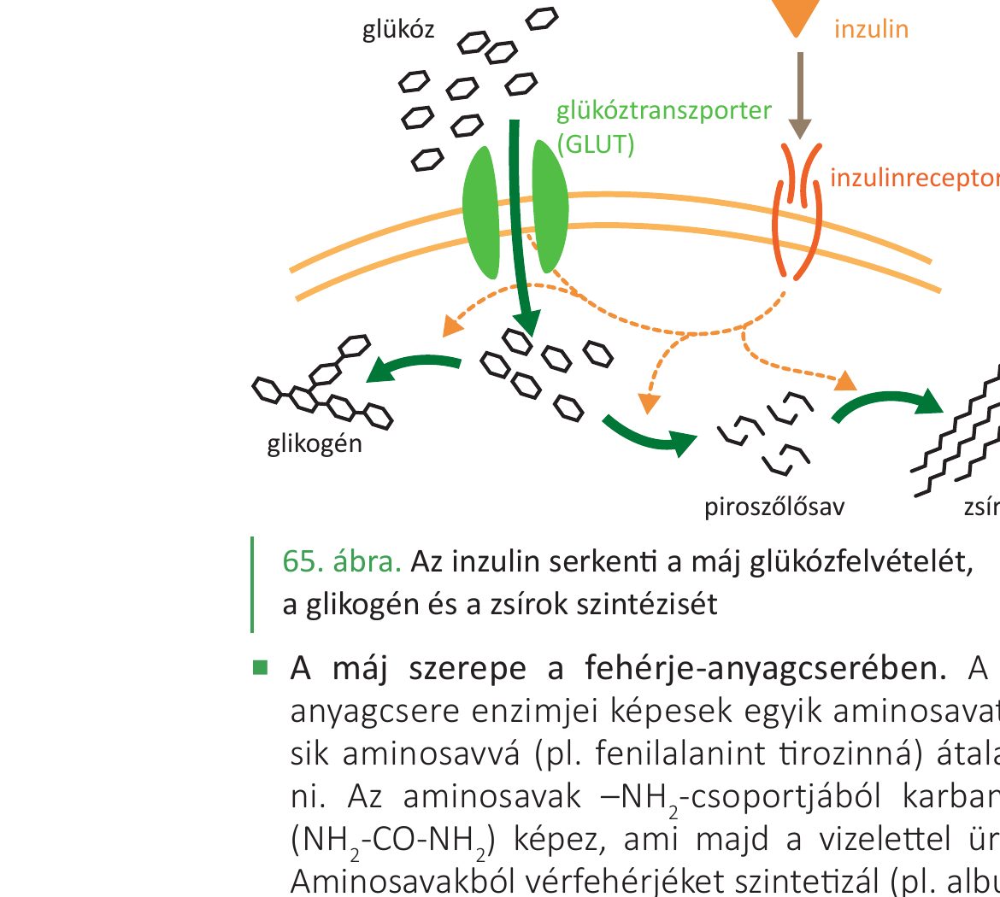
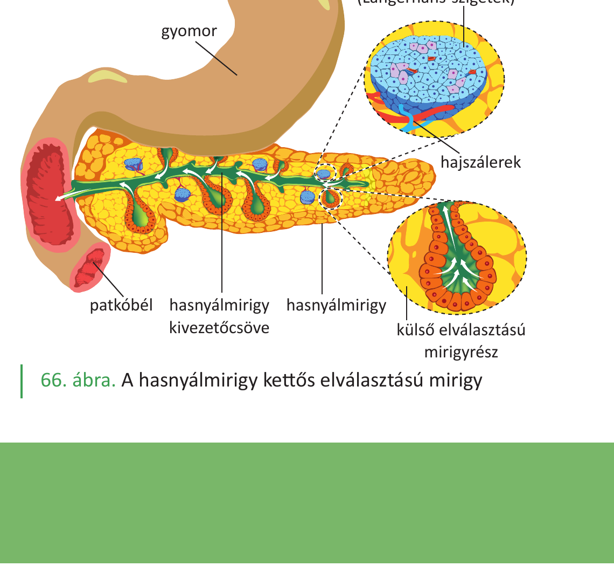

# 31. Cukoranyagcsere, cukorbetegség

A szervezet a szénhidrátokat (főként glükózt) gyors energiaforrásként használja: fajlagos energiatartalmuk **17 kJ/g**. A vér glükózszintje (vércukorszint) szűk határok között mozog, és a homeosztázis része. Ezt a szabályozást két hasnyálmirigy-hormon végzi (inzulin, glukagon). Ha a szabályozás zavart szenved, **cukorbetegség** alakul ki.

## A vércukorszint és normálértéke

A vér glükózszintje az **egészséges ember**ben deciliterenként **70–110 mg** (3,9–6,1 mmol/l) között van (egyes források a normál éhgyomri érték felső határát 100 mg/dl-ben, azaz 5,6 mmol/l-ben adják meg). Ez **étkezések között**, éhgyomri állapotban érvényes érték.

Étkezés után átmenetileg megemelkedik, majd a szabályozó hormonok hatására visszaáll a normál tartományba.

## A cukoranyagcsere lépései

### 1. Felszívás után — a máj központi szerepe

A vékonybélben felszívódott glükóz a **májkapuvénán** át **elsőként a májba** jut. A máj a központi raktár és szabályozó szerv:

- **Glikogénraktározás (glikogenezis)**: a vérből felvett glükózból **glikogént** állít elő (inzulin hatására). A májsejtek és a vázizomsejtek glikogén formájában tárolnak szénhidrátot.
- **Glikogénlebontás (glikogenolízis)**: a glikogénből glükózt szabadít fel (adrenalin, glukagon hatására), és a véráramba juttatja — **vércukorszint-emelés**.
- **Glukoneogenezis**: nem szénhidrátból (pl. tejsavból) is képes glükózt előállítani. A vázizomban anaerob lebontásból keletkező tejsav a vérbe kerül, és a máj újra glükózzá alakítja → ez a **Cori-kör**.
- **Zsírrá alakítás**: a többletglükózból zsírokat is előállít (inzulinhatás).

### 2. Felhasználás a sejtekben

A vér a glükózt a szövetekig szállítja. A sejtekbe jutva:

- **Biológiai oxidáció** (mitokondriumban): teljes lebomlás CO₂-vé és H₂O-vé, sok **ATP** szabadul fel,
- **Glikogénné** alakulás (raktározás, főleg máj és vázizom),
- **Zsírrá** alakulás (zsírszövet),
- **Erjedés** (vázizomban oxigénhiányos állapotban): tejsavvá bomlik, kevés ATP-vel.

Fontos megkülönböztetés: az **idegsejtek glükózfelvétele inzulinfüggetlen** — ellentétben az **inzulinérzékeny szövetekkel** (izom, zsír, máj). Az agy folyamatosan glükózt igényel, attól függetlenül, hogy van-e elegendő inzulin.

## A vércukorszint hormonális szabályozása

A szabályozást a **hasnyálmirigy** belső elválasztású részei, a **Langerhans-szigetek** sejtjei végzik. A hasnyálmirigy **kettős elválasztású mirigy**: külső elválasztású része termeli a hasnyálat (emésztőenzimekkel), a belső elválasztású részek elszórtan találhatók a szervben, kis sejtcsoportokat (Langerhans-szigeteket) alkotva. Számuk emberben kb. 1 millió.

A szigetek kétféle hormon-termelő sejtből állnak:

| Sejt | Hormon | Hatás |
|---|---|---|
| **β-sejt** (kisebb, világosabb) | **inzulin** | **csökkenti** a vércukorszintet, ha a normáltartomány **felett** van |
| **α-sejt** (nagyobb, sötétebbre festődő) | **glukagon** | **emeli** a vércukorszintet, ha a normáltartomány **alatt** van |

A Langerhans-szigetek vérellátása igen gazdag (a sejtek a vérbe ürítik váladékukat).

### Az inzulin hatása

Az **inzulin** akkor választódik el, ha emelkedik a vércukorszint (étkezés után). Hatására:

- a **máj és az izomsejtek felveszik a glükózt** (a sejtek **glükóztranszporterét** aktiválja az **inzulinreceptor**on át),
- a glükózt **glikogénné alakítja** (glikogenezis),
- serkenti a **zsírképzést** (zsírszintézis a többletből).

Az inzulin tehát a **„bő idők"** hormonja — eltárolja a felesleget.

### A glukagon hatása

A **glukagon** akkor választódik el, ha csökken a vércukorszint (pl. étkezések között, éhezéskor). Hatására:

- a máj **glikogéntartalma lebomlik glükózzá** (glikogenolízis),
- ez a glükóz a **véráramba** kerül → vércukorszint-emelkedés.

A glukagon a **„szűkös idők"** hormonja — előhívja a tartalékot.

### További szabályozók

- **Adrenalin** (mellékvesevelő-hormon): stressz, fizikai megerőltetés esetén szintén emeli a vércukorszintet.
- A **hipotalamusz** kontrollálja az éhségérzetet és a táplálkozási viselkedést.

## A glikémiás index

Egy adott élelmiszer vércukorszintre gyakorolt hatását a **glikémiás indexszel** (0–100 közötti skála) jellemezzük. Értékét két tényező határozza meg:

- az élelmiszer szénhidráttartalmának **emészthetősége**,
- a felszabaduló egyszerű cukrok **felszívódásának sebessége**.

A **magas indexű tápanyagok** gyorsan és nagymértékben megemelik a vércukrot — emiatt az inzulinelválasztás jelentősen fokozódik. Mivel az inzulin csökkenti a vércukrot, étkezést követően 1-2 órával **hipoglikémia** alakulhat ki, ami erős éhségérzetet kelt.

## A cukorbetegség (diabetes mellitus)

A cukorbetegség akkor áll fenn, ha a szervezet nem tudja megfelelően szabályozni a vércukorszintet — vagy az inzulinhiány, vagy az inzulinrezisztencia miatt.

### Típusai

- **1. típusú (I-es típusú) cukorbetegség**: a hasnyálmirigy β-sejtjei elpusztulnak (autoimmun folyamat), ezért **abszolút inzulinhiány** alakul ki. Általában fiatalkorban kezdődik. Kezelése: inzulin pótlása (injekció).
- **2. típusú (II-es típusú) cukorbetegség**: a sejtek **inzulinrezisztenssé** válnak — az inzulin termelődik, de a sejtek nem reagálnak rá megfelelően. Gyakran felnőttkorban alakul ki, **elhízás, mozgásszegény életmód** jelentős kockázati tényező. Kezelése: életmódváltás, gyógyszerek, súlyos esetben inzulin.

### A cukorbetegség diagnózisa

- **Éhgyomri vércukorszint mérése**: cukorbetegek esetén **126 mg/dl (7 mmol/l) felett** van.
- **Cukortűrési teszt**: 75 g szőlőcukor elfogyasztása után **2 órával**, ha a vércukorszint **200 mg/dl (11,1 mmol/l) felett** van, cukorbaj áll fenn.

### A cukorbetegség következményei

Ha a vércukorszint tartósan magas (hyperglikémia), számos szövődmény léphet fel:

- **Vesekárosodás**: a normál esetben a vesében aktív transzporttal visszaszívódó glükóz megjelenik a vizeletben (innen ered a betegség régi neve: „cukorbaj" = a vizelet cukortartalma).
- Szem- és érrendszeri károsodások (érelmeszesedés fokozódása).
- Idegrendszeri tünetek.
- Növekszik a **szív- és érrendszeri betegségek** és az **agyi infarktus** kockázata.

### Megelőzés

Az **elhízás megelőzése** kritikus fontosságú a 2. típusú cukorbetegség, a szív- és érrendszeri betegségek megelőzésében. Ehhez fontos: kiegyensúlyozott étrend (alacsony glikémiás indexű ételek), rendszeres testmozgás, megfelelő tápanyagarány.

---

## Ábrák

*A glükóz a máj glükóztranszporterén (GLUT) keresztül jut a májsejtbe. Az inzulin az inzulinreceptorhoz kötődve serkenti ezt a folyamatot. A májban a glükóz glikogénné (raktározás), piroszőlősavvá (lebontás) vagy zsírsavakká (átalakítás) alakulhat.*

*A hasnyálmirigy két részből áll: a külső elválasztású mirigyrész (a hasnyálat termeli, és a patkóbél felé üríti a kivezetőcsövön át), és a belső elválasztású sejtcsoportok (Langerhans-szigetek) — ezek hormonokat (inzulin, glukagon) termelnek, melyek a vérbe kerülnek a hajszálereken át.*

---

*Az anyag a 2. tankönyv 47, 48, 168, 169. oldalain található.*
