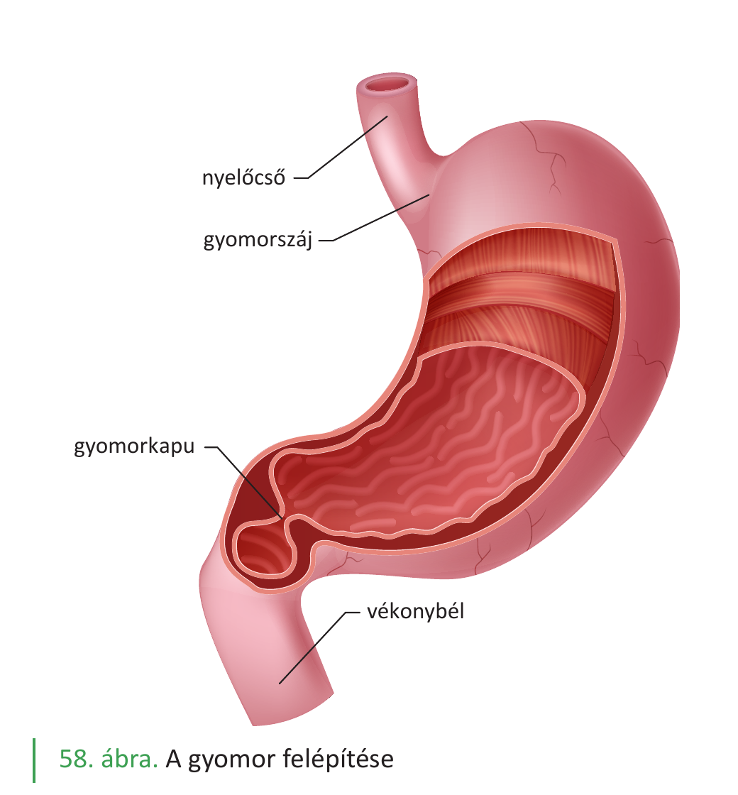
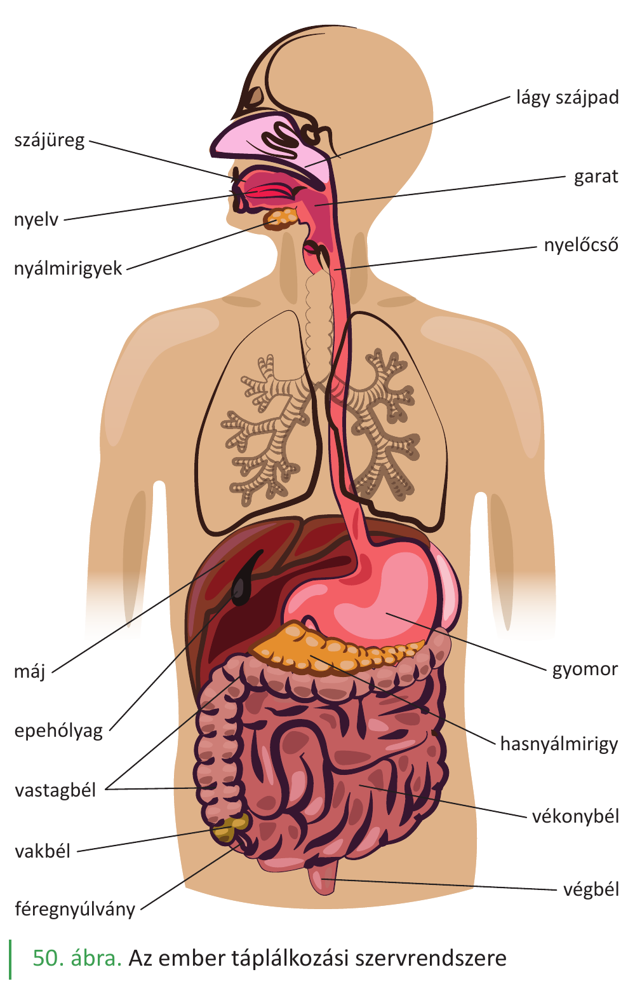

# 32. A fehérjék emésztése

A fehérjék az élet építőkövei, és a táplálkozással felvett legfontosabb tápanyagok egyike. Fajlagos energiatartalmuk **17 kJ/g**. A fehérje-emésztés célja, hogy a táplálékkal felvett, idegen szerkezetű fehérjéket **aminosavakra** bontsa, amelyekből a szervezet a saját fehérjéit építheti fel. A fehérje-emésztés a **gyomorban kezdődik** (a többi tápanyagtól eltérően) és a **vékonybélben fejeződik be**.

## A fehérjék lebontásának kémiája

A fehérjék hosszú **polipeptidláncok**, amelyekben az aminosavakat **peptidkötések** kapcsolják össze. Az emésztés során ezeket a peptidkötéseket **hidrolizálják** az emésztőenzimek, így a fehérjék fokozatosan:

**fehérje → oligopeptidek → kis peptidek → aminosavak**

## A szájüregben

A szájüregben **nincs fehérjebontó enzim**. A rágás csak mechanikailag aprítja a táplálékot, a falat továbbításra kerül a gyomorba.

## A gyomorban — itt kezdődik az emésztés

A gyomornedv a gyomor nyálkahártyájának csöves mirigyeiben termelődik. Három fő sejttípus vesz részt:

- **Fedősejtek**: H⁺- és Cl⁻-ionokat termelnek (sósav). A magas H⁺-koncentráció miatt a gyomornedv pH-ja **0,9 és 1,5 között** van.
- **Fősejtek**: **pepszinogént** termelnek. Ez a pepszin inaktív előalakja.
- **Melléksejtek**: mucinózus nyálkát termelnek, amely védi a gyomorfalat a saját savától és enzimétől.

A **pepszinogén aktiválása**:

- részben az **alacsony pH** hatására (a sósav „letörli" a gátló részt),
- részben **autokatalízissel** (a már aktivált pepszin maga is aktiválja a többi pepszinogén molekulát).

A keletkezett **pepszin** a savas pH-n optimális hatású fehérjeemésztő enzim. A pepszin a fehérjéket **adott aminosavaknál hasítja**, így a fehérjéket **oligopeptidekre** bontja.

A sósav további szerepei:

- denaturálja a fehérjéket (gombolyagot kioldja, így az enzimek könnyebben hozzáférnek),
- elöli a táplálékkal bekerült baktériumok nagy részét,
- aktiválja a pepszinogént.

**Érdekes**: a fehérjék emésztése **gyomor hiányában is jól végbemegy** a hasnyálmirigy és a bélnedv enzimjei hatására. A gyomor tehát fontos, de nem nélkülözhetetlen szerve a fehérje-emésztésnek.

## A vékonybélben — itt fejeződik be az emésztés

A vékonybél (patkóbél, éhbél, csípőbél) a fehérje-emésztés befejezésének és az aminosavak felszívásának helye. Két forrásból érkeznek emésztőenzimek:

### 1. A hasnyálmirigy enzimjei (hasnyál)

A hasnyál pH-ja kb. **8 körül van** (lúgos), ami semlegesíti a gyomorból érkező savas péppet. A hasnyál tartalmaz több fehérjebontó enzimet:

- **Tripszin**: inaktív **tripszinogén** formájában választódik el. A patkóbél nyálkahártyájában termelődő **enteropeptidáz** enzim aktiválja. A tripszin a polipeptideket adott helyen **oligopeptidekre** bontja (peptidkötéseket hidrolizál, **endopeptidáz**).
- **Kimotripszin**: a tripszinhez hasonlóan endopeptidáz, más helyeken hasít.

A tripszin inaktív tárolása fontos biztonsági mechanizmus: ha aktívan termelődne a hasnyálmirigyben, megemésztené magát a hasnyálmirigy szövetét.

### 2. A bélhámsejtek felszínén lévő enzimek

A bélnedv enzimei nem oldottak — a **bélhámsejtek sejtmembránjához kötötten** helyezkednek el. Ezek befejezik a fehérjék aminosavakra bontását:

- **Peptidázok**: a peptideket aminosavakká bontják.

A végeredmény: **szabad aminosavak**.

## A felszívás

Az aminosavak felszívódása a **vékonybélben** történik, főleg a bélhámsejtek mikrobolyhain keresztül:

- **Aminosavak**: együtt szállítás nátriumionokkal (**másodlagosan aktív transzport**) — hasonlóan a glükózhoz.

A felszívódott aminosavak a kapillárisvérbe lépnek a bolyhokban, majd a **májkapuvénán** át **a májba** kerülnek.

## A májsejt szerepe a fehérje-anyagcserében

A máj központi szerv a fehérje-anyagcserében:

- **Aminosav-átalakítás**: a máj-anyagcsere enzimjei képesek egyik aminosavat másik aminosavvá átalakítani (pl. fenilalanint tirozinná). Ez a folyamat a **transzamináció**.
- **Karbamidképzés**: az aminosavak **–NH₂-csoportjából karbamidot** (NH₂–CO–NH₂) képez, ami majd a vizelettel ürül ki. Ez azért fontos, mert az aminosavak energia-célú lebontásakor felszabaduló ammónia mérgező — a karbamid sokkal kevésbé toxikus.
- **Vérfehérje-szintézis**: aminosavakból vérfehérjéket szintetizál:
  - **albumin** (a vér ozmotikus nyomásának fő szabályozója),
  - **véralvadási fehérjék** (ezekhez K-vitamin szükséges).

## A felszívott aminosavak sorsa a sejtekben

A vér az aminosavakat a szövetekig szállítja. A sejtekbe jutva többféle sorsra juthatnak:

- **Fehérjeszintézis**: az aminosavakat a sejtek saját fehérjéinek felépítésére használják (riboszómákon).
- **Energia-termelés**: ha más tápanyag nem áll rendelkezésre, az aminosavak is lebonthatók (NH₂-csoport leválasztása után), és a szénvázból ATP keletkezik a biológiai oxidációban.
- **Átalakítás**: glükózzá vagy zsírrá átalakulhatnak (a máj különösen aktív ebben).

## Összefoglalás — a fehérjeemésztés szakaszai

| Hely | Enzim(ek) | Forrás | Termék |
|---|---|---|---|
| Szájüreg | – | – | – (csak mechanikai aprítás) |
| Gyomor | **pepszin** (inaktív pepszinogénből) | gyomor fősejtjei | oligopeptidek |
| Vékonybél | **tripszin** (tripszinogénből, enteropeptidáz aktiválja), **kimotripszin** | hasnyál | rövidebb peptidek |
| Vékonybél (bélhám) | **peptidázok** | bélhámsejtek membránja | **aminosavak** |

A felszívott aminosavak útja: **bélhámsejt → kapillárisvér → májkapuvéna → máj → szövetek**.

## Inaktív elválasztás — biztonsági mechanizmus

A fehérjebontó enzimek többsége **inaktív elővegyületként** (zimogénként) választódik el, és csak az aktív helyén aktiválódik:

- **pepszinogén → pepszin** (sósav + autokatalízis)
- **tripszinogén → tripszin** (enteropeptidáz)
- **kimotripszinogén → kimotripszin** (tripszin)

Ez azért fontos, mert a fehérjebontó enzimek **maguk is fehérjék**, és ha a termelő szervben aktívak lennének, az emésztené saját szövetét. Az inaktív tárolás és a célhelyen való aktiválás biztosítja, hogy a saját szervezet ne emésztődjön meg.

---

## Ábrák

*A gyomor felépítése: a nyelőcső felől érkező falat a gyomorszájon át jut a gyomorba, ahonnan a gyomorkapun keresztül halad tovább a vékonybélbe. A gyomor nyálkahártyájának redői és csöves mirigyei termelik a gyomornedvet (sósav + pepszinogén + nyálka).*

*Az emberi tápcsatorna áttekintése: a fehérje-emésztés a gyomorban kezdődik (pepszin), a vékonybélben fejeződik be (hasnyál tripszinje, bélhám peptidázai). A hasnyálmirigy és a máj a fehérje-anyagcsere kulcsszervei.*

---

*Az anyag a 2. tankönyv 45, 48, 50. oldalain található.*
