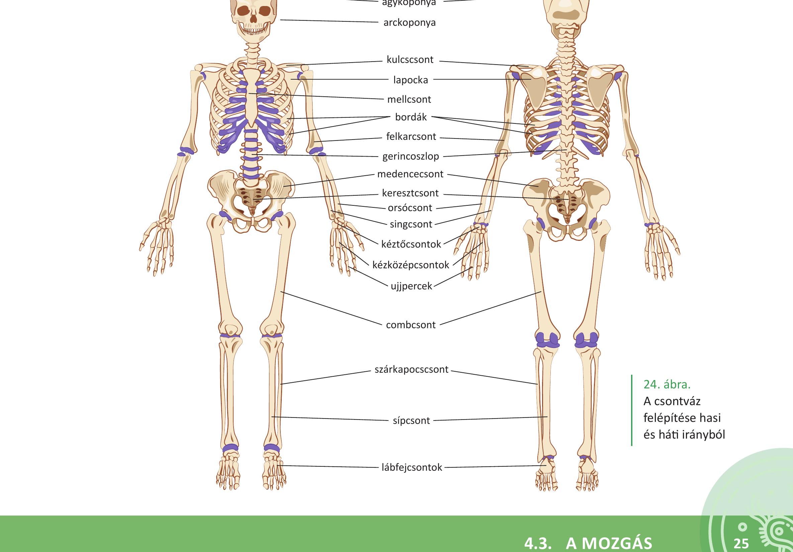
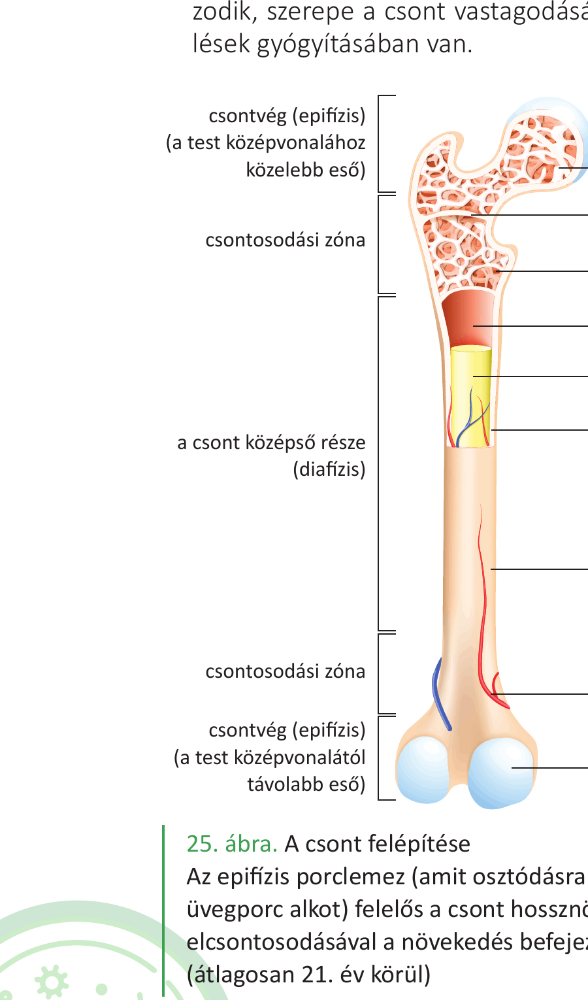
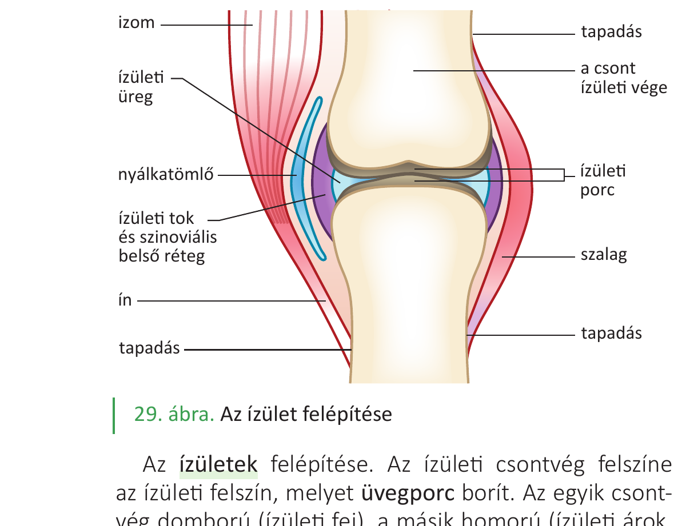

# 33. Csontok és kapcsolataik

A mozgást két szervrendszer valósítja meg: a **csontrendszer passzív módon**, a **vázizomrendszer aktívan** vesz részt a mozgások kivitelezésében. Ez a tétel a passzív részt, a csontvázat tárgyalja.

## A csontváz biológiai funkciói

- A **mozgás passzív szervei** alkotják.
- **Belső szilárd váz**, amely meghatározza a test alakját és méretét.
- Biztosítja egyes szervek (pl. agy) **védelmét**.
- Helyet biztosít a **vörös csontvelőnek**, így részt vesz a **vérképzésben**.
- A szervezet **kalciumraktára** (a test Ca²⁺-tartalmának 90%-a a csontokban van).

A gerinces állatoknak és az embernek **belső, csontos vázrendszere** van, szemben a gerinctelen állatok többségére jellemző külső vázzal. A belső váz nem akadályozza a növekedést.

## A csontvázrendszer felépítése

Nagyobb egységei: a **fejváz (koponya)**, a **törzsváz** (gerincoszlop és mellkas) és a **végtagok** csontjai.

### Koponya

Az **agykoponya** és az **arckoponya** részekből áll.

- **Agykoponya**: 7 csont (2 páros: falcsontok, halántékcsontok; 3 páratlan: homlokcsont, ékcsont, nyakszirtcsont). A nyakszirtcsonton található az **öreglyuk**, ahol a nyúltvelő folytatása, a gerincvelő lép ki. Az ékcsont tartalmazza a töröknyerget (az agyalapi mirigyet védi). A csontok **varratos összeköttetésekkel** kapcsolódnak (idősebb korban összecsontosodnak). Magzati korban a csontok között kötőszövetes lemez, a **kutacs** található — ez könnyíti a szülést, és az agy további növekedését.
- **Arckoponya**: csontjai a kor előrehaladtával összenőnek, kivéve az **állkapocscsontot**, amely **ízülettel** kapcsolódik a halántékcsonthoz.

### Gerincoszlop

Oldalnézetben **kétszeres S görbületű** — ez a koponya rugalmas alátámasztását teszi lehetővé. **Szelvényezett**, általában 32–35 csigolyából áll. Szakaszai:

- **nyaki**: 7 csigolya (első kettő: **fejgyám/atlas** és **tengely/axis** — a fej nagy fokú mozgékonyságát biztosítják),
- **háti**: 12 csigolya (bordákkal ízesülnek),
- **ágyéki**: 5 csigolya,
- **keresztcsonti**: 5 csigolya (felnőttkorra egységes **keresztcsonttá** nőnek össze),
- **farkcsonti**: 4–6 csigolya.

A mozgékony csigolyák **porckorongokkal, kötőszöveti szalagokkal, ízületekkel** kapcsolódnak. A csigolyák mérete lefelé egyre nő (a növekvő terhelés miatt).

**A csigolya részei**: csigolyatest (vérképzés zajlik benne), csigolyaív (a csigolyalyukat határolja), tövisnyúlvány (hátizmok tapadási helye), harántnyúlványok (bordák ízesülnek hozzá), ízületi nyúlványok (csigolyák egymáshoz ízesülése). A csigolyalyukak összessége alkotja a **gerinccsatornát**, amiben a gerincvelő foglal helyet.

### Mellkas

A mellkast **12 pár borda** és a **szegycsont** alkotja.

- **7 pár valódi borda**: külön-külön saját porccal ízesül a szegycsonthoz,
- **3 pár álborda**: közös porccal kapcsolódik egymáshoz és a 7. borda porcán át a szegycsonthoz,
- **2 pár lengőborda**: nem kapcsolódik a szegycsonthoz, vége a hasfal izomzatába ágyazódik.

Hátul a bordák a hátcsigolyák testéhez és harántnyúlványaihoz ízesülnek. A szegycsont részei: **markolat, test, kardnyúlvány** — lapos csont, vörös csontvelőt tartalmaz.

### Végtagok csontjai

A végtagokon **függesztőövet** és **szabad végtagot** különböztetünk meg.

**Felső végtag — vállöv és szabad felső végtag**:

- Vállöv: **kulcscsont** (szegycsonthoz és lapockához ízesül), **lapocka** (a hátizomba ágyazódik).
- Szabad felső végtag: **felkarcsont** (humerus), **orsócsont** (radius, a hüvelykujj felőli) és **singcsont** (ulna), **kéztőcsontok** (8 db), **kézközépcsontok**, **ujjpercek** (ujjanként 3, a hüvelykujj esetén 2).

**Alsó végtag — medenceöv és szabad alsó végtag**:

- Medenceöv: a páros **medencecsont** (csípőcsont + szeméremcsont + ülőcsont kb. 18 éves korra összeforr) és a **keresztcsont**. A medence alakja másodlagos nemi jelleg: nőknél szélesebb és alacsonyabb, a szeméremcsontok közti szög tompább (a szüléshez fontos).
- Szabad alsó végtag: **combcsont** (femur), **sípcsont** (tibia, a nagylábujj felőli) és **szárkapocscsont** (fibula), **lábtőcsontok** (7 db), **lábközépcsontok**, **ujjpercek**. A sípcsont alsó kiszélesedő része a **belső boka**, a szárkapocscsonté a **külső boka**.

## A csontok alakja

- **Csöves csontok**: hosszúkás, a végükön kiszélesedő csontok. Középső részük (**diafízis**) cső alakú, a két végük (**epifízis**) szivacsos állományt tartalmaz. Pl. felkarcsont, combcsont (hosszú), kézközépcsontok (rövid).
- **Lapos csontok**: két vékony, tömör állományú csontréteg közötti teret szivacsos csontállomány tölti ki vörös csontvelővel. Pl. lapockacsont, agykoponyacsontok, medencecsont, bordák.
- **Köbös csontok**: a tér különböző irányaiba közel azonos kiterjedésűek, szivacsos állománnyal, a vérképzés fő helyei. Pl. csigolyatestek, kéz- és lábtőcsontok.

## A csontok felépítése (kívülről befelé)

- **Csonthártya**: erekben és idegekben gazdag rostos kötőszövet. Belső rétegében csontképző sejtek vannak — itt indul a csont vastagodása és a sérült csont regenerációja.
- **Tömör állomány**: kívül helyezkedik el, a koncentrikus körökbe rendeződött csontsejtek és a sejt közötti állomány alkotja.
- **Szivacsos állomány**: a csontszövet lemezek és csövek finom rendszere. Nagy teherbírású, de könnyű. Üregeit **vörös csontvelő** tölti ki, amely a vérképzésben vesz részt.
- **Velőüreg**: a csöves csontokban belül található, **sárga csontvelő** (zsírszövet) tölti ki.
- **Csontbelhártya**: a velőüreget belülről borítja, lebontó szerepe van.

A csonthossznövekedését az **epifízis porclemez** (üvegporc) biztosítja; elcsontosodása után (átlagosan 21. év körül) a növekedés befejeződik.

## A csontszövet (Havers-rendszer)

A csontszövet **lemezes szerkezetű**:

- A nyúlványos csontsejtek **koncentrikus körökbe** rendeződnek.
- A központi **Havers-csatornában** vérerek és idegek futnak.
- A koncentrikus lemezekből álló egység neve **oszteon**.
- A Havers-csatornákat sugárirányban a **Volkmann-csatornák** kötik össze.

A csontszövet sejtjei:

- **Csontsejtek (oszteociták)**: a kész szövet sejtjei.
- **Csontfaló sejtek (oszteoklasztok)**: lebontják a csontszövetet.
- **Csontépítő sejtek (oszteoblasztok)**: új csontot építenek.

A csontszövet ezért élete folyamán **folyamatosan átépül** az aktuális terhelésnek megfelelően.

## A csontok összetétele

- **Szerves (30-40%)**: főleg **kollagén fehérjerostok** → a csontok **rugalmasságát** biztosítják.
- **Szervetlen (60-70%)**: **kalciumsók** (40%, pl. hidroxiapatit Ca₅(PO₄)₃(OH), CaCO₃) → a csontok **szilárdságát és keménységét** biztosítják.
- **Víz**: kb. 20%.

**Kísérlet**: ha a szervetlen állományt sósavval kioldjuk, a csont elveszti keménységét, gumiszerűen hajlíthatóvá válik. Ha a szerves állományt hevítéssel elégetjük, a csont ridegen-törékenyen viselkedik.

Az életkor előrehaladtával a foszfát-, kollagén- és víztartalom **csökken**, a karbonáttartalom **nő** → a csontok **törékenyebbek** lesznek (csontritkulás).

## A kalcium-anyagcsere szabályozása

A csontok kalciumraktárként szabályozott módon adnak le és vesznek fel kalciumot. Három fő hormon:

- **Parathormon** (mellékpajzsmirigy): **emeli** a vér kalciumszintjét. A csontfaló sejteket serkenti, a vesében serkenti a kalcium visszaszívását, és aktiválja a D-vitamin szintézisét.
- **Kalcitriol** (a D-vitamin aktív alakja): a bélben növeli a kalcium- és foszfátfelszívást, fokozza a csontok Ca²⁺-felvételét.
- **Kalcitonin** (pajzsmirigy): **csökkenti** a vér kalciumszintjét. A csontépítő sejteket serkenti.
- **Ösztrogén**: gátolja a csontfaló sejtek működését. Idősebb korban az ösztrogénhiány **csontritkuláshoz** vezethet.

## A csontok összeköttetései

### Folytonos összeköttetések

A kapcsolódó csontok között **anyagfolytonosság** van:

- **Csontos összenövés**: az eredetileg önálló csontok egybeforrnak (pl. keresztcsont 5 csigolyából, medencecsont, idősebb korban az arc- és agykoponyacsontok).
- **Porcos összeköttetés**: a csontokat **porc** köti össze (pl. csigolyák közötti porckorongok).
- **Kötőszövetes összeköttetés**: kötőszöveti szalagok kapcsolják az érintkező csontokat (pl. koponya varratai).

### Megszakított összeköttetések — az ízületek

Az **ízületekben** a kapcsolódó csontok között kisebb távolság van, ami lehetővé teszi az elmozdulást. Az ízületeket **szerveknek** tekintjük, mivel önmagukban lezárt szerkezeti és működési egységek.

**Az ízületek felépítése**:

- **Ízületi felszín**: az ízületi csontvég felszíne, melyet **üvegporc** borít. Az egyik csontvég domború (**ízületi fej**), a másik homorú (**ízületi árok/vápa**).
- **Ízületi tok**: termeli az **ízületi nedvet**, amely súrlódáscsökkentő, csúszóssá teszi a porcfelszínt.
- **Ízületi szalagok**: erős kötőszöveti szalagok az ízületet összetartják.
- **Külső légnyomás** is hozzájárul az ízület összetartásához.

**Az ízületek típusai** (az elmozdulás mértéke, iránya és a felszínek alakja szerint):

- **Feszes ízületek**: tényleges mozgásra alkalmatlanok, ízületi felszíneik szabálytalanok, szalagkészülékük igen feszes (pl. keresztcsont és csípőcsont közötti ízület).
- **Mozgékony ízületek**: a kapcsolódó csontok nagyobb elmozdulását teszik lehetővé. A legtöbb ízületünk ide tartozik. Az ízületi felszín alakja és az elmozdulás iránya alapján további csoportosítás lehetséges.
- **Szimfízis** (átmenet): pl. a két szeméremcsont közötti kapcsolat (porc és szalagok), rugalmas tágulása a szülésben fontos.

---

## Ábrák

*Az emberi csontváz áttekintő képe hasi és háti irányból: koponya, gerincoszlop, mellkas (szegycsont és bordák), vállöv (kulcscsont, lapocka), felső végtag (felkarcsont, orsócsont, singcsont, kéztő, kézközép, ujjpercek), medence, alsó végtag (combcsont, sípcsont, szárkapocscsont, lábtő, lábközép, ujjpercek).*

*A csöves csont szerkezete: csonthártya, tömör állomány/kéreg, szivacsos állomány vörös csontvelővel, velőüreg sárga csontvelővel, epifízis porclemez (csonthossznövekedéséért felelős, kb. 21. évre elcsontosodik), üvegporc/ízületi porc a végeken.*

*Az ízület szerkezete: ízületi felszínek üvegporccal borítva, ízületi üreg ízületi nedvvel, ízületi tok, szalag, az izom inakon át kapcsolódik a csonthoz (eredés, tapadás).*

---

*Az anyag a 2. tankönyv 22–28. oldalain található.*
